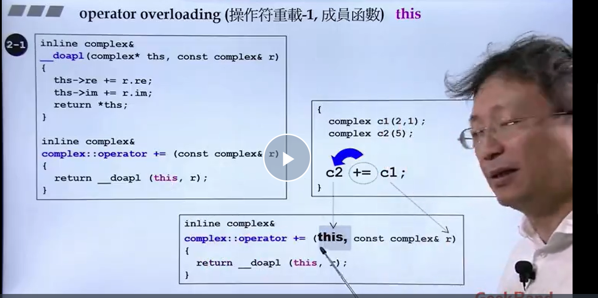
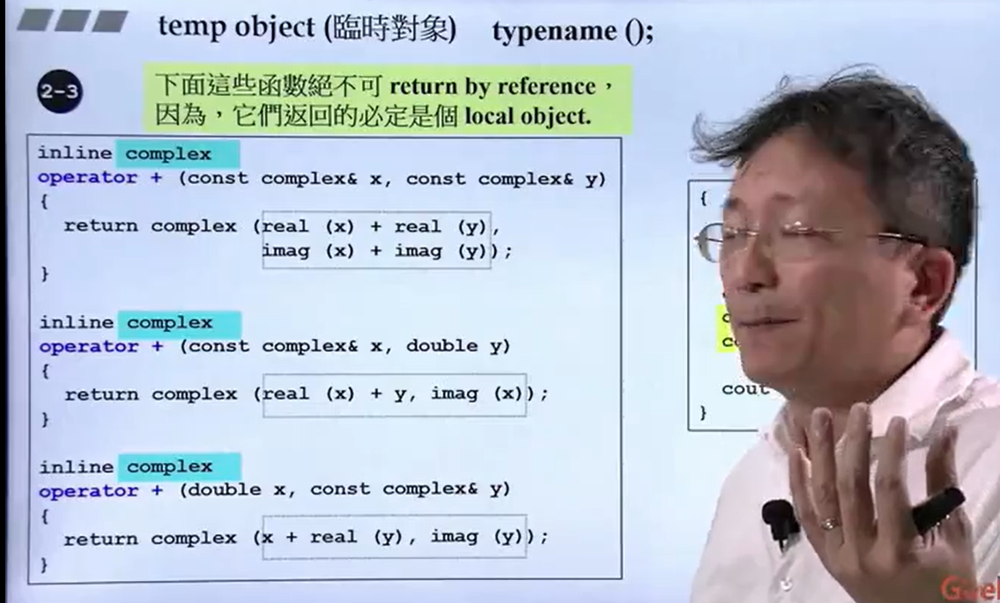
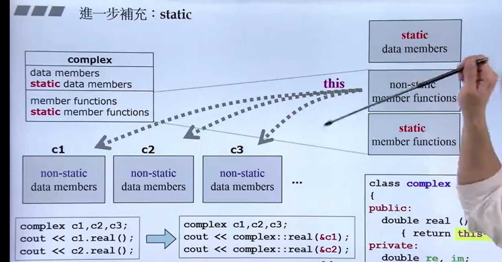
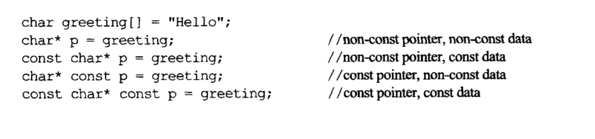
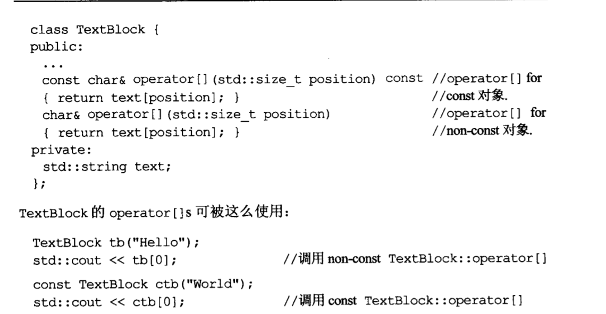
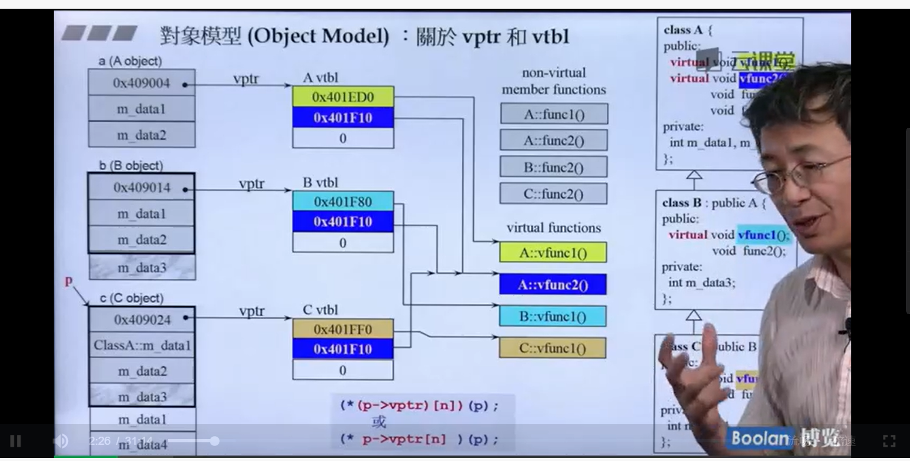

# Effective C++

## C++代码的基本形式

* .h头文件
* .cpp主程序
* 标准库.h Standard Library

## 防卫式声明

```C++
//如果定义过了这个名词的化，不去重复定义
#ifndef __COMPLEX__
#define __COMPLEX__
...
#endif
```

不会有重复的include动作


## 重载运算符

在C++中操作符就是函数

1. 操作符重载：写成一个成员函数



​	

定义在类中的操作符自带一个this指针

 不可以再参数列写出来，但是可以用

**作为类的成员函数的区别是，在类里面重载函数只有一个参数**


2. 操作符重载：非成员函数



注意，这个最好返回不是reference,因为返回的可能是栈空间的东西

3. 重载输出运算符

```
ostream& operator << (ostream& os, const complex& x) {

}

//下面这样使用是错误的
void  operator << (ostream& os, const complex& x)
```

## 三大函数：拷贝构造，析构，拷贝赋值

### 拷贝构造函数

```
class String {

}
int main() {
	String s1();
	String s2("hello");
	String s3(s1);//拷贝构造
	cout << s3 << endl;
	s3 = s2;//拷贝赋值
	cout << s3 << endl;
}
//如果这两个函数没有写，编译器会提供一份，一个字节一个字节的复制
String::~String() {
	delete[] m_data;
}
```

## 堆，栈内存管理

Stack是存在于作用域的内存空间，当你调用函数，函数本身会形成一个stack

Heap操作系统提供的一整块global空间，程序可动态分配若干区块

离开作用域，析构函数就会被调用


### new先分配memory,再调用构造函数

```C++
Complex* pc = new Complex(1, 2);
Complex* pc
1. void* mem = operator new(sizeof(Complex));//里面调用malloc
2. pc = statistic_cast<Complex*>(mem);//转型
3. pc->Complex::Complex(1, 2);//构造函数
```

delete 先调用析构函数，再释放memory

## static



右边那个就是内存里面的成员函数的情况，

加了 static就和原来的对象脱离了，存在内存的某个位置里面

static data number在同一时候只有一份

### 把构造器放在private里面

```
class A {
public:
	static A& getInstance(){return a;};
private:
	A();
	A(const A& rhs);
	...
};
```

单例模式

## 模板

class template:类模板

```c++
template<typename T>
class Complex {
public:
	Complex(T r, T i) {}
}
complex<double> c1(2.5, 1.5);
```

function template:函数模板

```c++
template <class T>
inline const T& min(const T&a, const T& b) {
    
}
```

## 虚函数

```C++
//在前面加virtual则函数变成虚函数
non-virtual:你不希望子类复写它
virtual:你希望重新定义,但是你已经有默认定义
pure-virtual:你希望函数一定要重新复写
```

```C++
class Shape {
	virtual void draw()const=0;//pure virtual
    virtual void error(const std::string&msg);//virtual
    int objectID()const//non virtual
}
```

> C++在函数声明时，后面跟个const是限定函数类型为常成员函数, 常成员函数是指不能改变成员变量值的函数。
>
> 例如“double d() const;”，其中的其中的“const”限定了d()函数中不能有任何改变其所属对象成员变量值的功能，如果有则会在编译阶段就报错。
>
> 它的主要作用就是能使成员函数的意义更加清楚，我们可在不改变对象的成员函数的函数原型中加上const说明。在需要增加可读性和减少逻辑出错的情况下，就可以用这种形式。

虚函数是由两个部分组成的

* 虚函数指针
* 虚函数表

1. 虚函数指针

虚函数指针 **(virtual function pointer)** 从本质上来说就只是一个指向函数的指针，与普通的指针并无区别。它指向用户所定义的虚函数，具体是在子类里的实现，当子类调用虚函数的时候，实际上是通过调用该虚函数指针从而找到接口。

虚函数指针是确实存在的数据类型，在一个被实例化的对象中，它总是被存放在该对象的地址首位，这种做法的目的是为了保证运行的快速性。

2. 虚函数表

上文已经提到，每个类的实例化对象都会拥有虚函数指针并且都排列在对象的地址首部。而它们也都是按照一定的顺序组织起来的，从而构成了一种表状结构，称为虚函数表 **(virtual table)** 。

>虚函数指针：就是指向虚函数内成员函数地址的指针，他们排列起来就构成了虚函数表，每一个基函数有自己的一张函数列表，如果有的话就会被覆盖

首先基函数的表项仍然保留，而得到正确继承的虚函数其指针将会被覆盖，而子类自己的虚函数将跟在表后。

而当多重继承的时候，表项将会增多，顺序会体现为继承的顺序，并且子函数自己的虚函数将跟在第一个表项后。

**C++中一个类是公用一张虚函数表的，基类有基类的虚函数表，子类是子类的虚函数表，这极大的节省了内存**

```C++
class Base
{
public:
	virtual void func()const
	{
		cout << "Base!" << endl;
	}
};
class Derived :public Base
{
public:
	virtual void func()
	{
		cout << "Derived!" << endl;
	}
};

void show(Base& b)
{
	b.func();
}
Base base;
Derived derived;

int main()
{
	show(base);
	show(derived);
	base.func();
	derived.func();
	return 0;
}
```

Base! Base! Base! Derived!

输出发现函数不多态了

这里有一个很大的问题，因为当我们将derived传过去的时候并没有调用derived的虚函数！也就是说虚函数不再是多态的了。

但是的话我们只需要简单的修改任意一项：将line4结尾的const限定符去掉或者将Derived的func1后加上const便可以使一切正常。这是为什么呢？

很多其他的博客将其解释为是const符号作用的原因，但实际上这样的解释并不正确。正确的原因是:

虚函数的声明与定义要求非常严格，只有在子函数中的虚函数与父函数一模一样的时候（包括限定符）才会被认为是真正的虚函数，不然的话就只能是重载。这被称为虚函数定义的同名覆盖原则，意思是只有名称完全一样时才能完成虚函数的定义。

## C++ const

​	const int *p = 8;

则指针指向的内容 8 不可改变。简称左定值，因为 const 位于 * 号的左边。

```C++
int a = 8;
int* const p = &a;
*p = 9; // 正确
int  b = 7;
p = &b; // 错误
```

对于 const 指针 p 其指向的内存地址不能够被改变，但其内容可以改变。简称，右定向。因为 const 位于 * 号的右边。

const 引用的目的是,禁止通过修改引用值来改变被引用的对象。 

1）const int & e 相当于 const int * const e
2）普通引用 相当于 int *const e
3）当使用常量（字面量）对const引用进行初始化时，C++编译器会为常量值
分配空间，并将引用名作为这段空间的别名
4）使用字面量对const引用初始化后，将生成一个只读变量


### 尽可能使用const



STL的迭代器iterator为指针，如果加上const,则等效为 T* const

```C++
std::vector<int> vec;
const std::vector<int>::iterator iter = vector.begin();
*iter = 10; //正确
iter++;//错误
```

要使指针具有const T * 的效果要使用const_iterator

> 注意const T * 和T const *都有人使用，所以要习惯

```
const Relational operator*(const Relational& lhs, const Relational& rhs);
```

返回一个const对象，以免用户做出了把“==”写成"="的暴行

### const成员函数

两个成员函数如果只是常量性的不同，可以被重载



​	

## size_t

size_t和int
   size_t是一些C/C++标准在stddef.h中定义的。这个类型足以用来表示对象的大小。size_t的真实类型与操作系统有关。

在32位架构中被普遍定义为：

typedef   unsigned int size_t;

而在64位架构中被定义为：

typedef  unsigned long size_t;
        size_t在32位架构上是4字节，在64位架构上是8字节，在不同架构上进行编译时需要注意这个问题。而int在不同架构下都是4字节，与size_t不同；且int为带符号数，size_t为无符号数。

## 尽量以const,enum,inline代替const

宁可以编译器替换预处理器

## Namespace

```
namespace {
//命名空间的定义
}
```

* 命名空间只能在全局定义
* 命名空间可以嵌套

```C++
namespace A {
 int a = 1000;
 namespace B {
 
 }
}
```

* 命名空间是开放的，可以随时把新的成员加入到命名空间中
* 命名空间可以存放变量和函数
* 无命名空间，相当于命名空间的标识符只能内部访问

```C++
namespace{
    int a = 10;
    void func(){
        cout<<"hello namespace"<<endl;
    }
}
void test(){
 
    //只能在当前源文件直接访问a 或 func
    cout<<"a = "<<a<<endl;
    func();
}
```

## vptr和vtbl



当函数里面使用虚函数时候，就会多出来指针

vptr就是虚函数指针，父类有虚函数，子类一定有，所以子类一定有虚指针

在C语言中调用 call xxx**静态绑定**

C++ 动态绑定：通过vptr，找到vtbl

```c++
(*(p->vptr)[n])(p);//用C语言模拟这个场景
```

> 静态绑定：编译器就知道调用哪个函数
>
> 动态绑定：运行的时候才知道绑定哪个函数

```
class Shape {

}

class Circle: Shape {

}
void func(Shape a) {
//运行的时候才知道a是什么类型
}
```

## 智能指针

智能指针主要用于管理在堆上分配的内存，它将普通的指针封装为一个栈对象。当栈对象的生存周期结束后，会在析构函数中释放掉申请的内存，从而防止内存泄漏。C++ 11中最常用的智能指针类型为shared_ptr,它采用引用计数的方法，记录当前内存资源被多少个智能指针引用。该引用计数的内存在堆上分配。当新增一个时引用计数加1，当过期时引用计数减一。只有引用计数为0时，智能指针才会自动释放引用的内存资源。对shared_ptr进行初始化时不能将一个普通指针直接赋值给智能指针，因为一个是指针，一个是类。可以通过make_shared函数或者通过构造函数传入普通指针。并可以通过get函数获得普通指针。

智能指针一定有一个真正的指针

```C++
template<class T>
class shared_ptr {
public:
    T& operator*() const {
        return *px;
    }
    T* operator->() const {//容易卡在这里
        return px;
    }
private:
    T* px;
}
```

使用智能指针

```C++
struct Foo {
    ......
    void method(void)
};
shared_ptr<Foo> sp(new Foo())
```

#### unique_ptr

（替换auto_ptr）unique_ptr实现独占式拥有或严格拥有概念，保证同一时间内只有一个智能指针可以指向该对象。它对于避免资源泄露(例如“以new创建对象后因为发生异常而忘记调用delete”)特别有用。

```C++
unique_ptr<string> p3 (new string ("auto"));   //#4
unique_ptr<string> p4；                       //#5
p4 = p3;//此时会报错！！
```

另外unique_ptr还有更聪明的地方：当程序试图将一个 unique_ptr 赋值给另一个时，如果源 unique_ptr 是个临时右值，编译器允许这么做；如果源 unique_ptr 将存在一段时间，编译器将禁止这么做，比如：

```C++
unique_ptr<string> pu1(new string ("hello world")); 
unique_ptr<string> pu2; 
pu2 = pu1;                                      // #1 不允许
unique_ptr<string> pu3; 
pu3 = unique_ptr<string>(new string ("You"));   // #2 允许
```

#### shared_ptr

shared_ptr实现共享式拥有概念。多个智能指针可以指向相同对象，该对象和其相关资源会在“最后一个引用被销毁”时候释放。从名字share就可以看出了资源可以被多个指针共享，它使用计数机制来表明资源被几个指针共享。可以通过成员函数use_count()来查看资源的所有者个数。除了可以通过new来构造，还可以通过传入auto_ptr, unique_ptr,weak_ptr来构造。当我们调用release()时，当前指针会释放资源所有权，计数减一。当计数等于0时，资源会被释放。

* use_count:返回引用计数
* unique:是否独占所有权
* swap:交换两个对象
* reset:放弃对象所有权
* get：返回对象内部指针

**可能存在的问题：两个对象内分别有一个指针指向对方，造成循环引用**

#### weak_ptr

weak_ptr 是一种不控制对象生命周期的智能指针, 它指向一个 shared_ptr 管理的对象. 进行该对象的内存管理的是那个强引用的shared_ptr， weak_ptr只是提供了对管理对象的一个访问手段。weak_ptr 设计的目的是为配合 shared_ptr 而引入的一种智能指针来协助 shared_ptr 工作, 它只可以从一个 shared_ptr 或另一个 weak_ptr 对象构造, 它的构造和析构不会引起引用记数的增加或减少。weak_ptr是用来解决shared_ptr相互引用时的死锁问题,如果说两个shared_ptr相互引用,那么这两个指针的引用计数永远不可能下降为0,资源永远不会释放。它是对对象的一种弱引用，不会增加对象的引用计数，和shared_ptr之间可以相互转化，shared_ptr可以直接赋值给它，它可以通过调用lock函数来获得shared_ptr。

### java的四种引用

强引用： 是指创建一个对象并把这个对象赋给一个引用变量。

```java
Object object =new Object();
String str ="hello";
```

 强引用有引用变量指向时永远不会被垃圾回收，JVM宁愿抛出OutOfMemory错误也不会回收这种对象。

软引用：如果一个对象具有软引用，内存空间足够，垃圾回收器就不会回收它；

软引用可用来实现内存敏感的高速缓存,比如网页缓存、图片缓存等。使用软引用能防止内存泄露，增强程序的健壮性。  
SoftReference的特点是它的一个实例保存对一个Java对象的软引用， 该软引用的存在不妨碍垃圾收集线程对该Java对象的回收。

弱引用：弱引用也是用来描述非必需对象的，当JVM进行垃圾回收时，无论内存是否充足，都会回收被弱引用关联的对象。在java中，用java.lang.ref.WeakReference类来表示。

虚引用：虚引用和前面的软引用、弱引用不同，它并不影响对象的生命周期。在java中用java.lang.ref.PhantomReference类表示。如果一个对象与虚引用关联，则跟没有引用与之关联一样，在任何时候都可能被垃圾回收器回收。PhantomReference 类实现虚引用。无法通过虚引用获取一个对象的实例，为一个对象设置虚引用关联的唯一目的就是能在这个对象被收集器回收时收到一个系统通知。

## ###
