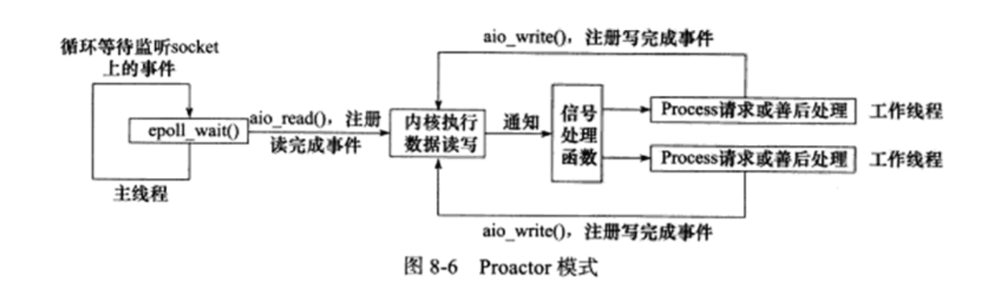
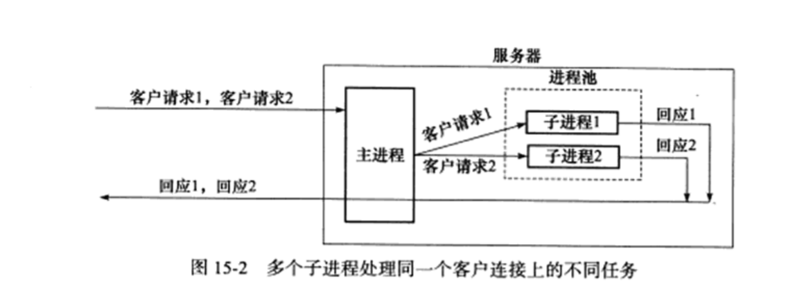

传统的网络模型处理IO事件是被动型的，有请求过来就给该请求分配cpu资源用来处理，请求在没有IO发生时也会占用该线程资源，reactor模型中一个线程用来对接nio中的select，在有IO事件时将IO下发给下游注册的处理器来处理IO，避免资源浪费，提高了系统吞吐量

1. 字节序
2. socket参数
3. 选项

socket(地址族，类型，协议)

## Linux高级IO函数

### pipe函数

```c
#include<unistd.h>
int pipe(int fd[2]);
```

通过pipe函数创建管道的两端，实现双向的数据传输，fd[0]只能读出数据，fd[1]只能读入数据，这一对文件描述符都是阻塞的，用read读取一个空的管道，read将被阻塞

### dup函数和dup2函数

**有时候我们把标准输入重定向一个大文件，标准输出重定向一个网络连接**

```C
#include<unistd.h>
int dup(int file_descriptor);
int dup2(int file_descriptor_one, int file_descriptor_two);
```

dup函数创建一个新的文件描述符，该文件描述符和原有文件描述符指向相同的文件，管道和网络连接

> CGI编程，CGI是指web服务器调用编程语言编写的程序的一个接口。比如我们可以编写一个用户注册的页面，用户将其输入的邮箱、用户名、密码输入并点击注册，此时浏览器就将用户输入的内容发送给了我们后台的CGI程序，我们的CGI程序接受到这些信息，可以对其进行处理。比如送入数据库、判断输入的信息是否合法等。

```c
int main(int argc, char* argv[]) {
	if (argc < 2) {
		
	}
    const char* ip = argv[1];
    int port = atoi(argv[2]);
    struct sockaddr_in adress;
    bzero(&adress, sizeof(adress));
    adress.sin_family = AF_INET;
    inet_pton(AF_INET, ip, adress.sin_addr);
    adress.sin_port = htons(port);//htons保存成二进制文件
    int sock = socket(PF_INET, SOCK_STREAM, 0);//
    int ret = bind(sock, (struct sockaddr*)& adress, sizeof(adress));
    ret = listen(sock, 5);//第二个参数是backlog,表示同时维持的最大establish的数量
    struct socketaddr_in client;
    socketlen_t client_addr_length = sizeof(client);
    int conn_fd = accept(sock, (struct socketaddr_in*)socketaddr_in, client_addr_length);
    if (conn_fd < 0) {
        printf("errorno is %d", conn_fd);
    } else {
        close(STDOUT_FILENO);
        dup(conn_fd);
        printf("abcd\n");
        close(connfd);
    }
    close(sock);
    return 0;
}
```

我们关闭了标准输出，dup返回当前系统最小可用的文件描述符，这样服务器输出到标准输出的内容会发送到socket上。

### readv函数和writev函数

readv函数从文件描述符读到分散的内存中，writev从分散的内存中读到文件描述符

```C
#include<sys/uio.h>
ssize_t readv(int fd, const struct iovec* vector, int count);
ssize_t writev(int fd, const struct iovec* vector, int count);
```

### sendfile函数

sendfile函数在两个文件描述符之间直接传递数据，避免了内核缓冲区和用户缓冲区的数据拷贝，被称为零拷贝。

```C
#include<sys/sendfile.h>
ssize_t sendfile(int out_fd, int in_fd, offf_t* offset, size_t count);
```

offset指定从文件哪个位置开始读

### mmap函数

mmap将一个文件或者其它对象映射进内存。文件被映射到多个页上，如果文件的大小不是所有页的大小之和，最后一个页不被使用的空间将会清零。mmap在用户空间映射调用系统中作用很大。
头文件 <sys/mman.h>
函数原型

```c
void* mmap(void* start,size_t length,int prot,int flags,int fd,off_t offset);
int munmap(void* start,size_t length);
```

mmap()[1] 必须以PAGE_SIZE为单位进行映射，而[内存](https://so.csdn.net/so/search?q=内存&spm=1001.2101.3001.7020)也只能以页为单位进行映射，若要映射非PAGE_SIZE整数倍的地址范围，要先进行内存对齐，强行以PAGE_SIZE的倍数大小进行映射。

用法:

下面说一下内存映射的步骤:
用open系统调用打开文件, 并返回描述符fd.
用mmap建立内存映射, 并返回映射首地址指针start.
对映射(文件)进行各种操作, 显示(printf), 修改(sprintf).
用munmap(void *start, size_t lenght)关闭内存映射.
用close系统调用关闭文件fd.

### fcntl函数 （file control）


## linux服务器程序规范

linux提供守护进程来处理系统日志——syslogd


```c
#include <syslog.h>
void syslog(int priority, const char* message);
```

### UID,EUID,GID,EGID,通过uid判断是否是root用户

### 进程间关系

Linux下每个进程都隶属于一个进程组，除了PID信息外，还有进程组ID（PGID）.我们可以使用如下程序获取指定进程的PGID

```
#include<unistd.h>
pid_t getpgid(pid_t pid);
```

一个进程只能设置自己和子进程的PGID

>在我们学习线程时知道,一个进程内可以有多个线程同时运行,多个同时运行的线程叫做线程组.
>线程组中还会有一个主线程,它的线程ID等于该线程组的组ID,类似的,也有多个进程同时归为一组的概念,
>就是进程组,进程组就是多个进程的集合,其中肯定有一个组长,其进程PID等于进程组的PGID 我们通过管道创建了三个进程,
>可以看到他们都属于一个进程组,其中组长进程是 11732
>我们首先应该注意到,只要该进程组内有任何一个进程存留,那么该进程组都存在最后可以看到他们的父进程都是 161与进程组相关的一个概念是作业作业
>在shell中,我们可以使用./可执行程序来执行程序,这里跟准确的说法是运行了一个作业(job)/进程组(Process Group)
>作业和进程组的唯一一个显著区分是进程组中进程创建出来的进程属于进程组,而作业中进程创建出来的进程不属于作业

### 会话

一些有关联的进程组会组成一个会话(session)，下面的函数用于创建一个会话：

```C
#include<unistd.h>
pid_t setsid(void);
```

**执行ps命令可以查看进程间的关系**

netstat可以查看网络的状态，tcpdump用于抓包，telnet用于通讯，使用top命令查看cpu的状态

### 服务器程序后台化

如何在代码中让一个进程以守护进程的方式运行，守护进程的编写遵循一般步骤

```C
bool daemonize() {
    pid_t pid = fork();
    if (pid < 0) {
        return false;
    }
    else if (pid > 0) {
        exit(0);
    }
    //创建子进程，关闭父进程
    
}
```

## 高性能服务器程序框架

### I/O模型

I/O复用是最常使用的I/O通知机制，应用程序通过I/O复用函数向内核注册一组事件，内核要通过I/O复用函数把就绪的事情通知给应用程序，linux常用的I/O复用函数是select ,poll,epoll.

I/O复用函数本身是阻塞的，提高程序效率的原因是同时监听多个I/O事件的能力。

阻塞IO,非阻塞IO


### Proactor模式

与reactor模式不同,proactor模式将所有的I/O操作都交给主线程和内核来完成，工作线程仅负责处理逻辑

使用异步I/O模型

1. 主线程调用aio_read注册读完成事件，告诉内核缓冲区读缓冲区的位置，读完成操作时如何通知内核。
2. 主线程继续处理其他逻辑
3. socket读入缓冲区的时候通知内核
4. 应用程序选择一个工作线程来处理客户请求。



使用同步I/O方式模拟preactor

* 主线程往epoll内核事件表注册socket读就绪事件。
* 主线程调用epoll_wait等待有数据可读
* 当socket有数据可读，epoll_wait通知主线程，主线程从socket读取数据，直到没有更多数据可读，然后将数据插入请求队列
* 睡眠在请求队列的工作线程被唤醒

### 高效的并发模式

**并发编程的目的是让程序“同时”执行多个任务，如果程序是计算密集型的，并发编程没有太大优势，反而会因为切换太多导致效率降低，如果程序是I/O密集型的，则经常访问文件，读写数据库，情况就会不同**

1. 半同步和半异步

在半同步/半异步模式中，同步线程用于处理客户的逻辑，相当于逻辑单元，异步线程用于处理I/O事件，相当于I/O的处理单元，异步线程监听到客户的请求后，就将其封装成请求对象并插入请求队列中，请求队列通知某个同步线程来处理该请求

2. 领导者和追随者模式

多个工作线程同时获得事件源集合，轮流监听，分发并处理事件是一种模式，在任何时间点，程序只有一个领导者线程，它负责监听I/O事件，其他线程都是追随者。

当前领导者如果检测到I/O事件了，首先要从线程池推举出新的领导者，然后处理I/O事件，此时，新的领导者等待新的I/O事件，原来的领导者处理I/O事件，二者实现了并发。


### 有限状态机

有的应用层协议的头部包含数据包的类型字段，每种类型可以映射为逻辑单元的一种执行状态，服务器可以根据相应的状态编写相应的处理逻辑。状态之间加上相互转移

```C
STATE_MACHINE(Package _pack) {
	State cur_state = type_A;
    while(cur_state != type_C) {
        Package _pack = getNewPackage();
        case type_A:
            process_package_stateA(_pack);
            cur_State = type_B;
        	break;
        case type_B:
        	process_package_stateA(_pack);
            cur_State = type_C;
        	break;
    }
}
```

## I/O复用

### select系统调用

在一段时间内，监听用户感兴趣的文件描述符上可读，可写，异常等事件

```C
#include<sys/select.h>
int select(int nfds, fd_set* readfds, fd_set* writefds, fd_set* expectfds, struct timeval* timeout);
```

nfds指定被监听的文件描述符的总数

readfds, writefds, expectfds指向可读可写，异常等事件，通过这三个参数传入感兴趣的文件描述符

timeout用来设置select的超时时间，是一个timeval的结构体指针

### 文件描述符的就绪条件


### poll

poll系统调用和select类似，也是在指定时间轮询一定数量的文件描述符，测试其中是否有就绪。

```C
#include<poll.h>
int poll(struct pollfd* fds, nfds_t nfds, int timeout);
```

### epoll系列系统调用

epoll是linux特有的I/O复用函数，在实现上与poll和select有很大差异，epoll把用户关心的文件描述符的事件放在内核的事件表中，从而无需向select,poll那样重复传入文件描述符集和事件集。

但epoll需要一个额外的文件描述符，文件描述符使用epoll_create创建

```C
#include<sys/epoll.h>
int epoll_create(int size)
```

size参数告诉内核事件表有多大。


```C
#include<sys/epoll.h>
int epoll_wait(int epfd, struct epoll_event* events, int maxevents, int timeout);
```

poll和epoll在使用上的差别

```C
int ret = poll(fds, MAX_EVENT_NUMBER, -1);
for (int i = 0; i < MAX_EVENT_NUMBER; i++) {
    if (fds[i].revents & POLLIN) {
        int sockfd = fds[i].fd;
        /*处理sockfd*/
    }
}
int ret = epoll_wait(epollfd, events, MAXEVENT_NUMBER, -1);
for (int i = 0; i < ret; i++) {
    int sockfd = events[i].data.fd;//不用遍历，直接就绪
}
```

### epoll的ET模式和LT模式

* LT: 应用程序不必处理，下次epoll会继续通知。
* ET: 应用程序必须立即处理，效率较高

```C
```

## Linux信号

Linux信号可由如下几种情况产生

* 对于前台进程，用户可通过发送特殊的中断字符发送信号，比如输入Ctrl+C通常会给进程发送一个中断信号。
* 系统异常，浮点异常和非法访问
* 系统状态变化
* 运行kill命令和调用kill函数

### 发送信号

Linux下，一个进程发送给其他进程的API是kill函数，其定义如下：

```C
#include<sys/type.h>
#include<signal.h>
int kill(pid_t pid, int sig)
```

Linux定义的信号值都大于0，如果sig取值为0，则kill函数不发送任何信号，但将sig设置为0可以检测目标进程和进程组的存在


### 信号处理方式

目标进程在接收信号时候，需要定义一个接收函数来处理之，信号函数的原型是：

```C
#include<signal.h>
typedef void (*__sig_handler_t)(int)
```

和网络编程几个重要的信号

**SIGHUP,SIGPIPE,SIGURG**

* SIGHUP: 控制终端挂起
* SIGPIPE: 用户自定义信号
* SIGURG: socket连接上有紧急数据

### 中断调用

如果程序在执行阻塞状态的系统调用接收到信号，我们为该信号设置了信号处理函数，则默认情况下系统调用将被中断

> 每个进程都有一个信号掩码（signal mask），也称为信号屏蔽字，它规定了当前要屏蔽或要阻塞递送到该进程的信号集。对于每种可能的信号，该掩码中都有一位与之对应。对于某种信号，若其对应位（bit）已设置，则它当前是被阻塞的。简单地说，信号掩码是一个“[位图](https://baike.baidu.com/item/位图)”，其中每一位都对应着一种信号。如果位图中的某一位为1，就表示在执行当前信号集的处理程序期间相应的信号暂时被“屏蔽”或“阻塞”，使得在执行的过程中不会嵌套地响应那个信号。

### signal系统调用

```C
#include<signal.h>
_sighandler_t signal(int sig, _sighandler_t _handle)
```

信号是一种异步事件，信号处理函数和程序的主循环是两种不同的执行路线，很显然，信号处理函数需要尽可能快的执行完毕，确保信号不被屏蔽太久，把信号的主要处理逻辑放到程序的主循环中，信号处理函数被触发时，只是简单的通知主程序接收到信号。

把信号值传递给主函数，主循环再运行目标逻辑代码，很多优秀的I/O框架库都实现了统一处理信号的和I/O事件。

### SIGPIPE

在一个读端关闭的管道和socket连接中写数据会引发SIGPIPE信号，我们需要在代码里捕获并处理此信号。


## 定时器

网络编程需要处理第三类事件是定时事件，定期检测一个客户的连接状态，服务器程序通常管理着众多定时事件，有效的组织定时事件，使之能在预定的时间点触发，且不影响服务器的主要逻辑，对于服务器的性能有至关重要的影响

### socket选项SO_RCVTIMEO和SO_SNDTIMEO

分别用来设置socket接收超时时间和发送超时时间

## 非阻塞connect

监控失败的fd上的可写请求

```C
int unblock_connect(const char* ip, int port, int time) {
    int ret = 0;
    struct sockaddr_in adress;
    bzero(&adress, sizeof(adress));
    address.sin_family = AF_INET;
    inet_pton(AF_INET, ip, &adress.sin_addr);
    adress.sin_port = htons(port);
    int fdopt = setnonblocking(sockfd);
    ret = connect(sockfd, (struct sockaddr*)& adress, sizeof(adress));
    if (ret == 0) {
        printf("connect with server immediately\n");
        fcntl(sockfd, F_SETFL, fdopt);
        return sockfd;
    }
    else if (errorno != EINPROGRESS) {
        ...//错误EINPROGRESS表示连接还在进行
    }
    fd_set readfds;
    fd_set writefds;
    struct timeval timeout;
    timeout.tv_sec = time;
    timeout.tv_uesc = 0;
    FD_ZERO(&readfds);
    FD_SET(&writefds);
    
}
```

## C++多线程编程

线程相关内容都属于POSIX线程标准

* 创建线程和结束线程
* 读取和设置线程属性
* POSIX线程同步方式：POSIX信号量，互斥锁和条件变量

> 线程是程序中完成一个独立任务的完整序列，即一个可调度的实体，根据运行环境和调度者的身份，线程可分为用户级线程和内核级线程，内核级线程也被称为轻量级线程，运行在内核空间，由内核来调度，当进程的一个内核线程获得CPU使用权时候，它就运行一个用户线程。内核线程相当于程序运行的容器。

一个进程可以拥有M个内核线程和N个用户级线程

M <= N

### 创建进程和结束进程

* pthread_create

```C
#include<pthread.h>
int pthread_create(pthread_t* thread, const pthread_attr_t* attr, void* (*start_routine)(void*), void* arg);
```

thread是新线程的标识符， attr用于设置线程的属性，传递NULL表示默认属性，phread_create成功时返回0，失败返回错误码

start_routine指定参数

* phread_exit

```C
void phread_exit(void* retval);
```

* phread_join

所有线程都可以调用phread_join回收其他线程

attr有以下属性


### POSIX信号量

专门用于线程同步的机制POSIX，互斥量和条件变量

```C
#include<semaphore.h>
int sem_init(sum_t* sem, int pshared, unsigned int value);
int sem_destroy(sum_t* sem);
int sem_wait(sem_t* sem);
int sem_trywait(sem_t* sem);
int sem_post(sem_t* sem);
```

这些函数是第一个参数sem指向的操作的信号量。

* sem_init:初始化一个未命名的变量
* sem_destroy： 用于销毁信号量
* sem_wait: 用原子方式将信号量-1,如果信号量为0则sem_wait被阻塞
* sem_post将信号量+1

### 互斥锁

可以用于保护关键代码段，确保其独占式的访问，有点像二进制信号量，当进入关键代码段，我们需要给互斥量加锁.


互斥锁属性

```C
#include<pthread.h>
//初始化互斥锁的属性对象
int pthread_mutexattr_init(pthread_mutexattr_t * attr);
//销毁互斥锁的属性对象
int pthread_mutexattr_destroy(pthread_mutexattr_t* attr);
```

互斥锁两个常用属性：pshared和type。pshared指定是否跨进程共享互斥锁

* PTHREAD_PROCESS_SHARED：互斥锁可以被跨进程共享。
* PTHREAD_PROCESS_PRIVATE:   互斥锁只能被和锁的初始化线程隶属同一个进程的线程共享

Linux支持如下四种互斥锁：

* PTHREAD_MUTEX_NORMAL: 普通锁
* PTHREAD_MUTEX_ERRORCHECK: 检错锁
* PTHREAD_MUTEX_RECURSIVE：嵌套锁
* PTHREAD_MUTEX_DEFAULT:默认锁

### 三种同步机制封装成类

```c++
#ifndef LOCKER_H
#define LOCKER_H

#include<exception>
#include<pthread.h>
#include<semaphore>
using namespace std;
/*封装信号量的类*/
class sem {
public:
    sem() {
        //sem_init用于初始化一个未命名的信号量，pshared指定信号量类型，如果其值为0，则信号量是当前进程的局部信号量
        if (sem_init(&m_sem, 0, 0) != 0) {
            throw std::exception();
        }
    }
    ~sem() {
        sem_destory(&m_sem);
    }
    
    //等待信号量
    bool wait() {
        return sem_wait(&m_sem) == 0;
    }
    
    //增加信号量
    bool post() {
        return sem_post(&m_sem) == 0;
    }
private:
    sem_t m_sem;
}

/*封装互斥锁的类*/
class locker {
public:
    //创建并初始化互斥锁
	locker() {
        if (pthread_mutex_init(&m_mutex, NULL) != 0) {
            throw std:exception;
        }
    }
    ~locker() {
        pthread_mutex_destroy(&m_mutex);
    }
    /*获取互斥锁*/
    bool lock() {
        return pthread_mutex_lock(&m_mutex) == 0
    }
    
    bool unlock() {
        return pthread_mutex_unlock(&m_mutex)
    }
    
private:
    pthread_mutex_t m_mutex;
}

#endif
```

### 可重入函数

如果一个函数可以被多个线程调用，不发生竞态条件，我们把它称作可重入函数（线程安全），Linux只有一小部分函数是不可重入的，可重入函数是在版本号后面加上_r


## 进程池，线程池

进程池和线程池相似，进程池是由服务器预先创建的一组子进程，这些子进程的数目在3~10个之间，httpd的守护进程就是包含7个子进程池实现并发的.

当有新任务到来时，主进程通过某种方式选择进程池里面的一个子进程来为自己服务，相比于动态创建进程，选择一个已经存在的子进程代价要小得多


### 处理多客户

> 回顾一下：在上面的学习中我们知道，高效的并发模式是同步线程用于处理客户逻辑，异步线程用于处理I/O调度

使用进程池管理客户任务时，首先要考虑一个问题：监听socket和连接socket是否都由主进程来统一管理，

**主进程管理所有监听socket,各个子进程管理属于自己的连接socket**



```C++
/*描述一个子进程的类*/
class process {
public:
	process(): m_pid(-1) {
        
    } 
private:
    pid_t m_pid;
    int m_pipefd[2];
}
/*进程池类*/
template<typename T>
class ProcessPool {
private:
    /*将构造函数构造成私有的，这样我们只能通过create来创建线程池*/
    ProcessPool(int listenfd, int process_number=8);
    void setup_sig_pipe();
    void run_parent();
    void run_child();
    static const int MAX_PROCESS_NUMBER=16;//进程池最大处理数量
public:
    static PeocessPool<T>* create(int listenfd, int process_number=8) {
        if (!m_instance) {
            m_instance = new ProcessPool<T>(listenfd, process_number);
        }
        return m_instance;
    }
    ~ProcessPool() {
        delete []m_sub_process;
    }
    
    void run();//启动线程池
};
template<typename T>
processpool<T>* processpool<T>::m_instance = NULL;
static int sig_pipefd[2];

static int setnonblocking(int fd) {
    int old_option = fcntl(fd, F_GETFL);//获取文件的描述符标志
    int new_option = old_option | O_NONBLOCK; //逻辑或，设置为非阻塞描述符
    fcntl(fd, F_SETFL, new_option);
    return old_option;
}

static void addfd(int epollfd, int fd) {
    epoll_event event;
    event.data.fd = fd;
    event.events = EPOLLIN | EPOLLET;
    epoll_ctl(epollfd, EPOLL_CTL_ADD, fd, &events);
    setnonblocking(fd);
}

/*从epoll_fd标识的内核事件表删除所有注册事件*/
static void removefd(int epollfd, int fd) {
    epoll_ctl(epollfd, EPOLL_CTL_DEL, fd, 0);
    close(fd);
}

static void sig_handler(int sig) {
    int save_errno = errno;
    int msg = sig;
    send(sig_pipefd[1], (char*)&msg, 1, 0);
    errno = save_errno;
}

/*进程池构造函数*/
template<typename T>
ProcessPool<T>::ProcessPoll(int listenfd, int process_number):m_listenfd(listenfd), m_process_number(process_number), m_idx(-1), m_stop(false) {
    /*建立数个子进程，并建立管道*/
    m_sub_process = new process[process_number];
    for (int i = 0; i < process_number; i++) {
        int ret = socketpair(PF_UNIX, SOCK_STREAM, 0, m_sub_process[i].m_pipefd);创建管道
        m_process[i].m_pid = fork();
    	if (m_sub_process[i].m_pid > 0) {
        	close(m_sub_process[i].m_pipefd[1]);
        	continue;
    	}
        else {
            close(m_sub_process[i].m_pipefd[0]);
            m_idx = i;
            break;
        }
    }
}
to be continue....
```

