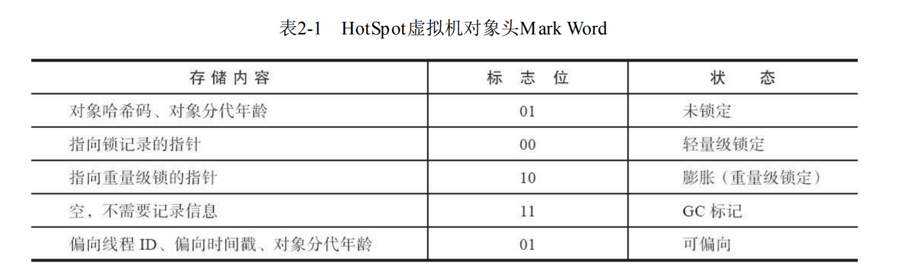

# JVM

## Java的final关键字

* final修饰类：太监类，没有儿子
* final修饰方法：当final关键字用来修饰一个方法的时候，这个方法就是最终方法，也就是不能被覆盖重写。
* final修饰局部变量：对于基本类型来说，不可变指的是变量之中的值不可变，对于引用类型来说，指的是地址不可变

## Java内存区域与内存溢出异常

java内存区域分为以下几个区域：


* 方法区：方法区与java栈一样，是各个线程共享的内存区域，用于存储已被虚拟机加载的类型信息，常量，静态变量，即时编译后的代码缓存等信息。
* 虚拟机栈：为执行Java方法来服务的
* 本地方法栈：为虚拟机执行的本地方法服务
* 堆： Java堆是虚拟机管理最大的一块，Java对象里所有线程共享的一块区域，Java堆是垃圾收集器的内存区域，也被称为GC堆，Java
* 程序程序计数器：程序计数器是一块较小的内存空间，可以看作是当前线程执行字节码的行号指示器，

有的虚拟机把虚拟机栈和本地方法栈合二为一

根据《Java虚拟机栈规范》的规定，如果方法区无法满足新的内存分配需求时，将抛出OutOfMemory异常。

### 运行时常量池

运行时常量池是方法区的一部分，Class文件中除了有类的版本，字段，方法，及接口等描述信息时候，还有一项信息是**常量池表**，会在之后放在运行时常量池。

运行时常量池具有动态性，运行期间可以有新的常量放到池子中，最典型的就是String.intern()方法

```java
String.intern();
//调用intern方法的时候，字符串会全部创建在常量池上
```

当常量池无法再申请到内存的时候，会出现OutOfMemory的错误。

### Java对象的创建

当Java虚拟机遇到字节码指令new的时候，首先去检查这个指令的参数是否能在常量池被定位到一个类的符号引用，并且检查这个类是否被加载，解析，初始化过，如果没有，需要先执行类的初始化过程。

虚拟机维护一个列表，记录哪些内存块是可用的，这种分配方式称为空闲列表

> 线程安全：对象创建在虚拟机中是非常频繁的行为，仅仅修改一个指针的位置，并发状态下不是线程安全的，虚拟机是采用**CAS**重试的方式来保证操作的原子性，即每个线程先在堆中分配一小块内存，称为本地内存缓冲区，哪个线程要分配，就在本地缓冲区分配，只有本地缓冲区用完了，才需要同步锁定

### Java对象的内存布局

存储区可以化为三个部分：

* 对象头：存储对象自身的运行数据，哈希码，GC分代年龄，锁状态标志，线程持有的锁，偏向线程ID，偏向时间戳

这部分的数据被称为“Mark Word”,''Mark Word'被设计成有动态意义的数据结构.

对象头的另一部分是类型指针：指向对象的元数据




* 实例数据
* 对齐填充

### 对象的访问定位

对象的访问方式是由虚拟机的实现确定的，主流的访问方式是有使用句柄和直接指针两种。、

使用句柄的最大好处是对象移动了，reference不需要修改


使用直接指针速度更快，节省了指针定位的时间开销


## Java垃圾回收机制

### 可达性算法

通过一系列称为“GC Root”的根对象作为起始点集，从这些点开始，通过引用关系向下搜索，搜索过的路径称为引用链，如果某个对象没有引用链，GC Root这个对象不可达，则证明此对象不可能再被使用。

* 强引用：只要强引用关系还存在，垃圾回收器就永远不会回收的对象
* 弱引用：描述那些非必须的对象，强度比软引用更弱一些，被弱引用关联的对象只能生存到下一次垃圾收集发生为止。
* 虚引用：幽灵引用，为对象设置虚引用，只是回收的时候会发生一个通知
* 软引用：描述一些还有用，但非必须的对象，只被软引用关联的对象，在系统发生内存溢出前，会进行回收

​	如果对象在进行可达性分析以后，没有发现与GCRoot的引用链，那它将会被第一次标记，筛选的条件是对象是否有必要执行finalize()方法，那么该对象会被置为一个F-Queue的队列之中

随后在一条由虚拟机建立的，低调度优先级线程，去执行finalize方法，并不承诺它一定运行结束。稍后，收集器将对F-Queue队列中的对象进行第二次小规模的标记

```java
public class FinalizeEscapeGC {
	public static FinalizeEscapeGC SAVE_HOOK = null;
	public void isAlive() {
		System.out.println("yes, i am still alive :)");
	}
	@Override
	protected void finalize() throws Throwable {
		super.finalize();
		System.out.println("finalize method executed!");
		FinalizeEscapeGC.SAVE_HOOK = this;
	}
	public static void main(String[] args) throws Throwable {
		SAVE_HOOK = new FinalizeEscapeGC();
		//对象第一次成功拯救自己
		SAVE_HOOK = null;
		System.gc();
		// 因为Finalizer方法优先级很低，暂停0.5秒，以等待它
		Thread.sleep(500);
		if (SAVE_HOOK != null) {
			SAVE_HOOK.isAlive();
		} else {
			System.out.println("no, i am dead :(");
		}
		// 下面这段代码与上面的完全相同，但是这次自救却失败了
		SAVE_HOOK = null;
		System.gc();
		// 因为Finalizer方法优先级很低，暂停0.5秒，以等待它
		Thread.sleep(500);
		if (SAVE_HOOK != null) {
			SAVE_HOOK.isAlive();
		} else {
			System.out.println("no, i am dead :(");
		}
	}
}

```

对象不会调用两次finalize

### 回收方法区

方法区一般不进行垃圾回收行为。

方法区回收一般回收两种对象：

* 废弃的常量
* 不再使用的类型

### 垃圾收集算法

当前的垃圾收集算法，都遵从了分代收集的理论。分代收集建立在两个分代假说上：

1. 弱分代假说：绝大多数对象都是朝生夕灭的
2. 强分代假说：熬过多次垃圾收集的对象就越难以消亡

收集器应该将Java堆划分成不同的区域，然后回收对象依据其年龄分配到不同的区域存储。

出现一个部分收集的问题？

> 新生代垃圾收集：收集发现老年代引用了新生代的对象，因此要重新扫描一遍老年代。

出现了一个假说：这种现象是极少的，不用为了这种现象去扫描整个老年代

部分收集：

* 新生代收集
* 老年代收集
* 混合收集
* 整堆收集

### 标记清除算法

最早的是，标记和清除两个阶段

标记清除算法的缺点：

1. 执行效率不稳定
2. 空间碎片太多

### 标记复制算法

它将可用的内存分成大小相等的两块，每次只使用其中的一块，当这一块内存用完了，就将存货的对象复制到另外一块去，然后把已经使用过的内存空间一次清理掉，这种方法会产生大量的复制花费。

### 标记整理算法

针对老年代对象存储的特征，后续步骤不是直接对可回收对象进行清理，而是让所有对象都向内存空间的一端移动，然后直接清理掉边界以外的内存。

如果移动存活对象，并更新引用必须停机才能进行，也被称为Stop the world

> 比较活泛的一个想法：先进性标记清除算法，等到内存乱到一定程度，再运行标记整理算法。

### HotSpot算法实现机制

### 根节点枚举

可达性分析算法：GCRoots集合找引用链，根节点枚举必须暂停用户线程，根节点枚举会造成stop the word的困境，现在已经可以开始并发

目前主流java虚拟机使用：准确式垃圾收集，当用户线程停顿下来后，不需要一个不漏的检查完所有执行上下文和全局引用位置，虚拟机可以得到哪些地方存放着对象引用。

使用OopMap达到这个目的。

在OopMap的帮助下，HotSpot可以快速完成GC Root枚举，引用关系的变化，可能会导致OopMap的变化。

**设立安全点：只在特定的位置，记录这些信息。**

对于安全点，另外一个需要考虑的问题是，如何在垃圾收集发生时让所有线程（这里其实不包括 执行JNI调用的线程）都跑到最近的安全点，然后停顿下来。

而主动式中断的思想是当垃圾收集需要中断线程的时候，不直接对线程操作，仅仅简单地设置一 个标志位，各个线程执行过程时会不停地主动去轮询这个标志，一旦发现中断标志为真时就自己在最 近的安全点上主动中断挂起。轮询标志的地方和安全点是重合的，另外还要加上所有创建对象和其他 需要在Java堆上分配内存的地方，这是为了检查是否即将要发生垃圾收集，避免没有足够内存分配新 对象。

### 安全区域

解决阻塞的程序：需要设置安全区域

安全区域是指能够确保在某一段代码片段之中，引用关系不会发生变化，因此，在这个区域中任 意地方开始垃圾收集都是安全的。我们也可以把安全区域看作被扩展拉伸了的安全点。

当用户线程执行到安全区域的代码后，会标识自己已经进入了安全区域，所以虚拟机不需要管进入安全区域的线程。

### 记忆集与卡表

记忆集：在分代收集的场景中，解决对象跨代引用的问题。垃圾收集器在新生代建立了名为记忆集的数据结构，避免把整个老年代加入了扫描范围。

记忆集是一种用于记录从非收集区域指向收集区域的指针集合的抽象数据结构。这种记录不需要太多的空间。

* 字长精度
* 对象精度
* 卡精度：将记录精确到一块内存

### 并发的可达性分析

* 白色：表示对象尚未被垃圾收集器访问过。显然在可达性分析刚刚开始的阶段，所有的对象都是 白色的，若在分析结束的阶段，仍然是白色的对象，即代表不可达。 

* 黑色：表示对象已经被垃圾收集器访问过，且这个对象的所有引用都已经扫描过。黑色的对象代 表已经扫描过，它是安全存活的，如果有其他对象引用指向了黑色对象，无须重新扫描一遍。黑色对 象不可能直接（不经过灰色对象）指向某个白色对象。 
* 灰色：表示对象已经被垃圾收集器访问过，但这个对象上至少存在一个引用还没有被扫描过。

并发扫描容易造成的问题，所以必须在一个一致性快照上进行可达性分析。


#### 避免并发标记的时候有新的节点连接，导致不该删除的对象被删除

* 增量更新：把新的黑色节点指向的点重新标记以下，（标成灰色节点）
* 内存快照

## CMS和G1垃圾收集器

·并行（Parallel）：并行描述的是多条垃圾收集器线程之间的关系，说明同一时间有多条这样的线 程在协同工作，通常默认此时用户线程是处于等待状态。 

·并发（Concurrent）：并发描述的是垃圾收集器线程与用户线程之间的关系，说明同一时间垃圾 收集器线程与用户线程都在运行。由于用户线程并未被冻结，所以程序仍然能响应服务请求，但由于 垃圾收集器线程占用了一部分系统资源，此时应用程序的处理的吞吐量将受到一定影响。

### CMS

cms目的：获取最短回收停顿时间。

* 初始标记 stop the world
* 并发标记
* 重新标记: stop the world
* 并发清除

初始标记：标记以下GC Roots能直接关联到的对象

并发标记：遍历一遍GC Roots能关联到的对象。

重新标记：修正并发标记期间的对象

并发清除：

> 并发收集，低停顿，但至少有以下三个缺点
>
> * 对处理器资源较敏感，占了一部分线程资源，导致速度变慢
> * 在并发清除以后，用户还在不断地产生垃圾，因此会产生大量的浮动垃圾，有可能会产生Full GC,CMS无法在此次处理它，只能在下次再处理。
> * CMS使用的是标记清除算法，出现了大量的内存碎片。

### Garbage First

简称G1垃圾收集器，G1开创了region的概念

虽然G1仍然保留新生代和老年代的概念，但新生代和老年代不再是固定的了，它们都是一系列区 域（不需要连续）的动态集合。G1收集器之所以能建立可预测的停顿时间模型，是因为它将Region作 为单次回收的最小单元，即每次收集到的内存空间都是Region大小的整数倍，这样可以有计划地避免 在整个Java堆中进行全区域的垃圾收集。

更具体的处理思路是让G1收集器去跟踪各个Region里面的垃 圾堆积的“价值”大小，价值即回收所获得的空间大小以及回收所需时间的经验值，然后在后台维护一 个优先级列表，每次根据用户设定允许的收集停顿时间（使用参数-XX：MaxGCPauseMillis指定，默 认值是200毫秒），优先处理回收价值收益最大的那些Region，这也就是“Garbage First”名字的由来。 这种使用Region划分内存空间，以及具有优先级的区域回收方式，保证了G1收集器在有限的时间内获 取尽可能高的收集效率。

在垃圾收集过程中，G1收集器会记 录每个Region的回收耗时、每个Region记忆集里的脏卡数量等各个可测量的步骤花费的成本，并分析得 出平均值、标准偏差、置信度等统计信息。这里强调的“衰减平均值”是指它会比普通的平均值更容易 受到新数据的影响，平均值代表整体平均状态，但衰减平均值更准确地代表“最近的”平均状态。换句 话说，Region的统计状态越新越能决定其回收的价值。然后通过这些信息预测现在开始回收的话，由 哪些Region组成回收集才可以在不超过期望停顿时间的约束下获得最高的收益。

G1收集器的运作过程：

* 初始标记
* 并发标记：** 只有并发标记是不需要暂停的 **
* 最终标记：对用户线程做一个暂停
* 筛选回收

​	考虑到G1只是回收一部分Region，停顿时间是用户可控 制的，所以并不实现回收阶段的并发执行

相比CMS,G1的优点：

1. 最大停顿时间
2. 按照Region的布局
3. 按收益确定回收。

## 内存分配与回收策略

Java技术体系的最根本目标是解决两个问题：

* 自动给对象分配内存
* 自动回收分配给对象的内存


### Survivor

1 为什么要有Survivor区
先不去想为什么有两个Survivor区，第一个问题是，设置Survivor区的意义在哪里？

如果没有Survivor，Eden区每进行一次Minor GC，存活的对象就会被送到老年代。老年代很快被填满，触发Major GC（因为Major GC一般伴随着Minor GC，也可以看做触发了Full GC）。老年代的内存空间远大于新生代，进行一次Full GC消耗的时间比Minor GC长得多。你也许会问，执行时间长有什么坏处？频发的Full GC消耗的时间是非常可观的，这一点会影响大型程序的执行和响应速度，更不要说某些连接会因为超时发生连接错误了。
为什么一个Survivor区不行？第一部分中，我们知道了必须设置Survivor区。假设现在只有一个survivor区，我们来模拟一下流程：
刚刚新建的对象在Eden中，一旦Eden满了，触发一次Minor GC，Eden中的存活对象就会被移动到Survivor区。这样继续循环下去，下一次Eden满了的时候，问题来了，此时进行Minor GC，Eden和Survivor各有一些存活对象，如果此时把Eden区的存活对象硬放到Survivor区，很明显这两部分对象所占有的内存是不连续的，也就导致了内存碎片化。
我绘制了一幅图来表明这个过程。其中色块代表对象，白色框分别代表Eden区（大）和Survivor区（小）。Eden区理所当然大一些，否则新建对象很快就导致Eden区满，进而触发Minor GC，有悖于初衷。


碎片化带来的风险是极大的，严重影响JAVA程序的性能。堆空间被散布的对象占据不连续的内存，最直接的结果就是，堆中没有足够大的连续内存空间，接下去如果程序需要给一个内存需求很大的对象分配内存。。。画面太美不敢看。。。这就好比我们爬山的时候，背包里所有东西紧挨着放，最后就可能省出一块完整的空间放相机。如果每件行李之间隔一点空隙乱放，很可能最后就要一路把相机挂在脖子上了。

那么，顺理成章的，应该建立两块Survivor区，刚刚新建的对象在Eden中，经历一次Minor GC，Eden中的存活对象就会被移动到第一块survivor space S0，Eden被清空；等Eden区再满了，就再触发一次Minor GC，Eden和S0中的存活对象又会被复制送入第二块survivor space S1（这个过程非常重要，因为这种复制算法保证了S1中来自S0和Eden两部分的存活对象占用连续的内存空间，避免了碎片化的发生）。S0和Eden被清空，然后下一轮S0与S1交换角色，如此循环往复。如果对象的复制次数达到16次，该对象就会被送到老年代中。下图中每部分的意义和上一张图一样，就不加注释了。


### 对象最先在Eden上分配

1. 新生代 GC（Minor GC）:指发生新生代的的垃圾收集动作，Minor GC 非常频繁，回收速度一般也比较快。

2. 老年代 GC（Major GC/Full GC）:指发生在老年代的 GC，出现了 Major GC 经常会伴随至少一次的 Minor GC（并非绝对），Major GC 的速度一般会比 Minor GC 的慢 10 倍以上。
   大多数情况下，对象在新生代Eden区中分配。当Eden区没有足够空间进行分配时，虚拟机将发起 一次Minor GC。

大对象就是指需要大量连续内存空间的Java对象，最典型的大对象便是那种很长的字符串，或者 元素数量很庞大的数组，本节例子中的byte[]数组就是典型的大对象。大对象对虚拟机的内存分配来说 就是一个不折不扣的坏消息，比遇到一个大对象更加坏的消息就是遇到一群“朝生夕灭”的“短命大对 象”，我们写程序的时候应注意避免。

虚拟机给每个对象定义了一个对象年龄Age计数器。对象每经过一次Minor GC就增加一岁。

对象晋升老年代的数值，可以通过-XX：MaxTenuringThreshold

### 空间分配担保

在发生Minor GC之前，虚拟机必须先检查**老年代最大可用的连续空间是否大于新生代所有对象总空间**

* HandlePromotionFailure参数的设置值是否允许担保失败
