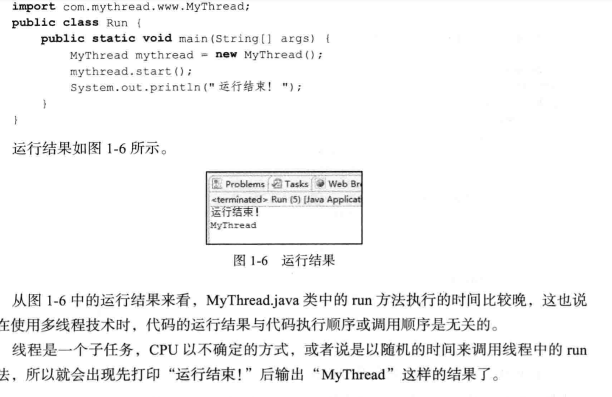
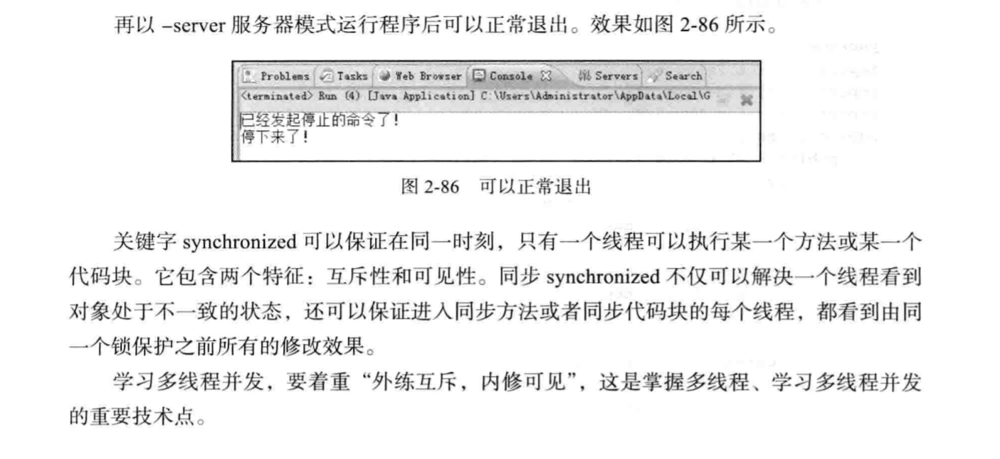

# java多线程

## 线程的可见性和原子性

### 可见性

在单核时代，所有的线程都是在一颗 CPU 上执行，CPU 缓存与内存的数据一致性容易解决。因为所有线程都是操作同一个 CPU 的缓存，一个线程对缓存的写，对另外一个线程来说一定是可见的。

例如在下面的图中，线程 A 和线程 B 都是操作同一个 CPU 里面的缓存，所以线程 A 更新了变量 V 的值，那么线程 B 之后再访问变量 V，得到的一定是 V 的最新值（线程 A 写过的值）。


CPU 缓存与内存的关系图一个线程对共享变量的修改，另外一个线程能够立刻看到，我们称为可见性。

多核时代，每颗 CPU 都有自己的缓存，这时 CPU 缓存与内存的数据一致性就没那么容易解决了，当多个线程在不同的 CPU 上执行时，这些线程操作的是不同的 CPU 缓存。比如下图中，线程 A 操作的是 CPU-1 上的缓存，而线程 B 操作的是 CPU-2 上的缓存，很明显，这个时候线程 A 对变量 V 的操作对于线程 B 而言就不具备可见性了。这个就属于硬件程序员给软件程序员挖的“坑”。多核 CPU 的缓存与内存关系图下面我们再用一段代码来验证一下多核场景下的可见性问题。下面的代码，每执行一次 add10K() 方法，都会循环 10000 次 count+=1 操作。在 calc() 方法中我们创建了两个线程，每个线程调用一次 add10K() 方法，我们来想一想执行 calc() 方法得到的结果应该是多少呢？

### 原子性

------


## java实现多线程编程的方式

* 继承Thread类
* 实现Runnable接口

```java
public class Thread implements Runnable
```

Thread类实现了Runnable,他们之间有多线程关系

```java
public class MyThread extends Thread {
	@Override
	public void run() {
		super.run();
	}
}
//通过start启动
```



Thread.java类中的start通知线程规划器，此线程已经准备就绪，等待调用线程的run方法，如果调用代码thread.run()就不是异步执行，而是同步。

### Runnable

如果想要创建的线程已经有父类了，这时就不能再继承Thread类了，java不支持多继承，需要实现Runaable接口来应对这样的情况

### 线程安全

通过在run方法前加入sychronized关键字，使得多个线程在执行方法的时候，排队处理，当一个线程想要执行同步方法里的代码的时候，线程会首先拿这把锁

### currentThread方法

currentThread可返回代码段正在被哪个线程调用

```java
public class Run1 {
	public static void main(String[] args) {
		System.out.println(Thread.currentThread().getName());
	}
}
```

### isAlive方法

判断当前线程是否处于活跃状态

```java
public class MyThread extends Thread {
	@Override
	public void run() {
        System.out.println("run=" + this.isAlive());
    }
}

public class Run {
    public static void main(String[] args) {
        MyThread myThread = new MyThread();
        System.out.println("begin==" + myThread.isAlive());
    }
}
```

### 停止线程

停止不了的线程，调用Interrupt方法来停止线程,但interrupt不像break,马上就停止线程，调用interrupt方法打了一个停止的标记，并不是真的停止线程。

```java
public class MyThread extends Thread {
	@Override
	public void run() {
		super.run();
		for (int i == 0; i < 500000; i++) {
			System.out.println("i=" + "(i + 1)")
		}
	}
}

public class Run {
    public static void main(String[] args) {
        try {
            MyThread myThread = new MyThread();
            thread.start();
            Thread.sleep(2000);
            thread.interrupt();
        } catch(InterruptedException e) {
            
        }
    }
}
```

打印了500000行，没有停止线程

Thread提供了两个方法

* this.interrupted()：测试当前线程是否是中断状态，执行后将状态标志清除为false的功能。
* this.isInterrupted()：测试对象是否是中断状态，但不清除标志

### 暴力停止线程的方法：异常法

```java
public class MyThread extends Thread {
	@Override
	public void run() {
		super.run();
		for (int i == 0; i < 500000; i++) {
			if (this.interrupted()) {
                break;//如果检测到停止，则停止
            }
			System.out.println("i=" + "(i + 1)")
		}
	}
}

public class Run {
    public static void main(String[] args) {
        try {
            MyThread myThread = new MyThread();
            thread.start();
            Thread.sleep(2000);
            thread.interrupt();
        } catch(InterruptedException e) {
            
        }
    }
}
```

### 在沉睡中停止

线程在sleep的状态下停止线程

在sleep的状态下停止线程，会马上进入try catch语句

### 暴力停止线程 stop

方法stop已经作废，强制停止线程会使请理性的工作得不到完成，对锁定的对象进行了解锁，使得数据得不到同步处理

### 使用return停止线程

### 暂停线程

使用suspend暂停线程，使用resume恢复线程

使用suspend和resume时，如果使用不当，容易造成线程的独占

```java
public class SynchronizedObject {
	synchronized public void printString() {
        System.out.println("begin");
        if (Thread.currentThread().getName().equals("a")) {
            System.out.println("a线程永远suspend了");
            Thread.currentThread().suspend();//这样会造成线程的永远锁定
        }
        System.out.println("end");
    }
}

public class Run {
    public static void main(String[] args) {
        try {
            final SynchronizedObject object = new SynchronizedObject();
            
        }
    }
}
```

### suspend和resume导致线程不同步

在使用suspend和resume会造成线程不同步的问题，创建项目suspend_resume_nosameValue，文件MyObject.java代码如下

```java
public class MyObject {
    private String userName = "1";
    private String password = "11";
    public void setValue(String u, String p) {
        this.userName = u;
        if (Thread.currentThread().getName().equals("a")) {
            System.out.println("停止a线程!");
            Thread.currentThread().suspend();
        }
        this.password = p
    }
    public void printUsernamePassword() {
        System.out.println(username + " " + password);
    }
}

public class Run {
    public static void main(String[] args) throws InterruptedException {
        final MyObject myObject = new MyObject();
        Thread thread1 = new Thread() {
            public void run() {
            	myobject.setValue("a", "aa");  
            };
        }
        thread1.setName("a");
        thread1.start();
        Thread.sleep(500);
        Thread thread2 = new Thread() {
            public void run() {
                myobject.printUsernamePassword();
            }
        };
        thread2.start();
    }
}
```

### yield方法

yield方法是放弃当前CPU资源，将它让给其他的任务去占用CPU时间。但放弃的时间不固定，有可能刚刚放弃，马上又获得CPU时间片

### 线程的优先级

在操作系统中，线程可以划分优先级，优先级较高的线程得到的CPU资源较多，是CPU优先执行的任务，设置线程的优先级使用setPriority()

在Java中，线程的优先级分成1~10个等级，如果小于1，大于10，则JDK抛出throw new IllegalArgumentException()

**在java中，线程的优先级具有继承特性，如果A线程启动B线程，则B线程的优先级和A是相同的**

```java
public class MyThread1 extends Thread {
    @Override
    public void run() {
        System.out.println("MyThread1 run priority=" + this.getPriority());
        MyThread2 thread2 = new MyThread2();
        thread2.start();
    }
}

public class MyThread2 extends Thread {
    @Override
    public void run() {
        System.out.println("MyThread2 run priority=" + this.getPriority());
    }
}
```

### 守护线程

在java中有两种线程

* 用户线程
* 守护线程

守护线程是一种特殊线程，他的特性有陪伴的含义，当进程中不存在非守护线程，守护线程自动销毁。

典型的守护线程就是垃圾回收线程

守护线程：任何一个守护线程都是JVM非守护线程的保姆，只有当最后一个非守护线程结束时，守护线程才随着JVM一同结束工作。

## 变量及对象的并发访问

sychronized加在方法前面实际上也是给**拥有这个方法的对象**加锁。（是以对象为单位，并不是整个对象都变得不可调用）

## synchronized锁重入

使用synchronized的时候，当一个线程得到一个对象锁的时候，再次请求该对象锁是可以再次得到该对象锁的。

> 在一个synchronized内部调用本类其他synchronized方法块时，永远是可以得到锁的

可重入锁：自己可以再次获取自己的内部锁

有一条线程获取了某个对象的锁，此时这个锁还没有释放，当再次想获取这个锁还是可以获取的，如果锁不可重入的话，就会造成死锁。

**当存在父子继承关系的时候，子类可以通过“可重入锁”调用父类方法**

### 当一个线程的锁出现异常的时候，锁会自动释放

### 同步不可以继承

同步不可以继承

```java
public class Main {
    synchronized public void serviceMethod() {
        try {
            System.out.println("int main 下一步 sleep  begin threadName=" + Thread.currentThread().getName() + " time=" + System.currentTimeMills());
           	Thread.sleep(5000);
        }
	}
}
```

继承了以后，必须也添加synchronized

------

### synchronized同步语句块

不在synchronized内的就异步执行，在synchronized的就同步执行。

### synchronized锁定的是对象！对象！对象！

### volatile

关键字volatile的主要作用是变量在多个线程可见。

### 关键字volatile与死循环

如果不是在多继承的情况下，使用继承Thread类和Runnable接口取得程序运行结果没有太大的区别，一旦出现多继承，则用Runnable解决线程的接口是很有必要的。

```java
public class PrintString {
    private boolean isContinuePrint = true;
    public boolean isContinuePrint() {
        return isContinuePrint;
    }
    public steContinuePrint(boolean isContinuePrint) {
        this.isContinuePrint = isContinuePrint;
    }
    public void printStringMethod() {
        try {
            while (isContinuePrint == true) {
                System.out.println("run printString Method threadName=" + Thread.currentThread().getName());
                Thread.sleep(1000);//会出现死循环
            }
        } catch (InterruptedException e) {
            e.printStackTrace();
        }
    }
}
```

**volatile的作用是强制从公共堆栈中取得值，而不是从线程的私有堆栈取得值**

```java
public class RunThread extends Thread {
    private boolean isRunning = true;
    public boolean isRunning() {
        return isRunning;
    }
    public void setRunning(boolean isRunning) {
        this.isRunning = isRunning;
    }
    @Override
    public void run() {
        System.out.println("进入run了");
        while (isRunning == true) {
            
        }
        System.out.println("线程被停止了");
    }
}

public class Run {
    public static void main(String[] args) {
        try {
        	RunThread runThread = new RunThread();
           	runThread.start();
            Thread.sleep(1000);
            thread.setRunning(false);
            System.our.print("已经赋值为false")
        }
    }
}
```

上面这个代码还是会造成死循环，因为线程还是会从线程的私有栈中取值，解决这个问题的办法是使用volatile关键字，强制从公共内存中读取变量，使用volatile增加了实例变量在多个线程之间的可见性，但volatile最关键的问题是**不支持原子性**。

### volatile的非原子特性

关键字volatile虽然增加了实例变量在多个线程之间的可见性，但他不具备同步性，也就是不具备原子性

>关键字volatile每次都从内存中读取变量，而不是从私有内存读取，这样就保证了数据的可见性，如果修改了实例中的数据，比如i++,也就是i = i + 1,则这样的操作不是一个原子操作，也就是非线程安全的。
>
>1. 从内存中取出i的值
>2. 计算i的值
>3. 写回到内存中

### 使用原子类进行i++操作

```java
public class AddCountThread extends Thread {
    private AtomicInteger count = new AtomicInteger(0);
    @Override
    public void run() {
        for (int i = 0; i < 10000; i++) {
            System.out.println(count.incrementAndGet());
        }
    }
}
```

### 原子类也并非安全

### synchronized代码块有volatile同步的功能

关键字volatile可以使多个线程访问同一个资源具有同步性，而且它还有将线程工作内存中的私有变量与公共内存变量同步的功能。

```java
public class Service {
    private boolean isContinueRun = true;
    public void runMethod() {
        while (isContinueRun) {
            
        }
        System.out.println("停下来了");
    }
    public void stopMethod() {
        isContinueRun = false;
    }
}
```



## 线程间通信

* 使用wait notify实现线程之间的通信
* 生产者/消费者模式的实现
* 方法join的使用
* ThreadLocal类的使用

### 等待通知机制

方法wait的作用是使当前执行代码的线程进行等待，wait是Object类方法，该方法将当前线程置入“预执行”队列中，并且在wait()停止执行，直到接到通知或中断为止。在调用wait之前，线程必须获取该对象的对象级别锁，即只能在同步方法中调用wait().

**如果调用wait时候没有合适的锁，则抛出IllegalMonitorStateException**它是RuntimeException一个子类，不需要try,catch捕捉异常。

方法notify也需要在同步方法或者同步块之中调用

* wait方法可以使调用该方法的线程释放共享资源的锁，然后从运行状态退出，进入等待队列，直到再次被唤醒。
* notify()可以随机唤醒等待队列中的一个线程。
* notifyAll()使等待中的线程，全部从锁状态退出。

### 方法wait释放锁，notify锁不释放

```java
public class Service {
    public void testMethod(Object lock) {
        try {
            synchronized(lock) {
                System.out.println(" begin wait() ThreadName=" + Thread.currentThread().getName());
                lock.wait();
                System.out.println(" end wait() ThreadName=" + Thread.currentThread().getName());
            }
        } catch(InterruptedException e) {
            e.printStackTrace();
        }
    }
    public void synNotifyMethod(Object lock) {
        try {
            synchronized(lock) {
                System.out.println("begin notify() ThreadName=" + Thread.currentThread().getName() + " time=" + System.currentTimeMillis());
                lock.notify();
                Thread.sleep(5000);
                
            }
        }
    }
}
```

必须执行完notify()所在的synchronized代码块后才释放锁。

notify()随机唤醒一个线程

### 通过管道进行线程间通信：字节流

* PipeInputSteam
* PipeOutputSteam
* PipeReader
* PipeWriter

### join方法的使用

主线程启动子线程，子线程要进行大量的耗时运算，主线程往往早于子线程结束，子线程处理一个数据，主线程想要得到这个值，就需要用到join方法

没有使用join方法，主线程提前打印，执行完毕

```java
public class MyThread extends Thread {
    @Override
    public void run() {
        try {
            int secondValue = (int) (Math.random() * 10000);
            System.out.println(secondValue);
            Thread.sleep(secondValue);
        } catch(InterrupedException e) {
            e.printStackTrace();
        }
    }
}

public class Test {
    public static void main(String[] args) {
        MyThread threadTest = new MyThread();
        threadTest.start();
        System.out.println("我想当mythread执行完再执行");
        System.out.println("上面的sleep的值应该写多少呢");
        System.out.println("不能确定");
    }
}
```

**使用join方法，等待打印，执行完毕**

```java
public class MyThread extends Thread {
    @Override
    public void run() {
        try {
            int secondValue = (int) (Math.random() * 10000);
            System.out.println(secondValue);
            Thread.sleep(secondValue);
        } catch(InterrupedException e) {
            e.printStackTrace();
        }
    }
}

public class Test {
    public static void main(String[] args) {
        MyThread threadTest = new MyThread();
        threadTest.start();
        threadTest.join();//使用join方法
        System.out.println("我想当mythread执行完再执行");
        System.out.println("上面的sleep的值应该写多少呢");
        System.out.println("不能确定");
    }
}
```


## ReentrantLock类

```java
public class Service {
    private Lock lock = new ReentrantLock();
    public void testMethod() {
        lock.lock();
        for (int i = 0; i < 5; i++) {
            System.out.println("ThreadName=" + Thread.getCurrentThread().getName() + " " + (i + 1));
            lock.unlock();
        }
    }
}
```

### 使用Condition实现等待通知机制

关键字synchronized与wait(),notify(),notifyAll()可以实现等待通知机制，ReentrantLock也可以实现相同功能，一个Lock对象可以创建多个Condition

synchronized相当于整个java对象只有一个单一的Condition对象，所有的线程都注册在一个Condition上面。

```java
public class MyService {
    private Lock lock = new ReentrantLock();
    private Condition condition = lock.newCondition();
    public void await() {
        try {
            condition.await();
        } catch(InterruptedException e) {
            e.printStackTrace();
        }
    }
}

public class ThreadA extends Thread {
    private MyService myService;
    public ThreadA(MyService myService) {
        this.myService = myService;
    }
    @Override
    public void run() {
        service.await();
    }
}

public class Run {
    public static void main(String[] args) {
        MyService service = new MyService();
        ThreadA a = new ThreadA(service);
        a.start();
    }
}
```

## 调用wait之前必须要获得对象级别锁！调用wait之前必须获得对象级别锁！调用wait之前必须获得对象级别锁

**所以上面的代码会报错**

### 正确使用Condition实现等待/通知

```java
public class MyService {
    private Lock lock = new ReentrantLock();
    private Condition condition = lock.newCondition();
    public void await() {
        try {
            lock.lock();
            condition.await();
        } catch(InterruptedException e) {
            e.printStackTrace();
        } finally {
            lock.unlock();
        }
    }
}

public class ThreadA extends Thread {
    private MyService myService;
    public ThreadA(MyService myService) {
        this.myService = myService;
    }
    @Override
    public void run() {
        service.await();
    }
}

public class Run {
    public static void main(String[] args) {
        MyService service = new MyService();
        ThreadA a = new ThreadA(service);
        a.start();
    }
}
```

### 使用多个Condition通知线程

```java
public class MyService {
    private Lock lock = new ReentrantLock();
    public Condition condition = lock.newCondition();
    public void awaitA() {
        try {
            lock.lock();
            System.out.println("begin awaitA的时间为" + System.currentTimeMillis() + "ThreadName=" + Thread.currentThread().getName);
            condition.await();
            System.out.println("end awaitA时间为")
        } catch (InterruptedException e) {
            e.printStackTrace();
        } finally {
            lock.unlock();
        }
    }
    
    public void awaitB() {
        try {
            lock.lock();
            System.out.println("begin awaitB的时间为" + System.currentTimeMillis() + "ThreadName=" + Thread.currentThread().getName);
            condition.await();
            System.out.println("end awaitB时间为")
        } catch (InterruptedException e) {
            e.printStackTrace();
        } finally {
            lock.unlock();
        }
    }
    
    public void signalAll() {
        try {
            lock.lock();
            condition.signalAll();
        } finally {
            lock.unlock();
        }
    }
    
}
```


## java线程池

### 并行和并发

并发是两个任务可以在重叠的时间段内启动，运行和完成。

并行是任务在同一时间段运行

**并发**


**并行**


### 什么是线程池

线程池是指在初始化一个多线程应用程序过程中创建一个线程集合，然后在需要执行新的任务时重用这些线程而不是新建一个线程（提高线程复用，减少性能开销）。线程池中线程的数量通常完全取决于可用内存数量和应用程序的需求。然而，增加可用线程数量是可能的。线程池中的每个线程都有被分配一个任务，一旦任务已经完成了，线程回到池子中然后等待下一次分配任务。

1. 线程池改进了一个任务的响应时间
2. 线程池节省了CLR,为每个短周期任务创建一个完整的线程开销，并在任务完成后回收资源
3. 线程池根据系统的进程优化时间片
4. 线程池允许我们开启多个任务，不用设置属性

### java中的线程池

起源于接口Executor,ExecutorService

```java
public interface Executor {
	void execute(Runnable command);
}

```


**1：int corePoolSize （core：核心的） = > 该线程池中核心线程数最大值**

什么是核心线程：线程池新建线程的时候，如果当前线程总数小于 corePoolSize ，则新建的是核心线程；如果超过corePoolSize，则新建的是非核心线程。

核心线程默认情况下会一直存活在线程池中，即使这个核心线程啥也不干(闲置状态)。

如果指定ThreadPoolExecutor的 allowCoreThreadTimeOut 这个属性为true，那么核心线程如果不干活(闲置状态)的话，超过一定时间( keepAliveTime)，就会被销毁掉

**2：int maximumPoolSize = > 该线程池中线程总数的最大值**

线程总数计算公式 = 核心线程数 + 非核心线程数。

**3：long keepAliveTime = > 该线程池中非核心线程闲置超时时长**

注意：一个非核心线程，如果不干活(闲置状态)的时长，超过这个参数所设定的时长，就会被销毁掉。但是，如果设置了 allowCoreThreadTimeOut = true，则会作用于核心线程。

**4：TimeUnit unit = > （时间单位）**

首先，TimeUnit是一个枚举类型，翻译过来就是时间单位，我们最常用的时间单位包括：

MILLISECONDS ： 1毫秒 、SECONDS ： 秒、MINUTES ： 分、HOURS ： 小时、DAYS ： 天

**5：BlockingQueue<Runnable> workQueue = >( Blocking：阻塞的，queue：队列)**

该线程池中的任务队列：维护着等待执行的Runnable对象。当所有的核心线程都在干活时，新添加的任务会被添加到这个队列中等待处理，如果队列满了，则新建非核心线程执行任务

1、线程安全的任务队列（采用队列，不过是线程安全的而已），保证工作线程在去任务时不会发生冲突（重复取同一个任务处理，二次执行或者多次的问题）。
2、对工作线程的监管（采用是List管理工作线程），方便线程的销毁和管理。

### 线程池的实现

对于线程池的实现我们划分为2个部分

1、线程安全的任务队列（采用队列，不过是线程安全的而已），保证工作线程在去任务时不会发生冲突（重复取同一个任务处理，二次执行或者多次的问题）。
2、对工作线程的监管（采用是List管理工作线程），方便线程的销毁和管理。

> 1.1、工作线程负责从阻塞任务队列中取出任务执行。由于存在很多个线程对同一个队列操作，因此这个任务队列一定得是线程安全的（采用BlockingQueue接口， 这是GUC提供的，线程安全）
> 1.2、工作线程的创建方式属于线程创建的方式之一。
> 1.3、每个工作线程都维护一个阻塞任务队列。
> 1.4、线程的执行方法run()中，以线程的中断状态为循环判断条件（方便线程销毁， 只要将工作线程的中断状态置为true即可释放工作线程）其次就是BlockingQueue接口提供的take()方法。
>
> 该方法在队列没有元素时处于阻塞状态，直接取到元素，这样就解决了没有任务工作线程处于阻塞状态，不会抢占CPU

```java
//实现工作线程 - 工作线程中维护了公有的任务队列（阻塞）, 工作线程的执行逻辑。 循环取队列中的任务去执行处理。
class Worker extends Thread {
    //阻塞任务队列 - 可以保证多个线程对队列操作， 线程安全
    private BlockingQueue<Runnable> queue = null;
    //每个工作线程都会有一个阻塞队列，这个队列中保存了所有的任务
    public Worker(BlockingQueue<Runnable> queue, int id) {
        this.queue = queue;
     //   Thread.currentThread().setName("郝梦武" + id + "号工作线程");
    }
    
    //工作线程执行内容
    @Override
    public void run() {
        //每个线程通过isInterrupted()判断线程异常状态。
        try {
            while (!Thread.currentThread().isInterrupted()) {
                //如果线程正常， 返回false, 出现异常， 返回true， 该状态默认为false
                Runnable command = queue.take();    //如果队列为空， take会让线程阻塞
                System.out.println(Thread.currentThread().getName() + "正在处理任务" + command.hashCode());
                command.run();
            }
        }
        catch(InterruptedException e) {
            System.out.println(Thread.currentThread().getName() + "被中止了");
        //    e.printStackTrace();      //不需要抛出异常
        }
    }
}
```

```java
//线程池 - 维护很多个线程， 当来一个任务时， 从线程池中获取一个线程去处理执行。
//好处： 防止线程频繁开辟和销毁带来的性能损耗
class MyThreadPool {
    //创建任务线程安全的队列, 保证多个线程对这个队列操作时是线程安全的
    private BlockingQueue<Runnable> queue = new LinkedBlockingQueue<>();
    //线程管理列表 - 这个列表保存了所有线程对象的引用， 方便后续的管理
    private List<Worker> Wokers = new ArrayList<>();
    private final static int maxWorkerCount = 10;   //线程池最大允许的个数

    //execute方法
    public void execute(Runnable command) throws InterruptedException {
        if(Wokers.size() < maxWorkerCount) {
            //创建一个新的工作线程
            Worker worker = new Worker(queue, Wokers.size());   //创建工作线程
            worker.start();                      //创建的工程线程启动
            Wokers.add(worker);                  //添加到管理列表中
        }
        queue.put(command);                      //添加任务到线程安全的队列中
    }

    //销毁所有线程 - 将每个线程中状态置为中断状态方法， 并且
    public void shutDown() throws InterruptedException {
        for(Worker worker : Wokers) {
            worker.interrupt();                  //将线程的状态置为中断， 调用isInterruptd()返回值为true
        }
        //并且让主线程join阻塞等待所有工作线程
        for(Worker worker : Wokers) {
            worker.join();                       //join方法可以让调用的线程处于阻塞状态， 知道等待的线程结束完毕之后就会恢复
        }
        //执行到这块， 代表所有的线程销毁完毕
        System.out.println("所有工作线程销毁完毕!");
    }
}
```

## java线程的run和start
在 Java 的程序中使用new Thread() 只是创建了一个 Thread 类的对象，此时和普通的对象没有任何区别，并没有因为 Java 程序中创建一个 Thread 对象就在操作系统中创建一个线程，真正在操作系统中创建了一个线程是 Java 中调用 start() 方法。

  run() 方法就是一个普通方法，直接使用 run()，其实就是之前使用的方法调用，并没有在操作系统层面创建新的线程，而是由调用 Thread 对象 run() 方法的主线程执行，在上面 run() 的实例中也有体现，当前执行的线程名是 main，而不是 thread1 或者 thread2。

  start() 方法其实也是 Java 中的一个普通方法，查看 start() 方法的源码，可以看到在 start() 源码中调用了private native void start0();，start0() 方法 是一个 native 方法，它的实现是用 C++ 实现的，在 start0() 方法中调用到了 cpppthread_create() 方法，而这个方法才是在操作系统中创建了一个线程。
  另外，在 start() 方法中并没有看到任何与调用 run() 方法有关的代码，在 start() 方法的注释中有一段话，说明了是在 JVM 中调用了 run() 方法。
