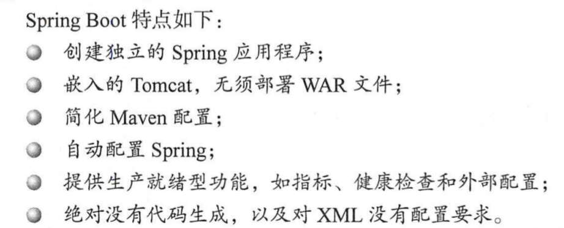

# Spring源码学习

## Spring的整体架构  FuckYou!990416


Spring的整体架构被总结为以下几个模块:

1. Core Container:包含有Core,Bean,Context和ExpressionLanguage

Core和Bean是框架的基础部分，提供IOC（控制反转）和依赖注入，基础概念是BeanFactory.

* Core包含Spring核心工具类，是其他组件的基本核心
* Beans是所有模块都要用到的，包含配置文件，创建和管理Bean以及进行IOC的各种控制类。
* Context构建与Core和Bean之上，提供一种类似JNDI注册器的框架式访问方法
* Expression Language提供了强大的表达语言。

```java
public class MyTestBean {
	private String testStr = "testStr";
    
    public String getTestStr() {
        return testStr;
    }
    
    public void setTestStr() {
        this.testStr = testStr;
    }
}

public class BeanFactoryTest {
    @Test
    public void testSimpleLoad() {
        BeanFactory bf = new XmlBeanFactory(new ClassPathResource("beanFactoryTest.xml"));
        MyTestBean bean = (MyTestBean) bf.getBean("MyTestBean");
    }
}
```

1. 读取配置文件beanFactoryTest.xml ConfigReader，读取配置文件
2. 找到相应的类，实例化 Reflection Util根据配置文件进行反射实例化
3. 调用实例化后的实例  App完成整个逻辑的串联

### Gardle

Gradle是一个基于ApacheAnt和Apache Maven概念的项目自动化构建工具。它使用一种基于Groovy的特定领域语言(DSL)来声明项目设置，抛弃了基于XML的各种繁琐配置。

* 一个像ant一样，通用的灵活的构建工具；

* 一种可切换的，像maven一样的基于约定优于配置的构建框架；

* 强大的多工程构建支持；

* 强大的依赖管理(基于Apache Ivy)；

* 对已有的maven和ivy仓库的全面支持；

* 支持传递性依赖管理，而不需要远程仓库或者 pom.xml 或者 ivy 配置文件；

* ant式的任务和构建是gradle的第一公民；

* 基于groovy，其 build脚本使用groovydsl 编写；

* 具有广泛的领域模型支持你的构建；

## Spring Bean包的结构层级

### Bean工程

1. DefaultListableBeanFactory

XmlBeanFactory继承自DefaultListableBeanFactory,DefaultListableBeanFactory是整个项目的核心部分，Spring注册以及加载Bean的默认实现，XmlBeanFactory只是实现了xml文件的解析

* AliasRegistry：定义对alias的简单增删改查操作
* SimpleAliasRegistry: 主要使用map作为alias的缓存，并对接口AilasRegistry进行实现

* SingletonBeanRegistry: 定义对单例的注册和获取
* BeanFactory：定义获取bean和bean的各种属性。
* DefaultSingletonBeanRegistry: 对接口SingletonBeanRegistry的各种实现
* HieracialBeanFactory: 继承BeanFactory,实现了对parentFactory的各种支持

...

建立Bean工厂的流程

1. 配置文件封装：Spring的配置文件读取是通过ClassPathResource完成的，在Java中，将不同来源抽象成URL,通过注册不同的handler来处理，通过不同的前缀来进行识别。

```java
file: http: jar:
```

getResource -> loadBeanDefinaton->加载Bean

### DTD与XSD

DTD是文档类型定义，是一种XML约束模式语言，是XML文件的验证机制，属于XML文档的一部分。

**DTD是一种保证文档有效的方法，通过比较xml文档和DTD元素来看文档是否规范，元素标签使用是否正确**

**XML Schema的语言就是XSD,XML SCHEMA描述了xml语言的结构**

Schema要致命文档的命名空间，版本和存储位置。


EntityResolver用来读取XSD声明，检查声明是否合格

```
阅读顺序：
BeanDefination
BeanDefinenationReader
DefaultDocumentLoader
```


当文件转换为Document后，接下来提取和注册Bean就是重头戏

> Document,是Java读取xml文件后建立的元素类

```Java
public int registerBeanDefinitions(Document doc, Resource resource) throws BeanDefinitionStoreException {
		BeanDefinitionDocumentReader documentReader = createBeanDefinitionDocumentReader();
		int countBefore = getRegistry().getBeanDefinitionCount();
    	//真正开始解析的语句
		documentReader.registerBeanDefinitions(doc, createReaderContext(resource));
		return getRegistry().getBeanDefinitionCount() - countBefore;
	}
```

```Java
	//真正的解析逻辑
	@Override
	public void registerBeanDefinitions(Document doc, XmlReaderContext readerContext) {
		this.readerContext = readerContext;
		doRegisterBeanDefinitions(doc.getDocumentElement());
	}
```

```java
protected void doRegisterBeanDefinitions(Element root) {
		// Any nested <beans> elements will cause recursion in this method. In
		// order to propagate and preserve <beans> default-* attributes correctly,
		// keep track of the current (parent) delegate, which may be null. Create
		// the new (child) delegate with a reference to the parent for fallback purposes,
		// then ultimately reset this.delegate back to its original (parent) reference.
		// this behavior emulates a stack of delegates without actually necessitating one.
		BeanDefinitionParserDelegate parent = this.delegate;
		this.delegate = createDelegate(getReaderContext(), root, parent);

		if (this.delegate.isDefaultNamespace(root)) {
			String profileSpec = root.getAttribute(PROFILE_ATTRIBUTE);
			if (StringUtils.hasText(profileSpec)) {
				String[] specifiedProfiles = StringUtils.tokenizeToStringArray(
						profileSpec, BeanDefinitionParserDelegate.MULTI_VALUE_ATTRIBUTE_DELIMITERS);
				// We cannot use Profiles.of(...) since profile expressions are not supported
				// in XML config. See SPR-12458 for details.
				if (!getReaderContext().getEnvironment().acceptsProfiles(specifiedProfiles)) {
					if (logger.isDebugEnabled()) {
						logger.debug("Skipped XML bean definition file due to specified profiles [" + profileSpec +
								"] not matching: " + getReaderContext().getResource());
					}
					return;
				}
			}
		}

		preProcessXml(root);
		parseBeanDefinitions(root, this.delegate);
		postProcessXml(root);

		this.delegate = parent;
	}
```

Spring中的标签解析包括

* 默认标签
* 自定义标签

```java
private void parseDefaultElement(Element ele, BeanDefinitionParserDelegate delegate) {
   if (delegate.nodeNameEquals(ele, IMPORT_ELEMENT)) {
      importBeanDefinitionResource(ele);
   }
   else if (delegate.nodeNameEquals(ele, ALIAS_ELEMENT)) {
      processAliasRegistration(ele);
   }
   else if (delegate.nodeNameEquals(ele, BEAN_ELEMENT)) {
      processBeanDefinition(ele, delegate);
   }
   else if (delegate.nodeNameEquals(ele, NESTED_BEANS_ELEMENT)) {
      // recurse
      doRegisterBeanDefinitions(ele);
   }
}
```

**最重要的是Bean标签的解析**

```java
protected void processBeanDefinition(Element ele, BeanDefinitionParserDelegate delegate) {
		BeanDefinitionHolder bdHolder = delegate.parseBeanDefinitionElement(ele);
		if (bdHolder != null) {
            //委托delegate进行解析
			bdHolder = delegate.decorateBeanDefinitionIfRequired(ele, bdHolder);
			try {
				// Register the final decorated instance.
				BeanDefinitionReaderUtils.registerBeanDefinition(bdHolder, getReaderContext().getRegistry());
			}
			catch (BeanDefinitionStoreException ex) {
				getReaderContext().error("Failed to register bean definition with name '" +
						bdHolder.getBeanName() + "'", ele, ex);
			}
			// Send registration event.
            //解析完成以后，向，上下文发送事件
			getReaderContext().fireComponentRegistered(new BeanComponentDefinition(bdHolder));
		}
	}
```

### Spring加载Bean的过程

1. 转换对应的Bean Name
2. 尝试从缓存中加载单例
3. bean的实例化
4. 原型模式的依赖检查
5. 检测parentBeanFactory: 如果缓存没有数据就到父类工厂加载,把它放进这个Set里面准备加载.

源码时刻考虑各种线程安全性

**AbstractBeanFactory.java**

```java
private final Set<String> alreadyCreated = Collections.newSetFromMap(new ConcurrentHashMap<>(256));
```

1. 寻找依赖（可能用到了其他Bean）
2. 针对不同的scope进行Bean的创建： Spring之中有不同的Singleton，默认的是Singleton,prototype,request之类的
3. 类型转换

> **JNDI的全称是Java Naming and Directory Interface**，即Java命名和目录接口，作用是为JAVA应用程序提供命名和目录访问服务的API。
>  咋一看这个解释似乎让人看不懂这个JNDI规范的作用。我个人感觉，**将JNDI规范看成是一个让配置参数和代码解耦的一种规范和思想会更好理解一些。**比如说常见的在DAO层通过原始的JDBC来连接数据库，我们可以选择在代码中直接写入数据库的连接参数，但一旦数据源发生变更，我们就势必要改动代码后重新编译才能连接新的数据源。而**如果我们将数据库连接参数改成外部配置的方式，那么也就实现了配置和代码之间的解耦**。JNDI规范本质上就是上述的这种操作。
>
> 看完上面的介绍，相信大家对JNDI的作用已经有了一个初步的认知。但是对于其具体的应用场景和工作流程还不是特别清楚。下面我们先来对JNDI的两个单词的概念进行解释：`Name`和`Directory`

```java
@Override
	public <T> T getBean(Class<T> requiredType, @Nullable Object... args) throws BeansException {
		Assert.notNull(requiredType, "Required type must not be null");
		Object resolved = resolveBean(ResolvableType.forRawClass(requiredType), args, false);
		if (resolved == null) {
			throw new NoSuchBeanDefinitionException(requiredType);
		}
		return (T) resolved;
	}

//通过名称解析Bean
@Nullable
	private <T> NamedBeanHolder<T> resolveNamedBean(
			ResolvableType requiredType, @Nullable Object[] args, boolean nonUniqueAsNull) throws BeansException {

		Assert.notNull(requiredType, "Required type must not be null");
		String[] candidateNames = getBeanNamesForType(requiredType);
		//
		if (candidateNames.length > 1) {
			List<String> autowireCandidates = new ArrayList<>(candidateNames.length);
			for (String beanName : candidateNames) {
				if (!containsBeanDefinition(beanName) || getBeanDefinition(beanName).isAutowireCandidate()) {
					autowireCandidates.add(beanName);
				}
			}
			if (!autowireCandidates.isEmpty()) {
				candidateNames = StringUtils.toStringArray(autowireCandidates);
			}
		}

		if (candidateNames.length == 1) {
			return resolveNamedBean(candidateNames[0], requiredType, args);
		}
		else if (candidateNames.length > 1) {
			Map<String, Object> candidates = CollectionUtils.newLinkedHashMap(candidateNames.length);
			for (String beanName : candidateNames) {
				if (containsSingleton(beanName) && args == null) {
					Object beanInstance = getBean(beanName);
					candidates.put(beanName, (beanInstance instanceof NullBean ? null : beanInstance));
				}
				else {
					candidates.put(beanName, getType(beanName));
				}
			}
			String candidateName = determinePrimaryCandidate(candidates, requiredType.toClass());
			if (candidateName == null) {
				candidateName = determineHighestPriorityCandidate(candidates, requiredType.toClass());
			}
			if (candidateName != null) {
				Object beanInstance = candidates.get(candidateName);
				if (beanInstance == null) {
					return null;
				}
				if (beanInstance instanceof Class) {
					return resolveNamedBean(candidateName, requiredType, args);
				}
				return new NamedBeanHolder<>(candidateName, (T) beanInstance);
			}
			if (!nonUniqueAsNull) {
				throw new NoUniqueBeanDefinitionException(requiredType, candidates.keySet());
			}
		}

		return null;
	}

@Nullable
	private <T> T resolveBean(ResolvableType requiredType, @Nullable Object[] args, boolean nonUniqueAsNull) {
        //通过名称来解析Bean
		NamedBeanHolder<T> namedBean = resolveNamedBean(requiredType, args, nonUniqueAsNull);
		if (namedBean != null) {
            //如果缓存中有就直接返回
			return namedBean.getBeanInstance();
		}
        //通过父类工厂加载Bean
		BeanFactory parent = getParentBeanFactory();
		if (parent instanceof DefaultListableBeanFactory dlfb) {
			return dlfb.resolveBean(requiredType, args, nonUniqueAsNull);
		}
		else if (parent != null) {
			ObjectProvider<T> parentProvider = parent.getBeanProvider(requiredType);
			if (args != null) {
				return parentProvider.getObject(args);
			}
			else {
				return (nonUniqueAsNull ? parentProvider.getIfUnique() : parentProvider.getIfAvailable());
			}
		}
		return null;
	}
```

doGetBean通过单例模式加载Bean

加载Bean的全过程：**AbstractBeanFactory**

```java
protected <T> T doGetBean(
			String name, @Nullable Class<T> requiredType, @Nullable Object[] args, boolean typeCheckOnly)
			throws BeansException {

		String beanName = transformedBeanName(name);
		Object beanInstance;

		// Eagerly check singleton cache for manually registered singletons.
		Object sharedInstance = getSingleton(beanName);
		if (sharedInstance != null && args == null) {
			if (logger.isTraceEnabled()) {
				if (isSingletonCurrentlyInCreation(beanName)) {
					logger.trace("Returning eagerly cached instance of singleton bean '" + beanName +
							"' that is not fully initialized yet - a consequence of a circular reference");
				}
				else {
					logger.trace("Returning cached instance of singleton bean '" + beanName + "'");
				}
			}
			beanInstance = getObjectForBeanInstance(sharedInstance, name, beanName, null);
		}

		else {
			// Fail if we're already creating this bean instance:
			// We're assumably within a circular reference.
			if (isPrototypeCurrentlyInCreation(beanName)) {
				throw new BeanCurrentlyInCreationException(beanName);
			}

			// Check if bean definition exists in this factory.
			BeanFactory parentBeanFactory = getParentBeanFactory();
			if (parentBeanFactory != null && !containsBeanDefinition(beanName)) {
				// Not found -> check parent.
				String nameToLookup = originalBeanName(name);
				if (parentBeanFactory instanceof AbstractBeanFactory abf) {
					return abf.doGetBean(nameToLookup, requiredType, args, typeCheckOnly);
				}
				else if (args != null) {
					// Delegation to parent with explicit args.
					return (T) parentBeanFactory.getBean(nameToLookup, args);
				}
				else if (requiredType != null) {
					// No args -> delegate to standard getBean method.
					return parentBeanFactory.getBean(nameToLookup, requiredType);
				}
				else {
					return (T) parentBeanFactory.getBean(nameToLookup);
				}
			}

			if (!typeCheckOnly) {
				markBeanAsCreated(beanName);
			}

			StartupStep beanCreation = this.applicationStartup.start("spring.beans.instantiate")
					.tag("beanName", name);
			try {
				if (requiredType != null) {
					beanCreation.tag("beanType", requiredType::toString);
				}
				RootBeanDefinition mbd = getMergedLocalBeanDefinition(beanName);
				checkMergedBeanDefinition(mbd, beanName, args);

				// Guarantee initialization of beans that the current bean depends on.
				String[] dependsOn = mbd.getDependsOn();
				if (dependsOn != null) {
					for (String dep : dependsOn) {
						if (isDependent(beanName, dep)) {
							throw new BeanCreationException(mbd.getResourceDescription(), beanName,
									"Circular depends-on relationship between '" + beanName + "' and '" + dep + "'");
						}
						registerDependentBean(dep, beanName);
						try {
							getBean(dep);
						}
						catch (NoSuchBeanDefinitionException ex) {
							throw new BeanCreationException(mbd.getResourceDescription(), beanName,
									"'" + beanName + "' depends on missing bean '" + dep + "'", ex);
						}
					}
				}

				// Create bean instance.
				if (mbd.isSingleton()) {
					sharedInstance = getSingleton(beanName, () -> {
						try {
							return createBean(beanName, mbd, args);
						}
						catch (BeansException ex) {
							// Explicitly remove instance from singleton cache: It might have been put there
							// eagerly by the creation process, to allow for circular reference resolution.
							// Also remove any beans that received a temporary reference to the bean.
							destroySingleton(beanName);
							throw ex;
						}
					});
					beanInstance = getObjectForBeanInstance(sharedInstance, name, beanName, mbd);
				}

				else if (mbd.isPrototype()) {
					// It's a prototype -> create a new instance.
					Object prototypeInstance = null;
					try {
						beforePrototypeCreation(beanName);
						prototypeInstance = createBean(beanName, mbd, args);
					}
					finally {
						afterPrototypeCreation(beanName);
					}
					beanInstance = getObjectForBeanInstance(prototypeInstance, name, beanName, mbd);
				}

				else {
					String scopeName = mbd.getScope();
					if (!StringUtils.hasLength(scopeName)) {
						throw new IllegalStateException("No scope name defined for bean '" + beanName + "'");
					}
					Scope scope = this.scopes.get(scopeName);
					if (scope == null) {
						throw new IllegalStateException("No Scope registered for scope name '" + scopeName + "'");
					}
					try {
						Object scopedInstance = scope.get(beanName, () -> {
							beforePrototypeCreation(beanName);
							try {
								return createBean(beanName, mbd, args);
							}
							finally {
								afterPrototypeCreation(beanName);
							}
						});
						beanInstance = getObjectForBeanInstance(scopedInstance, name, beanName, mbd);
					}
					catch (IllegalStateException ex) {
						throw new ScopeNotActiveException(beanName, scopeName, ex);
					}
				}
			}
			catch (BeansException ex) {
				beanCreation.tag("exception", ex.getClass().toString());
				beanCreation.tag("message", String.valueOf(ex.getMessage()));
				cleanupAfterBeanCreationFailure(beanName);
				throw ex;
			}
			finally {
				beanCreation.end();
			}
		}

		return adaptBeanInstance(name, beanInstance, requiredType);
	}
```

单例模式获取Singleton

```java
@Nullable
	protected Object getSingleton(String beanName, boolean allowEarlyReference) {
		// Quick check for existing instance without full singleton lock
		//快速检查现在Bean对象有没有加载
		Object singletonObject = this.singletonObjects.get(beanName);
		if (singletonObject == null && isSingletonCurrentlyInCreation(beanName)) {
			singletonObject = this.earlySingletonObjects.get(beanName);
			if (singletonObject == null && allowEarlyReference) {
				synchronized (this.singletonObjects) {
					//锁起来一整个对象
					// Consistent creation of early reference within full singleton lock
					singletonObject = this.singletonObjects.get(beanName);
					if (singletonObject == null) {
						singletonObject = this.earlySingletonObjects.get(beanName);
						if (singletonObject == null) {
							//用单例工厂加载Bean
							ObjectFactory<?> singletonFactory = this.singletonFactories.get(beanName);
							if (singletonFactory != null) {
								singletonObject = singletonFactory.getObject();
								this.earlySingletonObjects.put(beanName, singletonObject);
								this.singletonFactories.remove(beanName);
							}
						}
					}
				}
			}
		}
		return singletonObject;
	}
```

创建Bean的过程,创建Bean的过程中不会加锁，创建后会给Bean加锁

```java
	@Override
	protected Object createBean(String beanName, RootBeanDefinition mbd, @Nullable Object[] args)
			throws BeanCreationException {

		if (logger.isTraceEnabled()) {
			logger.trace("Creating instance of bean '" + beanName + "'");
		}
		RootBeanDefinition mbdToUse = mbd;

		// Make sure bean class is actually resolved at this point, and
		// clone the bean definition in case of a dynamically resolved Class
		// which cannot be stored in the shared merged bean definition.
		Class<?> resolvedClass = resolveBeanClass(mbd, beanName);
		if (resolvedClass != null && !mbd.hasBeanClass() && mbd.getBeanClassName() != null) {
			mbdToUse = new RootBeanDefinition(mbd);
			mbdToUse.setBeanClass(resolvedClass);
		}

		// Prepare method overrides.
		try {
			mbdToUse.prepareMethodOverrides();
		}
		catch (BeanDefinitionValidationException ex) {
			throw new BeanDefinitionStoreException(mbdToUse.getResourceDescription(),
					beanName, "Validation of method overrides failed", ex);
		}

		try {
			// Give BeanPostProcessors a chance to return a proxy instead of the target bean instance.
			Object bean = resolveBeforeInstantiation(beanName, mbdToUse);
			if (bean != null) {
				return bean;
			}
		}
		catch (Throwable ex) {
			throw new BeanCreationException(mbdToUse.getResourceDescription(), beanName,
					"BeanPostProcessor before instantiation of bean failed", ex);
		}

		try {
			Object beanInstance = doCreateBean(beanName, mbdToUse, args);
			if (logger.isTraceEnabled()) {
				logger.trace("Finished creating instance of bean '" + beanName + "'");
			}
			return beanInstance;
		}
		catch (BeanCreationException | ImplicitlyAppearedSingletonException ex) {
			// A previously detected exception with proper bean creation context already,
			// or illegal singleton state to be communicated up to DefaultSingletonBeanRegistry.
			throw ex;
		}
		catch (Throwable ex) {
			throw new BeanCreationException(
					mbdToUse.getResourceDescription(), beanName, "Unexpected exception during bean creation", ex);
		}
	}
```

真正的doCreateBean

```java
protected Object doCreateBean(String beanName, RootBeanDefinition mbd, @Nullable Object[] args)
			throws BeanCreationException {

		// Instantiate the bean.
		BeanWrapper instanceWrapper = null;
		if (mbd.isSingleton()) {
			instanceWrapper = this.factoryBeanInstanceCache.remove(beanName);
		}
		if (instanceWrapper == null) {
			instanceWrapper = createBeanInstance(beanName, mbd, args);
		}
		Object bean = instanceWrapper.getWrappedInstance();
		Class<?> beanType = instanceWrapper.getWrappedClass();
		if (beanType != NullBean.class) {
			mbd.resolvedTargetType = beanType;
		}

		// Allow post-processors to modify the merged bean definition.
		synchronized (mbd.postProcessingLock) {
			if (!mbd.postProcessed) {
				try {
					applyMergedBeanDefinitionPostProcessors(mbd, beanType, beanName);
				}
				catch (Throwable ex) {
					throw new BeanCreationException(mbd.getResourceDescription(), beanName,
							"Post-processing of merged bean definition failed", ex);
				}
				mbd.postProcessed = true;
			}
		}

		// Eagerly cache singletons to be able to resolve circular references
		// even when triggered by lifecycle interfaces like BeanFactoryAware.
		boolean earlySingletonExposure = (mbd.isSingleton() && this.allowCircularReferences &&
				isSingletonCurrentlyInCreation(beanName));
		if (earlySingletonExposure) {
			if (logger.isTraceEnabled()) {
				logger.trace("Eagerly caching bean '" + beanName +
						"' to allow for resolving potential circular references");
			}
			addSingletonFactory(beanName, () -> getEarlyBeanReference(beanName, mbd, bean));
		}

		// Initialize the bean instance.
		Object exposedObject = bean;
		try {
			populateBean(beanName, mbd, instanceWrapper);
			exposedObject = initializeBean(beanName, exposedObject, mbd);
		}
		catch (Throwable ex) {
			if (ex instanceof BeanCreationException && beanName.equals(((BeanCreationException) ex).getBeanName())) {
				throw (BeanCreationException) ex;
			}
			else {
				throw new BeanCreationException(
						mbd.getResourceDescription(), beanName, "Initialization of bean failed", ex);
			}
		}

		if (earlySingletonExposure) {
			Object earlySingletonReference = getSingleton(beanName, false);
			if (earlySingletonReference != null) {
				if (exposedObject == bean) {
					exposedObject = earlySingletonReference;
				}
				else if (!this.allowRawInjectionDespiteWrapping && hasDependentBean(beanName)) {
					String[] dependentBeans = getDependentBeans(beanName);
					Set<String> actualDependentBeans = new LinkedHashSet<>(dependentBeans.length);
					for (String dependentBean : dependentBeans) {
						if (!removeSingletonIfCreatedForTypeCheckOnly(dependentBean)) {
							actualDependentBeans.add(dependentBean);
						}
					}
					if (!actualDependentBeans.isEmpty()) {
						throw new BeanCurrentlyInCreationException(beanName,
								"Bean with name '" + beanName + "' has been injected into other beans [" +
								StringUtils.collectionToCommaDelimitedString(actualDependentBeans) +
								"] in its raw version as part of a circular reference, but has eventually been " +
								"wrapped. This means that said other beans do not use the final version of the " +
								"bean. This is often the result of over-eager type matching - consider using " +
								"'getBeanNamesForType' with the 'allowEagerInit' flag turned off, for example.");
					}
				}
			}
		}

		// Register bean as disposable.
		try {
			registerDisposableBeanIfNecessary(beanName, bean, mbd);
		}
		catch (BeanDefinitionValidationException ex) {
			throw new BeanCreationException(
					mbd.getResourceDescription(), beanName, "Invalid destruction signature", ex);
		}

		return exposedObject;
	}
```

### FactoryBean

一般情况下，Spring通过反射机制利用bean的class 属性来指定实例化Bean,在某些情况下，实例化Bean的过程很复杂，如果按照传统的方式，需要在Bean中提供大量的配置信息，配置方式的灵活性受限，Spring因此提供了一个FactoryBean的接口类，工厂可以根据接口，定制化实现Bean的逻辑。

* getObject
* isSingleton
* getObjectType


### Spring的循环依赖问题

IOC:控制反转，将原本在程序中手动创建对象的控制权，交由 Spring 框架来管理，不需要我们手动去各种 new 。

所谓的循环依赖是指，A 依赖 B，B 又依赖 A，它们之间形成了循环依赖。或者是 A 依赖 B，B 依赖 C，C 又依赖 A，形成了循环依赖。更或者是自己依赖自己。它们之间的依赖关系如下：


```java
public class BeanB {
	private BeanA beanA;
	public void setBeanA(BeanA beanA){
		this.beanA = beanA;
	}
}
public class BeanA {
	private BeanB beanB;
	public void setBeanB(BeanB beanB){
	this.beanB = beanB; 
	}
}
```

A依赖B，B依赖A，无限循环依赖**Spring “肯定”不会让这种事情发生的，如前言我们说的 Spring 实例化对象分两步，第一步会先创建一个原始对象，只是没有设置属性，可以理解为"半成品"—— 官方叫 A 对象的早期引用（EarlyBeanReference），所以当实例化 B 的时候发现依赖了 A， B 就会把这个“半成品”设置进去先完成实例化，既然 B 完成了实例化，所以 A 就可以获得 B 的引用，也完成实例化了，这其实就是 Spring 解决循环依赖的思想。**

#### Spring创建对象的过程如下


spring使用三级缓存解决单例循环依赖的问题：

* singletonObjects：完成初始化的单例对象的 cache，这里的 bean 经历过 实例化->属性填充->初始化 以及各种后置处理（一级缓存）。
* earlySingletonObjects：存放原始的 bean 对象（完成实例化但是尚未填充属性和初始化），仅仅能作为指针提前曝光，被其他 bean 所引用，用于解决循环依赖的 （二级缓存）。
* singletonFactories：在 bean 实例化完之后，属性填充以及初始化之前，如果允许提前曝光，Spring 会将实例化后的 bean 提前曝光，也就是把该 bean 转换成 beanFactory 并加入到 singletonFactories（三级缓存）。

如果我们从缓存中获取Bean，就会从三级缓存中获取，如果没有的话，就要进行创建

1、创建 bean 从以下代码开始，一个匿名内部类方法参数（总觉得 Lambda 的方式可读性不如内部类好理解）。

if (mbd.isSingleton()) {sharedInstance = getSingleton(beanName, () -> {try {return createBean(beanName, mbd, args); }catch (BeansException ex) { destroySingleton(beanName);throw ex; } }); bean = getObjectForBeanInstance(sharedInstance, name, beanName, mbd);}

getSingleton() 方法内部主要有两个方法：

```
public Object getSingleton(String beanName, ObjectFactory<?> singletonFactory){
// 创建 singletonObjectsingletonObject = singletonFactory.getObject();
// 将 singletonObject 放入缓存 
addSingleton(beanName, singletonObject);}
```

2、getObject() 匿名内部类的实现真正调用的又是 createBean(beanName, mbd, args)。

3、往里走，主要的实现逻辑在 doCreateBean方法，先通过 createBeanInstance 创建一个原始 bean 对象。

4、接着 addSingletonFactory 添加 bean 工厂对象到 singletonFactories 缓存（三级缓存）。

5、通过 populateBean 方法向原始 bean 对象中填充属性，并解析依赖，假设这时候创建 A 之后填充属性时发现依赖 B，然后创建依赖对象 B 的时候又发现依赖 A，还是同样的流程，又去 getBean(A)，这个时候三级缓存已经有了 beanA 的“半成品”，这时就可以把 A 对象的原始引用注入 B 对象（并将其移动到二级缓存）来解决循环依赖问题。这时候 getObject() 方法就算执行结束了，返回完全实例化的 bean。

6、最后调用 addSingleton 把完全实例化好的 bean 对象放入 singletonObjects 缓存（一级缓存）中，打完收工。

> 问：还是不太懂，为什么这么设计呢，即使有代理，在二级缓存代理也可以吧 | 为什么要使用三级缓存呢？
>
> 我们再来看下相关代码，假设我们现在是二级缓存架构，创建 A 的时候，我们不知道有没有循环依赖，所以放入二级缓存提前暴露，接着创建 B，也是放入二级缓存，这时候发现又循环依赖了 A，就去二级缓存找，是有，但是如果此时还有 AOP 代理呢，我们要的是代理对象可不是原始对象，这怎么办，只能改逻辑，在第一步的时候，不管3721，所有 Bean 统统去完成 AOP 代理，如果是这样的话，就不需要三级缓存了，但是这样不仅没有必要，而且违背了 Spring 在结合 AOP 跟 Bean 的生命周期的设计。
>
> 所以 Spring “多此一举”的将实例先封装到 ObjectFactory 中（三级缓存），主要关键点在 getObject() 方法并非直接返回实例，而是对实例又使用 SmartInstantiationAwareBeanPostProcessor 的 getEarlyBeanReference 方法对 bean 进行处理，也就是说，当 Spring 中存在该后置处理器，所有的单例 bean 在实例化后都会被进行提前曝光到三级缓存中，但是并不是所有的 bean 都存在循环依赖，也就是三级缓存到二级缓存的步骤不一定都会被执行，有可能曝光后直接创建完成，没被提前引用过，就直接被加入到一级缓存中。因此可以确保只有提前曝光且被引用的 bean 才会进行该后置处理。


### Spring创建Bean的过程

创建Bean的过程分为三个部分：

* 实例化的前置处理
* 解决循环依赖的实例化处理
* 实例化后处理

resolveBeforeInstantiation

1. 如果是单例，则需要先清除缓存
2. 实例化Bean,将BeanDefination转换为BeanWarpper
3. MergeBeanDefinationPostProcessor的应用，进行预解析
4. 依赖处理
5. 属性填充
6. 注册DisposableBean
7. 返回

创建Bean实例的方法

Spring中的实例化分为带参数的实例化和不带参数的实例化。

不带参数的实例化：

* 从缓存中获取
* 从参数列表里直接读取
* 从配置文件读取

```java
protected BeanWrapper createBeanInstance(String beanName, RootBeanDefinition mbd, @Nullable Object[] args) {
		// Make sure bean class is actually resolved at this point.
		Class<?> beanClass = resolveBeanClass(mbd, beanName);

		if (beanClass != null && !Modifier.isPublic(beanClass.getModifiers()) && !mbd.isNonPublicAccessAllowed()) {
			throw new BeanCreationException(mbd.getResourceDescription(), beanName,
					"Bean class isn't public, and non-public access not allowed: " + beanClass.getName());
		}

		Supplier<?> instanceSupplier = mbd.getInstanceSupplier();
		if (instanceSupplier != null) {
			return obtainFromSupplier(instanceSupplier, beanName);
		}

		if (mbd.getFactoryMethodName() != null) {
			return instantiateUsingFactoryMethod(beanName, mbd, args);
		}

		// Shortcut when re-creating the same bean...
		boolean resolved = false;
		boolean autowireNecessary = false;
		if (args == null) {
			synchronized (mbd.constructorArgumentLock) {
				if (mbd.resolvedConstructorOrFactoryMethod != null) {
					resolved = true;
					autowireNecessary = mbd.constructorArgumentsResolved;
				}
			}
		}
		if (resolved) {
			if (autowireNecessary) {
				return autowireConstructor(beanName, mbd, null, null);
			}
			else {
				return instantiateBean(beanName, mbd);
			}
		}

		// Candidate constructors for autowiring?
		Constructor<?>[] ctors = determineConstructorsFromBeanPostProcessors(beanClass, beanName);
		if (ctors != null || mbd.getResolvedAutowireMode() == AUTOWIRE_CONSTRUCTOR ||
				mbd.hasConstructorArgumentValues() || !ObjectUtils.isEmpty(args)) {
			return autowireConstructor(beanName, mbd, ctors, args);
		}

		// Preferred constructors for default construction?
		ctors = mbd.getPreferredConstructors();
		if (ctors != null) {
			return autowireConstructor(beanName, mbd, ctors, null);
		}

		// No special handling: simply use no-arg constructor.
		return instantiateBean(beanName, mbd);
	}
```


### 属性注入

首先要注意到Bean Wrapper

将属性注入各种各样的Bean

使用populateBean

1. InstantiationAwareBeanPostProcessor处理器的postProcessAfterInstantiation函数的应用，可以控制程序是否继续进行属性填充
2. 根据依赖类型，提取依赖的Bean，存入propertyValues
3. 将所有PropertyValues填充进入BeanWrapper

autowireByName

```java
protected void autowireByName(
			String beanName, AbstractBeanDefinition mbd, BeanWrapper bw, MutablePropertyValues pvs) {

		String[] propertyNames = unsatisfiedNonSimpleProperties(mbd, bw);
		for (String propertyName : propertyNames) {
			if (containsBean(propertyName)) {
				Object bean = getBean(propertyName);
				pvs.add(propertyName, bean);
				registerDependentBean(propertyName, beanName);
				if (logger.isTraceEnabled()) {
					logger.trace("Added autowiring by name from bean name '" + beanName +
							"' via property '" + propertyName + "' to bean named '" + propertyName + "'");
				}
			}
			else {
				if (logger.isTraceEnabled()) {
					logger.trace("Not autowiring property '" + propertyName + "' of bean '" + beanName +
							"' by name: no matching bean found");
				}
			}
		}
	}
```

applyPropertyValues:将value set进BeanWrapper

```java
protected void applyPropertyValues(String beanName, BeanDefinition mbd, BeanWrapper bw, PropertyValues pvs) {
		if (pvs.isEmpty()) {
			return;
		}

		MutablePropertyValues mpvs = null;
		List<PropertyValue> original;

		if (pvs instanceof MutablePropertyValues) {
			mpvs = (MutablePropertyValues) pvs;
			if (mpvs.isConverted()) {
				// Shortcut: use the pre-converted values as-is.
				try {
					bw.setPropertyValues(mpvs);
					return;
				}
				catch (BeansException ex) {
					throw new BeanCreationException(
							mbd.getResourceDescription(), beanName, "Error setting property values", ex);
				}
			}
			original = mpvs.getPropertyValueList();
		}
		else {
			original = Arrays.asList(pvs.getPropertyValues());
		}

		TypeConverter converter = getCustomTypeConverter();
		if (converter == null) {
			converter = bw;
		}
		BeanDefinitionValueResolver valueResolver = new BeanDefinitionValueResolver(this, beanName, mbd, converter);

		// Create a deep copy, resolving any references for values.
		List<PropertyValue> deepCopy = new ArrayList<>(original.size());
		boolean resolveNecessary = false;
		for (PropertyValue pv : original) {
			if (pv.isConverted()) {
				deepCopy.add(pv);
			}
			else {
				String propertyName = pv.getName();
				Object originalValue = pv.getValue();
				if (originalValue == AutowiredPropertyMarker.INSTANCE) {
					Method writeMethod = bw.getPropertyDescriptor(propertyName).getWriteMethod();
					if (writeMethod == null) {
						throw new IllegalArgumentException("Autowire marker for property without write method: " + pv);
					}
					originalValue = new DependencyDescriptor(new MethodParameter(writeMethod, 0), true);
				}
				Object resolvedValue = valueResolver.resolveValueIfNecessary(pv, originalValue);
				Object convertedValue = resolvedValue;
				boolean convertible = bw.isWritableProperty(propertyName) &&
						!PropertyAccessorUtils.isNestedOrIndexedProperty(propertyName);
				if (convertible) {
					convertedValue = convertForProperty(resolvedValue, propertyName, bw, converter);
				}
				// Possibly store converted value in merged bean definition,
				// in order to avoid re-conversion for every created bean instance.
				if (resolvedValue == originalValue) {
					if (convertible) {
						pv.setConvertedValue(convertedValue);
					}
					deepCopy.add(pv);
				}
				else if (convertible && originalValue instanceof TypedStringValue &&
						!((TypedStringValue) originalValue).isDynamic() &&
						!(convertedValue instanceof Collection || ObjectUtils.isArray(convertedValue))) {
					pv.setConvertedValue(convertedValue);
					deepCopy.add(pv);
				}
				else {
					resolveNecessary = true;
					deepCopy.add(new PropertyValue(pv, convertedValue));
				}
			}
		}
		if (mpvs != null && !resolveNecessary) {
			mpvs.setConverted();
		}

		// Set our (possibly massaged) deep copy.
		try {
			bw.setPropertyValues(new MutablePropertyValues(deepCopy));
		}
		catch (BeansException ex) {
			throw new BeanCreationException(
					mbd.getResourceDescription(), beanName, "Error setting property values", ex);
		}
	}
```


### 初始化bean

bean配置的时候有一个init-method属性，这个属性的作用是bean实例化前调用init-method来根据用户的业务进行实例化。此函数的目的主要是进行客户设置的初始化方法调用。

**这个方法是Bean完成创建以后执行**

1. 激活Aware方法

aware方法都大同小异，完成BeanFactoryAware的实例，完成后会被注入BeanFactory,完成ApplicationContext的实例，完成后会被注入ApplicationContext

```java
public class Hello {
    public void say() {
        System.out.println("潘驴邓小闲");//普通的方法
    }
}

//定义BeanFactoryAware的方法
public class Test implements BeanFactoryAware {
    //声明Bean的时候Spring会自动注入BeanFactory
    @Override
    public void setBeanFactory(BeanFactory beanFactory) {
        this.beanFactory = beanFactory;
    }
    
    public void testAware() {
        Hello hello = (Hello)beanFactory.getBean("hello");
        hello.say();
    }
}
```

2. BeanPostProcessor给用户充足的权限扩展Bean
3. 激活自定义的init-method方法


## ApplicationContext扩展BeanFactory的功能

ApplicationContext包含了Bean Factory的所有功能

```
ApplicationContext bf = new ClassPathXmlApplicationContext("beanFactoryTest.xml");

```

refresh函数包括了ApplicationContext的全部逻辑：

1. 准备刷新的上下文环境
2. 初始化BeanFactory,并进行XML文件的读取
3. 对BeanFactory进行功能的填充
4. 子类覆盖方法做额外处理
5. 激活BeanFactory处理器（**激活后处理器**）
6. 注册Bean的拦截器
7. 为上下文初始化Message源（多国语言系统的兼容）

（1） 准备刷新

```java
protected void prepareRefresh() {
		// Switch to active.
		this.startupDate = System.currentTimeMillis();
		this.closed.set(false);
		this.active.set(true);

		if (logger.isDebugEnabled()) {
			if (logger.isTraceEnabled()) {
				logger.trace("Refreshing " + this);
			}
			else {
				logger.debug("Refreshing " + getDisplayName());
			}
		}

		// Initialize any placeholder property sources in the context environment.
		initPropertySources();//比较重要的代码

		// Validate that all properties marked as required are resolvable:
		// see ConfigurablePropertyResolver#setRequiredProperties
		getEnvironment().validateRequiredProperties();//比较重要的代码

		// Store pre-refresh ApplicationListeners...
		if (this.earlyApplicationListeners == null) {
			this.earlyApplicationListeners = new LinkedHashSet<>(this.applicationListeners);
		}
		else {
			// Reset local application listeners to pre-refresh state.
			this.applicationListeners.clear();
			this.applicationListeners.addAll(this.earlyApplicationListeners);
		}

		// Allow for the collection of early ApplicationEvents,
		// to be published once the multicaster is available...
		this.earlyApplicationEvents = new LinkedHashSet<>();
	}
```

（2）加载BeanFactory

ApplicationContext是BeanFactory的扩展

方法中将核心实现委托给refreshBeanFactory

```java
protected final void refreshBeanFactory() throws BeansException {
		if (hasBeanFactory()) {
			destroyBeans();
			closeBeanFactory();
		}
		try {
            //创建DefaultListableBeanFactory
			DefaultListableBeanFactory beanFactory = createBeanFactory();
            //为了序列化指定ID，如果需要的话将BeanFactory从id序列化到对象
			beanFactory.setSerializationId(getId());
            //定制BeanFactory
			customizeBeanFactory(beanFactory);
            //初始化DocumentReader，进行解析
			loadBeanDefinitions(beanFactory);
			this.beanFactory = beanFactory;
		}
		catch (IOException ex) {
			throw new ApplicationContextException("I/O error parsing bean definition source for " + getDisplayName(), ex);
		}
	}
```

使用prepareBeanFactory对BeanFactory进行扩展

```java
protected void prepareBeanFactory(ConfigurableListableBeanFactory beanFactory) {
		// Tell the internal bean factory to use the context's class loader etc.
    	//设置beanFactory的classLoader为当前的classLoader
		beanFactory.setBeanClassLoader(getClassLoader());
		if (!shouldIgnoreSpel) {
            //设置beanFactory的表达式语言处理器，Spring3增加了对表达语言的支持
            //默认可以用bean.xxx调用值
			beanFactory.setBeanExpressionResolver(new StandardBeanExpressionResolver(beanFactory.getBeanClassLoader()));
		}
    	//添加BeanPostProcessor
		beanFactory.addPropertyEditorRegistrar(new ResourceEditorRegistrar(this, getEnvironment()));

		// Configure the bean factory with context callbacks.
		beanFactory.addBeanPostProcessor(new ApplicationContextAwareProcessor(this));
		beanFactory.ignoreDependencyInterface(EnvironmentAware.class);
		beanFactory.ignoreDependencyInterface(EmbeddedValueResolverAware.class);
		beanFactory.ignoreDependencyInterface(ResourceLoaderAware.class);
		beanFactory.ignoreDependencyInterface(ApplicationEventPublisherAware.class);
		beanFactory.ignoreDependencyInterface(MessageSourceAware.class);
		beanFactory.ignoreDependencyInterface(ApplicationContextAware.class);
		beanFactory.ignoreDependencyInterface(ApplicationStartupAware.class);

		// BeanFactory interface not registered as resolvable type in a plain factory.
		// MessageSource registered (and found for autowiring) as a bean.
		beanFactory.registerResolvableDependency(BeanFactory.class, beanFactory);
		beanFactory.registerResolvableDependency(ResourceLoader.class, this);
		beanFactory.registerResolvableDependency(ApplicationEventPublisher.class, this);
		beanFactory.registerResolvableDependency(ApplicationContext.class, this);

		// Register early post-processor for detecting inner beans as ApplicationListeners.
		beanFactory.addBeanPostProcessor(new ApplicationListenerDetector(this));

		// Detect a LoadTimeWeaver and prepare for weaving, if found.
    	//增加对AOP的支持
		if (!NativeDetector.inNativeImage() && beanFactory.containsBean(LOAD_TIME_WEAVER_BEAN_NAME)) {
			beanFactory.addBeanPostProcessor(new LoadTimeWeaverAwareProcessor(beanFactory));
			// Set a temporary ClassLoader for type matching.
			beanFactory.setTempClassLoader(new ContextTypeMatchClassLoader(beanFactory.getBeanClassLoader()));
		}

		// Register default environment beans.
		if (!beanFactory.containsLocalBean(ENVIRONMENT_BEAN_NAME)) {
			beanFactory.registerSingleton(ENVIRONMENT_BEAN_NAME, getEnvironment());
		}
		if (!beanFactory.containsLocalBean(SYSTEM_PROPERTIES_BEAN_NAME)) {
			beanFactory.registerSingleton(SYSTEM_PROPERTIES_BEAN_NAME, getEnvironment().getSystemProperties());
		}
		if (!beanFactory.containsLocalBean(SYSTEM_ENVIRONMENT_BEAN_NAME)) {
			beanFactory.registerSingleton(SYSTEM_ENVIRONMENT_BEAN_NAME, getEnvironment().getSystemEnvironment());
		}
		if (!beanFactory.containsLocalBean(APPLICATION_STARTUP_BEAN_NAME)) {
			beanFactory.registerSingleton(APPLICATION_STARTUP_BEAN_NAME, getApplicationStartup());
		}
	}
```

上面的函数主要进行了一下几个扩展：

* 增加对Spel语言的支持

mybatis里面#{}就是spring的Spel语言

* 增加对属性编辑器的支持

自定义一些属性编辑器

* 增加对一些内置类，EvironmentAware的注入
* 设置了依赖功能可忽略的接口
* 注册一些固定属性的依赖

### BeanFactory的后处理

BeanFactory作为Spring中容器功能的基础，用于存放所有已经加载的bean,为了保证程序的高扩展性，Spring针对BeanFactory做了大量的扩展

1. 激活注册的BeanFactoryPostProcessor

> BeanFactoryPostProcessor接口跟BeanPostProcessor类似，可以对bean的定义（配置元数据）进行处理。也就是说，Spring IOC容器运行BeanFactoryPostProcessor在容器实际实例化任何其他的bean之前读取配置元数据，并有可能修改它

### Spring监听器

监听器可以在使用过程时监听某些事件的发生，然后对这些事件做出响应处理。监听器对应用场景很多,用户的每一个操作都可以被定义为一个事件，通过监听器就能对某些业务场景中的事件进行监听。

Spring中提供了ApplicationListener监听事件，本文会从应用出发讲解Spring的监听器，并逐步深入到源码之中。

首先自定义一个事件，只需要继承 ApplicationEvent 就可以创建一个自己的事件。

```text
public class MyApplicationEvent extends ApplicationEvent {
    public MyApplicationEvent(Object source) {
        super(source);
    }
}
```

接着定义一个事件监听器，实现当监听到事件后在控制台输出一条消息。

```text
@Component
public class MyListener implements ApplicationListener<MyApplicationEvent> {
    @Override
    public void onApplicationEvent(MyApplicationEvent applicationEvent) {
        System.out.println("事件："+applicationEvent.toString());
    }
}
```

首先自定义一个事件，只需要继承 ApplicationEvent 就可以创建一个自己的事件。

```text
public class MyApplicationEvent extends ApplicationEvent {
    public MyApplicationEvent(Object source) {
        super(source);
    }
}
```

接着定义一个事件监听器，实现当监听到事件后在控制台输出一条消息。

```text
@Component
public class MyListener implements ApplicationListener<MyApplicationEvent> {
    @Override
    public void onApplicationEvent(MyApplicationEvent applicationEvent) {
        System.out.println("事件："+applicationEvent.toString());
    }
}
```

在配置类中增加包扫描地址。

```text
@Configuration
@ComponentScan(basePackages = "com.javayz.listenerDemo")
public class MainConfig {
}
```

最后在启动容器时发布一条事件，观察结果

```text
public class Application {
    public static void main(String[] args) {
        AnnotationConfigApplicationContext context = new AnnotationConfigApplicationContext(MainConfig.class);
        context.publishEvent(new MyApplicationEvent("我发布了一个事件"));
    }
}
```


通过结果可以发现，除了自定义的事件之外，还有一条Spring自带的事件也被打印出来，修改监听器，只打印自定义的事件：

```text
@Component
public class MyListener implements ApplicationListener<ApplicationEvent> {
    @Override
    public void onApplicationEvent(ApplicationEvent applicationEvent) {
        if (applicationEvent instanceof MyApplicationEvent){
            System.out.println("事件："+applicationEvent.toString());
        }
    }
}
```

通过 AnnotationConfigApplicationContext 进入Spring源码内部：

```text
   public AnnotationConfigApplicationContext(Class<?>... componentClasses) {
      this();
      register(componentClasses);
      refresh();
   }
```

这三个方法是Spring源码的核心，和监听器相关的内容在refresh方法中。进入refresh方法，和监听器相关的三个方法是**initApplicationEventMulticaster()、registerListeners()和finishRefresh();**


首先看initApplicationEventMulticaster()

```text
   protected void initApplicationEventMulticaster() {
      ConfigurableListableBeanFactory beanFactory = getBeanFactory();
      if (beanFactory.containsLocalBean(APPLICATION_EVENT_MULTICASTER_BEAN_NAME)) {
         this.applicationEventMulticaster =
               beanFactory.getBean(APPLICATION_EVENT_MULTICASTER_BEAN_NAME, ApplicationEventMulticaster.class);
         if (logger.isTraceEnabled()) {
            logger.trace("Using ApplicationEventMulticaster [" + this.applicationEventMulticaster + "]");
         }
      }
      else {
         this.applicationEventMulticaster = new SimpleApplicationEventMulticaster(beanFactory);
         beanFactory.registerSingleton(APPLICATION_EVENT_MULTICASTER_BEAN_NAME, this.applicationEventMulticaster);
         if (logger.isTraceEnabled()) {
            logger.trace("No '" + APPLICATION_EVENT_MULTICASTER_BEAN_NAME + "' bean, using " +
                  "[" + this.applicationEventMulticaster.getClass().getSimpleName() + "]");
         }
      }
   }
```

这一段代码很好理解，首先获取ConfigurableListableBeanFactory工厂，然后判断现在Bean工厂里是否有applicationEventMulticaster，如果有的话就获取该多播器，如果没有就新建一个SimpleApplicationEventMulticaster简单多播器并注册到Bean工厂中，这段代码相当于初始化一个多播器。

接下来是registerListeners()方法:

```text
   protected void registerListeners() {
      // Register statically specified listeners first.
      for (ApplicationListener<?> listener : getApplicationListeners()) {
         getApplicationEventMulticaster().addApplicationListener(listener);
      }

      // Do not initialize FactoryBeans here: We need to leave all regular beans
      // uninitialized to let post-processors apply to them!
      String[] listenerBeanNames = getBeanNamesForType(ApplicationListener.class, true, false);
      for (String listenerBeanName : listenerBeanNames) {
         getApplicationEventMulticaster().addApplicationListenerBean(listenerBeanName);
      }

      // Publish early application events now that we finally have a multicaster...
      Set<ApplicationEvent> earlyEventsToProcess = this.earlyApplicationEvents;
      this.earlyApplicationEvents = null;
      if (!CollectionUtils.isEmpty(earlyEventsToProcess)) {
         for (ApplicationEvent earlyEvent : earlyEventsToProcess) {
            getApplicationEventMulticaster().multicastEvent(earlyEvent);
         }
      }
   }
```

上面这段注册监听器的代码一共做了三件事情，第一件事情是容器中已有的监听器注册到多播器中；第二件事情是将Bean定义中的事件，也就是我们自己定义的监听器注册到多播器中；第三件事情是发布早期待处理事件，这些早期事件我们定义的监听器是监听不了的，这里发布早期待处理事件时通过multicastEvent()方法进行发布，这个方法会和下面一起讲。

最后看finishRefresh方法，该方法调用的publishEvent方法正式将我们定义的事件发布出去。

```text
protected void finishRefresh() {
   // Clear context-level resource caches (such as ASM metadata from scanning).
   clearResourceCaches();

   // Initialize lifecycle processor for this context.
   initLifecycleProcessor();

   // Propagate refresh to lifecycle processor first.
   getLifecycleProcessor().onRefresh();

   // Publish the final event.
   publishEvent(new ContextRefreshedEvent(this));

   // Participate in LiveBeansView MBean, if active.
   if (!NativeDetector.inNativeImage()) {
      LiveBeansView.registerApplicationContext(this);
   }
}
```

进入publishEvent方法内部，可以看到它的内部同样调用了multicastEvent()方法，说明所有的真正发布动作都是由multicastEvent()完成的。


因此我们有必要来看一下multicastEvent()的发布过程，这里的代码也通俗易懂，判断是否有Executor，如果有的话异步加载invokeListener方法，没有的话同步调用invokeListener方法

```text
public void multicastEvent(final ApplicationEvent event, @Nullable ResolvableType eventType) {
   ResolvableType type = (eventType != null ? eventType : resolveDefaultEventType(event));
   Executor executor = getTaskExecutor();
   for (ApplicationListener<?> listener : getApplicationListeners(event, type)) {
      if (executor != null) {
         executor.execute(() -> invokeListener(listener, event));
      }
      else {
         invokeListener(listener, event);
      }
   }
}
```

在invokeListener()方法中，终于看到了熟悉的onApplicationEvent方法，这个方法就是我们在自定义监听器时重写的方法，也正是在这里监听器调用了我们自己定义的onApplicationEvent()，实现了自定义的一些功能。


### 初始化非延迟加载单例

完成BeanFactory的初始化工作，包括：

1. ConversionService的设置
2. 配置冻结 不改变Bean的属性
3. 非延迟加载的Bean的初始化工作：Application实现的默认行为就是启动时将所有的单例Bean实例化


## AOP源码阅读

AnnotationAwareAspectJAutoProxyCreator

所有的解析器都是对BeanDefinationParser接口的统一实现，入口都是从parse开始

```java
public BeanDefinition parse(Element element, ParserContext parserContext) {
		AopNamespaceUtils.registerAspectJAnnotationAutoProxyCreatorIfNecessary(parserContext, element);
		extendBeanDefinition(element, parserContext);
		return null;
	}
```

**registerAspectJAutoProxyCreatorIfNecessary**是比较重要的方法

```java
public static void registerAspectJAutoProxyCreatorIfNecessary(
			ParserContext parserContext, Element sourceElement) {
		//注册升级AutoProxyCreator定义beanName为org.spring.aop.config
		BeanDefinition beanDefinition = AopConfigUtils.registerAspectJAutoProxyCreatorIfNecessary(
				parserContext.getRegistry(), parserContext.extractSource(sourceElement));
    	//对于proxy做进一步处理
		useClassProxyingIfNecessary(parserContext.getRegistry(), sourceElement);
		registerComponentIfNecessary(beanDefinition, parserContext);
	}
```

对于AOP的实现，基本都是靠AnnotationAwareAspectJAutoProxyCreator实现的，他可以根据@Point自动匹配相应的Bean

Spring使用自定义配置帮我们实现AnnotationAwareAspectJAutoProxyCreator,注册过程就是在这里实现的

```java
private static BeanDefinition registerOrEscalateApcAsRequired(
			Class<?> cls, BeanDefinitionRegistry registry, @Nullable Object source) {

		Assert.notNull(registry, "BeanDefinitionRegistry must not be null");

		if (registry.containsBeanDefinition(AUTO_PROXY_CREATOR_BEAN_NAME)) {
			BeanDefinition apcDefinition = registry.getBeanDefinition(AUTO_PROXY_CREATOR_BEAN_NAME);
			if (!cls.getName().equals(apcDefinition.getBeanClassName())) {
				int currentPriority = findPriorityForClass(apcDefinition.getBeanClassName());
				int requiredPriority = findPriorityForClass(cls);
				if (currentPriority < requiredPriority) {
					apcDefinition.setBeanClassName(cls.getName());
				}
			}
			return null;
		}

		RootBeanDefinition beanDefinition = new RootBeanDefinition(cls);
		beanDefinition.setSource(source);
		beanDefinition.getPropertyValues().add("order", Ordered.HIGHEST_PRECEDENCE);
		beanDefinition.setRole(BeanDefinition.ROLE_INFRASTRUCTURE);
		registry.registerBeanDefinition(AUTO_PROXY_CREATOR_BEAN_NAME, beanDefinition);
		return beanDefinition;
	}
```

### 两种动态代理方式的对比

Cglib和jdk动态代理的区别？

1、Jdk动态代理：利用拦截器（必须实现InvocationHandler）加上反射机制生成一个代理接口的匿名类，在调用具体方法前调用InvokeHandler来处理

2、 Cglib动态代理：利用ASM框架，对代理对象类生成的class文件加载进来，通过修改其字节码生成子类来处理

什么时候用cglib什么时候用jdk动态代理？

1、目标对象生成了接口 默认用JDK动态代理

2、如果目标对象使用了接口，可以强制使用cglib

3、如果目标对象没有实现接口，必须采用cglib库，Spring会自动在JDK动态代理和cglib之间转换

JDK动态代理和cglib字节码生成的区别？

1、JDK动态代理只能对实现了接口的类生成代理，而不能针对类

2、Cglib是针对类实现代理，主要是对指定的类生成一个子类，覆盖其中的方法，并覆盖其中方法的增强，但是因为采用的是继承，所以该类或方法最好不要生成final，对于final类或方法，是无法继承的

 Cglib比JDK快？

1、cglib底层是ASM字节码生成框架，但是字节码技术生成代理类，在JDL1.6之前比使用java反射的效率要高

2、在jdk6之后逐步对JDK动态代理进行了优化，在调用次数比较少时效率高于cglib代理效率

3、只有在大量调用的时候cglib的效率高，但是在1.8的时候JDK的效率已高于cglib

4、Cglib不能对声明final的方法进行代理，因为cglib是动态生成代理对象，final关键字修饰的类不可变只能被引用不能被修改

Spring如何选择是用JDK还是cglib？

1、当bean实现接口时，会用JDK代理模式

2、当bean没有实现接口，用cglib实现

3、可以强制使用cglib（在spring配置中加入<aop:aspectj-autoproxy proxyt-target-class=”true”/>）

### AbstractAutoProxyCreator

父类AbstractAutoProxyCreator

```java
public Object postProcessBeforeInstantiation(Class<?> beanClass, String beanName) {
		Object cacheKey = getCacheKey(beanClass, beanName);

		if (!StringUtils.hasLength(beanName) || !this.targetSourcedBeans.contains(beanName)) {
			if (this.advisedBeans.containsKey(cacheKey)) {
				return null;
			}
			if (isInfrastructureClass(beanClass) || shouldSkip(beanClass, beanName)) {
				this.advisedBeans.put(cacheKey, Boolean.FALSE);
				return null;
			}
		}

		// Create proxy here if we have a custom TargetSource.
		// Suppresses unnecessary default instantiation of the target bean:
		// The TargetSource will handle target instances in a custom fashion.
		TargetSource targetSource = getCustomTargetSource(beanClass, beanName);
		if (targetSource != null) {
			if (StringUtils.hasLength(beanName)) {
				this.targetSourcedBeans.add(beanName);
			}
			Object[] specificInterceptors = getAdvicesAndAdvisorsForBean(beanClass, beanName, targetSource);
			Object proxy = createProxy(beanClass, beanName, specificInterceptors, targetSource);
			this.proxyTypes.put(cacheKey, proxy.getClass());
			return proxy;
		}

		return null;
	}
```

get

## Spring Boot特点



1. SpringContext创建
2. bean的加载


