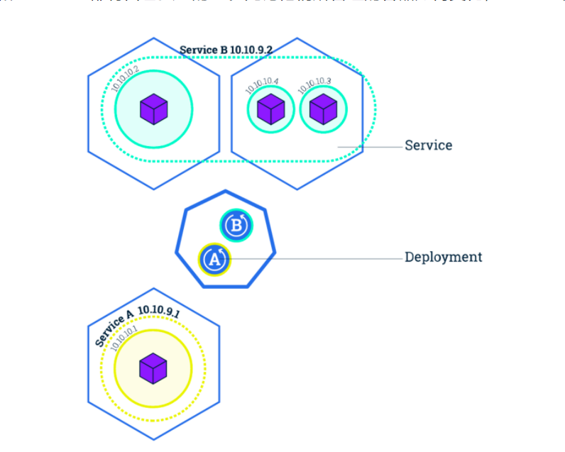
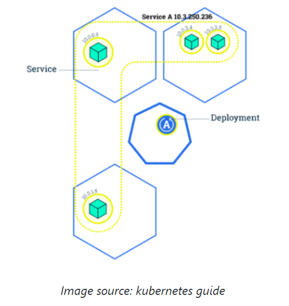

# Kubernate基础知识

## kubernate namespace

Kubernetes namespace 是用来构建虚拟的资源池；使用 kubernetes namespace，管理员可以将 kubernetes 划分成多个虚拟的区域，不同的项目或者团队可以使用不同的 namespace，达到了共享 kubernetes 集群资源的目的。此外， namespace 也被用来划分命名空间，即不同 namespace 里的资源可以取相同的名字，相同 namespace 内的资源不能重名。

### NameSpaces

kubectl create -f 创建一个namespace

## kubernates集群

当我们有一个kubernates集群后，可以开始部署在kubernates上部署应用，在Kubernates中Pods是应用的载体。

* Pod是由多个容器组成，是kubernates的最小调度单元，一般情况下，我们不直接创建pod，而是通过Deployment创建pod,由Deployment来创建，更新，维护相应的pod

### Create Deployment

我们可以通过yaml文件创建Deployment,从而创建应用

### Get Pods

使用kubectl get nodes查看当前的nodes

## 在pod中执行命令

```bash
kubectl exec nginx-66857ff745-5l8rc -n tutorial -- ls -l
```

> 在这里执行教程的代码碰到一个问题，启动nginx容器一直ImagePullOff,使用docker pull 教程中的容器名字也没办法下载下来，推测是这里的容器地址有问题，于是我把 docker pull ...
>
> 换成 docker pull nginx  pull普通的nginx
>
> 解决问题！

total 80
drwxr-xr-x   2 root root 4096 Jul 11 00:00 bin
drwxr-xr-x   2 root root 4096 Jun 30 21:35 boot
drwxr-xr-x   5 root root  360 Jul 25 02:04 dev
drwxr-xr-x   1 root root 4096 Jul 19 19:20 docker-entrypoint.d
-rwxrwxr-x   1 root root 1202 Jul 19 19:19 docker-entrypoint.sh
drwxr-xr-x   1 root root 4096 Jul 25 02:04 etc
drwxr-xr-x   2 root root 4096 Jun 30 21:35 home
drwxr-xr-x   1 root root 4096 Jul 11 00:00 lib
drwxr-xr-x   2 root root 4096 Jul 11 00:00 lib64
drwxr-xr-x   2 root root 4096 Jul 11 00:00 media
drwxr-xr-x   2 root root 4096 Jul 11 00:00 mnt
drwxr-xr-x   2 root root 4096 Jul 11 00:00 opt
dr-xr-xr-x 247 root root    0 Jul 25 02:04 proc
drwx------   2 root root 4096 Jul 11 00:00 root
drwxr-xr-x   1 root root 4096 Jul 25 02:04 run
drwxr-xr-x   2 root root 4096 Jul 11 00:00 sbin
drwxr-xr-x   2 root root 4096 Jul 11 00:00 srv
dr-xr-xr-x  13 root root    0 Jul 25 02:03 sys
drwxrwxrwt   1 root root 4096 Jul 19 19:20 tmp
drwxr-xr-x   1 root root 4096 Jul 11 00:00 usr
drwxr-xr-x   1 root root 4096 Jul 11 00:00 var

注意，我们通过双横线（“--”）区分本地终端命令和容器中执行的命令；当执行的命令只有一个单词的时候，可以省略。如果容器中有 `shell`，我们也可以启动一个远程终端：

## Kubernate Service

1. 提供固定IP，Pod可以随时启停，Pod IP可能随时变化，Service为Pods提供固定的IP
2. 提供负载均衡。Serivce由多个Pod组成，kubernates对组成Service的Pods提供负载均衡方案
3. 服务发现，集群中的其他服务可以通过Serivice名字访问后端服务（DNS）

**下图是 kubernetes Pods, Service 的典型关系。下图有两个 Deployment: A 和 B。其中 Deployment A 创建了一个 Pods（黄色），Deployment B 创建了三个 Pod（绿色）。我们可以创建两个 Service: A 和 B。 Service A 管理由 Deployment A 创建的 Pods，Service B 管理 Deployment B 创建的 Pods。可以看到， Service A 和 Service B 都有自己独立的 IP。无论他们所管理的容器如何变化， Service 的 IP 都不会变化。**




> [curl](https://so.csdn.net/so/search?q=curl&spm=1001.2101.3001.7020)，全称CommandLine URL 或 CommandLine Uniform Resource Locator，顾名思义，curl命令是在命令行方式下工作，利用URL的语法进行数据的传输或者文件的传输。（可以使用curl命令执行url接口）
>
> 这个[命令行](https://so.csdn.net/so/search?q=命令行&spm=1001.2101.3001.7020)工具现在多用于Unix和Linux操作系统，是一个开源的工具，功能十分强大。
> 下面是curl的官方网站，我们可以在该网站获取该工具的最新版本，还有最全面的使用方法。
>
> 从官网我们可以知道，该工具支持以下30多种类型的传输方式，这当中包含多种协议。


最常使用的有FILE、FTP、HTTP、HTTPS等协议。
对于程序员来说，在我们开发远程服务的时候，比如http传输，SOCKET等网络编程时，这个工具能非常方便的作为你的验证工具和测试工具。

比如下面是最简单的用法，通过这种方式获取一个页面。我输入的www.baidu.com甚至还不是一个完整的URL，因为没有指明所用的协议，curl智能地进行了选择。

执行curl 10.110.74.91

```html
<html>
<head>
<title>Welcome to nginx!</title>
<style>
html { color-scheme: light dark; }
body { width: 35em; margin: 0 auto;
font-family: Tahoma, Verdana, Arial, sans-serif; }
</style>
</head>
<body>
<h1>Welcome to nginx!</h1>
<p>If you see this page, the nginx web server is successfully installed and
working. Further configuration is required.</p>

<p>For online documentation and support please refer to
<a href="http://nginx.org/">nginx.org</a>.<br/>
Commercial support is available at
<a href="http://nginx.com/">nginx.com</a>.</p>

<p><em>Thank you for using nginx.</em></p>
</body>
</html>

```

## Node Port Service

上述创建的Service只能被集群内部节点和Pod访问，并不能被外部访问，我们可以通过两种方式暴露服务：NodePort和LoadBalancer。NodePort通过在每个节点打开一个端口对外提供服务，LoadBalancer通过创建一个外部均衡器来对外提供服务，这里我们尝试用NodePort

## Kubernate Label

Service通过selector&Label来选取他管理的Pod,Deployment也是通过selector label选取他管理的Pod。因为我们是通过Deployment创建的Pod,因此selector一定是匹配Pod的label,

### View selector label

下面的输出可以看到，上述创建的Deployment和Service的Selector都是app=nginx

```
 kubectl describe deployment nginx -n tutorial
Name:                   nginx
Namespace:              tutorial
CreationTimestamp:      Sun, 24 Jul 2022 22:31:52 +0800
Labels:                 app=nginx
Annotations:            deployment.kubernetes.io/revision: 2
                        kubectl.kubernetes.io/last-applied-configuration:
                          {"apiVersion":"apps/v1","kind":"Deployment","metadata":{"annotations":{},"labels":{"app":"nginx"},"name":"nginx","namespace":"tutorial"},"...
Selector:               app=nginx
Replicas:               1 desired | 1 updated | 1 total | 1 available | 0 unavailable
StrategyType:           RollingUpdate
MinReadySeconds:        0
RollingUpdateStrategy:  25% max unavailable, 25% max surge
Pod Template:
  Labels:  app=nginx
  Containers:
   nginx:
    Image:        nginx
    Port:         80/TCP
    Host Port:    0/TCP
    Environment:  <none>
    Mounts:       <none>
  Volumes:        <none>
Conditions:
  Type           Status  Reason
  ----           ------  ------
  Available      True    MinimumReplicasAvailable
  Progressing    True    NewReplicaSetAvailable
OldReplicaSets:  <none>
NewReplicaSet:   nginx-66857ff745 (1/1 replicas created)
Events:          <none>

```

| Resource                       | selector |
| ------------------------------ | -------- |
| Deployment A, Service A, Pod A | app=A    |
| Deployment B, Service B, Pod B | app=B    |

Label可以在创建时添加，可以在运行时添加或修改，运行时会影响集群状态。

## Kubernate Deployment Operations

### 水平扩展应用和更新应用

下图中，Deployment A 有一个 Pod 在运行，Service A 管理该 Pod。


通过调整 Deployment 的副本数量，我们可以将 Pod 的数量调整到 4 个。与此同时，Service 会感知到同样 label 的 Pod 被扩容到了 4 个，会将流量导到所有 Pod（而不是只有最开始的 Pod）。



```
kubectl scale deployments nginx --replicas=4 -n tutorial

deployment.apps/nginx scaled

root@VM-12-9-ubuntu:~# kubectl get deployments -n tutorial

NAME    READY   UP-TO-DATE   AVAILABLE   AGE
nginx   4/4     4            4           16h

```

### Update via setting Image

kubernates更新应用的过程

```
root@VM-12-9-ubuntu:~# kubectl set image deployments nginx nginx=1.9.3 -n tutorial
deployment.apps/nginx image updated
```

kubernates通过更新Image更新应用

### Deployment Rollout

rollout可以使部署状态回滚

## Kubernates Yaml

Kubernate yaml分为五个部分

* apiVersion: kubernates的分组
* kind：表明当前操作的资源的类型
* metaData：是资源的元数据
* spec：是用户对资源的“说明书”
* status：是当前资源的状态

```
apiVersion: v1
kind: Pod
metadata:
  creationTimestamp: "2019-06-28T08:16:45Z"
  generateName: nginx-646b46d648-
  labels:
  name: nginx-646b46d648-7c457
  namespace: tutorial
  ownerReferences:
  resourceVersion: "28549"
  selfLink: /api/v1/namespaces/tutorial/pods/nginx-646b46d648-7c457
  uid: e4312b93-9570-45a9-b981-8b26644f096c
spec:
  containers:
  dnsPolicy: ClusterFirst
  enableServiceLinks: true
  nodeName: minikube
  priority: 0
  restartPolicy: Always
  schedulerName: default-scheduler
  securityContext: {}
  serviceAccount: default
  serviceAccountName: default
  terminationGracePeriodSeconds: 30
  tolerations:
  volumes:
status:
  conditions:
  containerStatuses:
  hostIP: 10.0.2.15
  phase: Running
  podIP: 172.17.0.8
  qosClass: Burstable
  startTime: "2019-06-28T08:16:46Z"
```

## Kubernates Events

Kubernates events显示了kubernates集群中的各种事件。不同于其他资源，kubernates events并不是由用户创建的资源，而是由kubernates系统组件创造，提示用户集群发生的各种事件。我们可以通过kubectl来查询。

```bash
root@VM-12-9-ubuntu:~# kubectl get events -n tutorial
LAST SEEN   TYPE      REASON              OBJECT                        MESSAGE
18m         Normal    Scheduled           pod/nginx-66857ff745-c2bkg    Successfully assigned tutorial/nginx-66857ff745-c2bkg to minikube
18m         Normal    Pulled              pod/nginx-66857ff745-c2bkg    Container image "nginx" already present on machine
18m         Normal    Created             pod/nginx-66857ff745-c2bkg    Created container nginx
18m         Normal    Started             pod/nginx-66857ff745-c2bkg    Started container nginx
14m         Normal    Killing             pod/nginx-66857ff745-c2bkg    Stopping container nginx
18m         Normal    Scheduled           pod/nginx-66857ff745-hpg5d    Successfully assigned tutorial/nginx-66857ff745-hpg5d to minikube
18m         Normal    Pulled              pod/nginx-66857ff745-hpg5d    Container image "nginx" already present on machine
18m         Normal    Created             pod/nginx-66857ff745-hpg5d    Created container nginx
18m         Normal    Started             pod/nginx-66857ff745-hpg5d    Started container nginx
18m         Normal    Scheduled           pod/nginx-66857ff745-s6mz2    Successfully assigned tutorial/nginx-66857ff745-s6mz2 to minikube
18m         Normal    Pulled              pod/nginx-66857ff745-s6mz2    Container image "nginx" already present on machine
18m         Normal    Created             pod/nginx-66857ff745-s6mz2    Created container nginx
18m         Normal    Started             pod/nginx-66857ff745-s6mz2    Started container nginx
18m         Normal    SuccessfulCreate    replicaset/nginx-66857ff745   Created pod: nginx-66857ff745-c2bkg
18m         Normal    SuccessfulCreate    replicaset/nginx-66857ff745   Created pod: nginx-66857ff745-hpg5d
18m         Normal    SuccessfulCreate    replicaset/nginx-66857ff745   Created pod: nginx-66857ff745-s6mz2
14m         Normal    SuccessfulDelete    replicaset/nginx-66857ff745   Deleted pod: nginx-66857ff745-c2bkg
14m         Normal    Scheduled           pod/nginx-8c98cc988-4jrdw     Successfully assigned tutorial/nginx-8c98cc988-4jrdw to minikube
12m         Normal    Pulling             pod/nginx-8c98cc988-4jrdw     Pulling image "1.9.3"
12m         Warning   Failed              pod/nginx-8c98cc988-4jrdw     Failed to pull image "1.9.3": rpc error: code = Unknown desc = Error response from daemon: pull access denied for 1.9.3, repository does not exist or may require 'docker login': denied: requested access to the resource is denied
12m         Warning   Failed              pod/nginx-8c98cc988-4jrdw     Error: ErrImagePull
4m46s       Normal    BackOff             pod/nginx-8c98cc988-4jrdw     Back-off pulling image "1.9.3"
12m         Warning   Failed              pod/nginx-8c98cc988-4jrdw     Error: ImagePullBackOff
14m         Normal    Scheduled           pod/nginx-8c98cc988-9g6v2     Successfully assigned tutorial/nginx-8c98cc988-9g6v2 to minikube
12m         Normal    Pulling             pod/nginx-8c98cc988-9g6v2     Pulling image "1.9.3"
12m         Warning   Failed              pod/nginx-8c98cc988-9g6v2     Failed to pull image "1.9.3": rpc error: code = Unknown desc = Error response from daemon: pull access denied for 1.9.3, repository does not exist or may require 'docker login': denied: requested access to the resource is denied
12m         Warning   Failed              pod/nginx-8c98cc988-9g6v2     Error: ErrImagePull
4m40s       Normal    BackOff             pod/nginx-8c98cc988-9g6v2     Back-off pulling image "1.9.3"
12m         Warning   Failed              pod/nginx-8c98cc988-9g6v2     Error: ImagePullBackOff
14m         Normal    SuccessfulCreate    replicaset/nginx-8c98cc988    Created pod: nginx-8c98cc988-9g6v2
14m         Normal    SuccessfulCreate    replicaset/nginx-8c98cc988    Created pod: nginx-8c98cc988-4jrdw
18m         Normal    ScalingReplicaSet   deployment/nginx              Scaled up replica set nginx-66857ff745 to 4
14m         Normal    ScalingReplicaSet   deployment/nginx              Scaled up replica set nginx-8c98cc988 to 1
14m         Normal    ScalingReplicaSet   deployment/nginx              Scaled down replica set nginx-66857ff745 to 3
14m         Normal    ScalingReplicaSet   deployment/nginx              Scaled up replica set nginx-8c98cc988 to 2
```

### Kubernates Pod生命周期

Pod生命周期包括：

* Pod Phase
* Pod Condition
* Restart Policy
* Container probes

在整个的生命周期中，Pod会出现5种状态（相位），分别如下：

● 挂起（Pending）：apiserver已经创建了pod资源对象，但他尚未被调度完成或者仍处于下载镜像的过程中。

● 运行中（Running）：Pod已经被调度至某节点，并且所有容器都已经被kubectl创建完成

● 成功（Succeeded）：Pod中的所有容器都已经成功终止并且不会重启

● 失败（Failed）：所有容器都已经终止，但至少有一个容器终止失败，即容器返回了非0值得退出状态

● 未知（Unknown）：apiServer无法正常获取到pod对象的状态信息，通常由网络通信失败所导致


## Execise: 

1. proxy: 使用proxy监听在其他端口上
2. port-forward通过端口转发映射本地端口到指定的应用端口，从而访问应用程序（Pod）
3. 进一步学习Pod Liftcycle