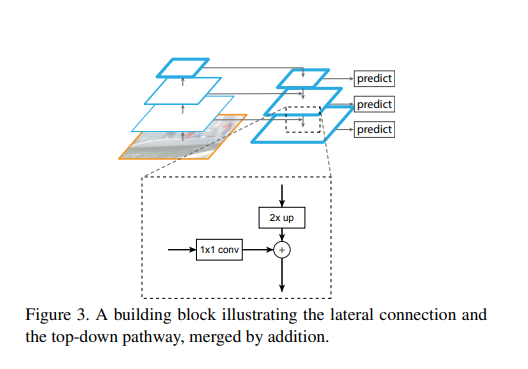
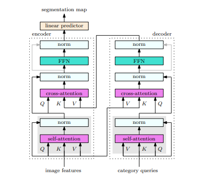

# 网络回顾

## FPN

### Abstract

最近的学习避免使用金字塔结构，一定程度上他们需要大量的计算内存，在这篇文章里我们使用继承的多尺度，一个自上而下的结构，将高级别的语义特征集合到所有尺度。

### Method 



建设金字塔网络使用到了一个自底而上的路径，一个自顶而下的路径

* 自底而上的路径：自底而上的路径计算除以2的特征图，我们定义每一个金字塔级别为一个stage,我们使用残差结构连接这些层。Specifically, for ResNets [16] we use the feature activations output by each stage’s last residual block. We denotethe output of these last residual blocks as {C2, C3, C4, C5}for conv2, conv3, conv4, and conv5 outputs, and note thatthey have strides of {4, 8, 16, 32} pixels with respect to theinput image. We do not include conv1 into the pyramid dueto its large memory footprint.
* 自顶向下的路径：自顶向下的路径使用空间上采样来获得更高的分辨率，但是越小的特征图拥有越高级的语义特征，上采样的结果通过1*1的卷积与相应层的结果相加 This final set of feature maps is
  called {P2, P3, P4, P5}, corresponding to {C2, C3, C4, C5}that are respectively of the same spatial sizes.

## ROI Pooling

目标检测architecture通常可以分为两个阶段：
（1）region proposal：给定一张输入image找出objects可能存在的所有位置。这一阶段的输出应该是一系列object可能位置的bounding box。这些通常称之为region proposals或者 regions of interest（ROI），在这一过程中用到的方法是基于滑窗的方式和selective search。
（2）final classification：确定上一阶段的每个region proposal是否属于目标一类或者背景。这个architecture存在的一些问题是：

产生大量的region proposals 会导致performance problems，很难达到实时目标检测。
在处理速度方面是suboptimal。
无法做到end-to-end training。
这就是ROI pooling提出的根本原因，ROI pooling层能实现training和testing的显著加速，并提高检测accuracy。该层有两个输入：

从具有多个卷积核池化的深度网络中获得的固定大小的feature maps；
一个表示所有ROI的N*5的矩阵，其中N表示ROI的数目。第一列表示图像index，其余四列表示其余的左上角和右下角坐标；
 ROI pooling example
我们有一个8*8大小的feature map，一个ROI，以及输出大小为2*2.

*******************

输入的固定大小的feature map


region proposal 投影之后位置（左上角，右下角坐标）：（0，3），（7，8）。


将其划分为（2 *2）个sections（因为输出大小为2*2），我们可以得到：


对每个section做max pooling，可以得到：

 

## Segmentation Transformer: Object-Contextual Representations for Semantic Segmentation

### Abstract

学习语义分割中的上下文信息

 ### Method


作者在这里用了两种方法：

* 计算每个像素与soft segmentation分割区域的公式信息

f_k是每个像素计算出来的权重，w是通过softmax与相应区域之间的关系进行计算，然后加在一起，最后再经过一层1*1的卷积


* 使用交叉注意力机制对像素信息进行学习



其实作者的的一系列方法是使用注意力机制实现的

``` python
class BaseOC_Context_Module(nn.Module):
    """
    Output only the context features.
    Parameters:
        in_features / out_features: the channels of the input / output feature maps.
        dropout: specify the dropout ratio
        fusion: We provide two different fusion method, "concat" or "add"
        size: we find that directly learn the attention weights on even 1/8 feature maps is hard.
    Return:
        features after "concat" or "add"
    """
    def __init__(self, in_channels, out_channels, key_channels, value_channels, dropout=0, sizes=([1]), bn_type=None):
        super(BaseOC_Context_Module, self).__init__()
        self.stages = []
        self.stages = nn.ModuleList([self._make_stage(in_channels, out_channels,
                                                      key_channels, value_channels, size, bn_type) for size in sizes])
        self.conv_bn_dropout = nn.Sequential(
            ModuleHelper.BNReLU(out_channels, bn_type=bn_type),
            nn.Dropout2d(dropout),
            )

    def _make_stage(self, in_channels, output_channels, key_channels, value_channels, size, bn_type):
        return SelfAttentionBlock2D(in_channels,
                                    key_channels,
                                    value_channels,
                                    output_channels, 
                                    size, bn_type=bn_type)
        
    def forward(self, feats):
    	# 首先生成feats的特征图，feats的每一个channel都是一个预测类别（就和最后出结果一样）
        priors = [stage(feats) for stage in self.stages]
        # stage是自注意力机制，在每个图层运行自注意力机制，就相当于计算像素对于那个类别的关系向量，因为注意力机制里就使用了softmax，所以采用注意力机制的方式实现。
        context = priors[0]
        # 所以可以德岛篇相应的关系向量
        for i in range(1, len(priors)):
            context += priors[i]
        #最后把关系向量相加就是最后的context向量
        output = self.conv_bn_dropout(context)
        return output

```

