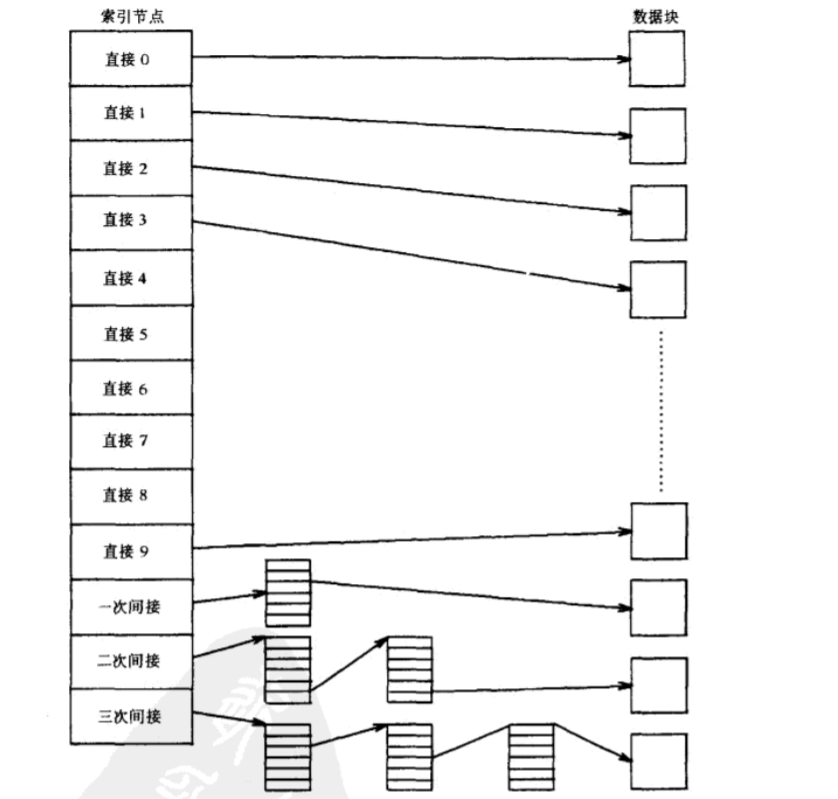

# Unix系统的高层特征

* 文件系统：层次结构，对文件数据的一致处理，建立与删除文件的能力，文件的动态增长，文件的动态保护
* 处理环境：一个程序是一个可执行环境，一个进程是执行中程序的实例，在unix系统中可以执行多个进程
* 构件原语：提供操作系统原语（进行系统调用），使用户能够书写小的，模块化的程序，并把他们作为构件去构筑更复杂的程序，重定向I/O的能力便是shell用户一个可见的原语

### 操作系统内核：

内核代表用户进程完成各种原语操作，以便支持上述描述过的用户接口

### 中断与例外

UNIX操作系统允许I/O外围设备异步的中断CPU,接收到中断时，内核保存当前的上下文，判定中断原因，为中断服务


## Unix操作系统内核

图中有三个层次，用户，内核和硬件，系统调用和库接口体现了用户程序与内核间的边界，系统调用像C语言中普通的函数调用，库把这些函数映射成操作系统需要的原语

系统调用的集合可以分为**文件子系统的交互部分和进程子系统的交互部分**

文件子系统通过缓冲机制读取文件数据，缓冲机制调节内核在二级设备之间的数据流


### 内核数据结构

#### 文件子系统概貌

一个文件的内部表示由一个索引节点给出，索引节点描述了文件数据在磁盘上的布局，文件的所有者，存取的许可权。

index node

```c
struct iNode {
    void* adress;
    char* name;
    char* property
}INode;
```

当系统调用open("/fs", 1)内核检查“/fs2”所对应的索引节点，当一个进程建立一个新文件时，内核分配一个尚未使用的索引节点，索引节点存在文件系统中，当操纵文件时，内核将它们读到**内存索引节点表**中。

内核还包括文件表和用户文件描述符表，文件表是一个全局核心结构，用户文件描述表对每个进程分配一个，当一个进程打开或建立一个文件时，内核为每个表中相应于该文件的索引节点分配一个表项

> 文件表只在全局打开的时候使用，而索引节点存储了文件的所有信息，文件表保存着文件中字节的偏移量，下一次读写将从那里开始，用户文件描述符保存着一个进程打开的所有文件。


一个文件系统由一个逻辑块序列组成，每个块都包含512个字节，1024个字节或者2048个字节，依赖于系统实现

引导块：占据文件系统的开头，是一个扇区，含有被读人机器的引导代码。

超级块：描述了文件系统的状态，它有多大，它能存储多少文件，文件系统在何处可以找到空闲空间

索引节点表

数据块

### 进程

unix系统上的进程是被系统调用fork创建的实体，除了0进程以外，所有进程都是fork创建的，调用系统调用fork进程的父进程，新创建的是子进程，每一个进程都有一个进程ID来标识进程

> 0进程是一个特殊进程，它是在系统引导时被手动创建的，当它创建了一个进程1进程后，就与0进程变成对换进程，1进程是系统中每个进程的祖先。

　exec把当前进程映像替换成新的程序文件，而且该新程序通常从main函数开始执行，进程ID并不改变。我们称调用exec的进程为调用进程（calling process），称新执行的程序为新程序（new program）

系统调用exec期间，内核把可执行文件装入栈区中，被装入的进程被称为正文区，数据区和栈区组成，栈区是自动创建的，大小是运行的时候内核自动调节的。

unix系统核心栈和用户栈是分开的


**核心态运行的进程往往是不可抢占的**

## 数据缓冲区高速缓冲区

对文件系统的一切操作，内核都能通过每次从磁盘上直接读，直接写来实现，慢的磁盘传输速率会让响应时间变长，内核通过保持一个高速缓冲来减小磁盘的存储速率。高速缓冲含有最近使用过的磁盘的数据

**描述内核用于操纵高速缓冲中的缓冲区的算法**

缓冲区由两个部分组成：

* 存储器数组
* 标识缓冲区的缓冲头部

一个缓冲区的数据与文件系统上的逻辑磁盘的数据相对应，并且内核通过考察缓冲区头部的内容来识别缓冲区的内容，缓冲区是磁盘主存的拷贝


缓冲头部包含一个设备号和块号的字段，两个字段指明了文件系统与磁盘数据的块号，并且唯一标识了该缓冲区

> 缓冲区状态是如下状态的组合，缓冲区当前为上锁，缓冲区包含有效数据，内核把缓冲区重新分配出去必须把缓冲区写在磁盘上，这种被称为延迟写，内核当前正在把

内核按照最少使用算法将数据存储在缓冲池中，在它把缓冲区分配给一个磁盘后，内核维护一个缓冲区的空闲表

当内存存取一个磁盘块时，它使用适当的设备号和块号去找相应的缓冲区，它并不是搜索整个缓冲区池，它把缓冲区组织成一个一个队列，在队列上使用散列函数。


```
系统中空闲表和散列队列的配合是这样的：所有的缓冲区都可以在散列队列里面，可以通过散列函数被找到，空闲块可以存在于散列队列和空闲表中，如果系统想查找相应的空闲表，则查找散列队列，如果摘下空闲块，则会搜索空闲队列。
```

**注意：一个块如果不被使用就是空闲块，而不是里面没数据才被称为空闲块**

#### 获取缓冲池上一个块的写法

1. 在散列队列上可以找到该块，并且该缓冲区空闲

2. 在散列队列上找不到该块，系统分配一个空闲块
3. 在散列队列上找不到该块，系统没有空闲块
4. 内核在散列队列

#### 分配了缓冲区释放缓冲区的写法


上面缓冲区送入头部是发生了I/O错误，可以覆盖缓冲区

**这是一个缓冲区的图**


高速缓冲全都是优点，只有延迟写这个致命的缺点。


## 文件的内部表示

索引节点以静态方式存储在硬盘上，内核读进内存索引节点表操纵他们

索引节点并不标明存取文件的路径名

内存中的索引节点除了拷贝磁盘中的字段之外，还拥有：

* 内存的索引节点指示

1. 索引节点是否被上锁
2. 是否有进程等待索引节点变为开锁状态
3. 索引节点数据更改的结果
4. 文件数据更改的结果
5. 是否为文件的安装点

* 索引节点号
* 指向其他索引节点指针
* 引用数

### 对索引节点的存取

内核用文件系统和索引节点号来标识特定的索引节点，高层算法请求分配索引节点，算法iget为索引节点分配一个内存拷贝

内核独立的操作索引节点锁和引用计数，在系统调用执行期间把锁关闭，在系统调用结束后把锁关闭，两次系统调用间隔期间，索引节点不上锁


连续分配文件的空间，可能会导致文件扩展相当困难，因此unix允许文件遍布整个操作系统，为使索引节点表保持较小的结构就能管理较大的空间，磁盘块地址，保持如下的结构



u区包含一个指向当前索引节点的指针，当前的目录被存储在进程的u区，而索引节点存储在全局变量中


### 超级块

* 文件系统的规模
* 文件系统空闲块的数量
* 文件系统可用的空闲块

本章的其余部分讲述数组，索引和锁的使用，如果超级块被修改，则内核定期把超级块写入到磁盘上

**整个文件的存储结构**


#### 虚拟子系统

```c
struct vfs {
    该子文件系统的操作指针
    安装点的v节点状态标志/* 只读、上锁、有等待上锁进程等*/
    基本文件系统块大小
    文件系统标识数/* 指明是本地还是远地的文件系统*/
    安装表项指针
}
```


子文件系统被安装时，在系统安装表中给该子文件系统建立了一个安装表项，使得每个子文件系统的vfs 都与一个安装表项一一对应，每个安装表项由数据结构mount定义：

```c
struct mount {
    该文件系统的vfs指针
    设备号
    超级块缓冲区指针
    各项quota值
    该文件系统根节点指针
    安装点节点指针
}
```


### 管道

管道相关的知识


## 进程结构


假定核心正在执行进程，但他们不能同时装入主存，进程0，即对换进程，换出我们的进程，为另外一个进程腾出空间

描述进程状态的内核数据结构是：进程表项和u区

```
进程表 {
	状态字段；
	进程表项的一些字段
}
```

u区中的状态各个字段刻画了进程的特性

* 指向进程表的指针
* 真正的用户标识号，有效用户标识号
* 计时器字段：进程在用户态和核心态使用的时间
* 一个出错字段
* 一个含有系统调用返回值字段

一个unix进程是由三个逻辑段组成的：

1. 正文段： 机器为一个进程执行指令的集合
2. 数据段：
3. 栈

正文段的地址包括正文地址，数据地址和栈地址

### 区

### 内核的安排

内核是在某个进程的上下文中进行的，内核相联系的虚存映射与所有进程都无关，内核的代码和数据永远驻留在内存中，并被所有进程共享


### u区

每一个进程都有一个u区，进程访问u区的时候，就好像系统只有一个u区，即正在运行进程的u区

一个进程**在核心态的时候可以访问u区**，用户态不能访问，内核用u区的虚地址，一次只能存取一个U区

### 进程的上下文

进程的上下文是由用户地址空间的内容，硬件寄存器的内容和进程有关的内核组成

> 用户级上下文，寄存器上下文，系统级上下文，系统级上下文包括页表和u区，核心栈

寄存器上下文

核心栈：当一个进程在核心中执行的时候，含有内核的栈结构，尽管所有进程执行相同的内核代码。

**他们各有一个私有的核心栈拷贝，拷贝指出了对内核函数的特殊调用**


中断访问与静态部分无关

### 中断与例外

每一个进程都有一个u区，进程访问u区的时候，就好像系统只有一个u区，u区包含指向进程的指针，进程的状态,出错字段和计时器

上下文包括：u区，页表，核心栈

系统陷入：库函数是在用户态下执行，系统调用的接口**是中断处理的特例**

系统调用是一种特殊的中断


#### 内核通过禁止任意的中断保持数据的一致性和完整性

### 上下文切换

### 系统睡眠的实现

* 抽象表达：进程在一个事件睡眠，直到该事件发生，他们醒来就进入就绪状态。
* 实际的实现方法：将他们映射到一组（内核）的虚地址上

算法sleep

```
提高处理机的执行级屏蔽中断
设置进程状态为睡眠
将睡眠地址保存在表项中
if (进程的睡眠是不可中断的) {
	做上下文切换
	处理机优先级复位为进程进入睡眠时候的值，从而允许中断
}
if (该进程没有待处理的软中断信号) {

}
```

算法wake up

磁盘中断处理程序唤醒一个等待的进程，核心在wakeup中提高处理机屏蔽中断，对睡眠的每个进程，将其状态置为就绪

将进程移除睡眠队列


## 进程控制

### 1. 进程创建

用户创建一个新进程的唯一方法是fork

```C
pid = fork()
```

pid不同，具有完全相同的用户级上下文，在父进程中，pid为子进程号，子进程中，pid值为0

系统初启动时创建的进程0是**唯一不通过系统调用创建的进程**

```
fork
算法
检查可用的内核资源
取一个空闲的进程表项和唯一的PID
检查用户有没有过多的运行进程
将子进程设置为创建状态
将父进程的表项拷贝到子进程的表项中
当前目录的索引节点+1
```

系统对用户同时运行的进程数有一个限制，这个限制是可装配的


### 2. 软中断信号

软中断信号(signal),通知进程发生了异步事件，进程之间可以通过kill发送软中断信号


> **仅当进程从核心态返回用户态时才处理软中断信号。**由于软中断信号主要由应用程序运行时发出，不是影响系统正常运行的特别紧急事件，故不在核心态下处理——当进程在核心态下运行时，软中断信号并不立即起作用。并且，核心也保证了进程在核心态下运行的时间不会太长，能够保证进程能很快在从核心态返回用户态时，对可能的软中断信号进行处理，从而确保对应用程序的响应时间要求。

记住发送软中断信号和捕俘软中断信号的不同，软中断信号为了应对致命的事件


核心进程控制表proc

```
进程使用系统调用kill来发送软中断信号：
kill ( pid,  signum)
其中signum是要发送的软中断信号号，pid为软中断信号接收进程，pid的值与对应进程的关系如下：
1、pid为正值，信号发送给进程号为pid的进程；
2、pid为0，信号发送给与发送者同组的所有进程；
3、pid为-1，信号发送给真正用户标识号等于发送者的有效用户标识号的所有进程。
4、pid为负数但非-1，信号发送给组号为pid绝对值所有进程。
```

### 3. wait的调用

系统通过调用wait保持与子进程的同步

```
pid = wait(stat_addr)
pid是僵死的进程号，stat_addr是一个整数在用户空间的地址，它含有子进程的退出码
```


## 进程调度

unix的进程调度称为多级反馈循环调度，内核给进程分配一个CPU时间片，抢先一个超过其时间片的进程，并把它反馈到若干优先队列的某个队列。

**每个进程都有一个核心态优先权**


具有用户级优先权的进程（返回用户态则获得用户级优先权）

**收到软中断信号时，低核心优先权的进程先被唤醒，高优先权的进程继续沉睡**

> 在系统中，最高优先权的值是0

核心级优先权只在sleep中获得

* 用户级优先权低于一个阈值，用户级优先权高于一个阈值

1. 内核将优先权赋予一个即将睡眠的进程：将一个固定的优先权值和睡眠时间联系起来
2. 内核调整从核心态返回用户态的优先级，为了公平起见，内核要处罚该进程，因为进程使用了宝贵的内核资源
3. 时钟处理程序以1秒的间隔调整进程的优先权（防止某个进程垄断使用CPU）

$$
decay(CPU) = CPU / 2
$$

调整CPU的最近使用时间
$$
pirority = ("recent CPU usage"/2) + (base level user pirority)
$$
CPU时间片用完：时钟中断

> 一般情况下都是可以进行时钟中断的，当内核正在执行一段代码，但是优先级还没有高到可以屏蔽时钟中断


### 进程优先权的控制

使用nice(value)控制进程优先权
$$
priority = ("recent CPU usage"/constant) + (basepirority) + (nice value) 
$$
软中断信号：软件对硬件中断进行的模拟，进程之间唯一的异步交互方式。
