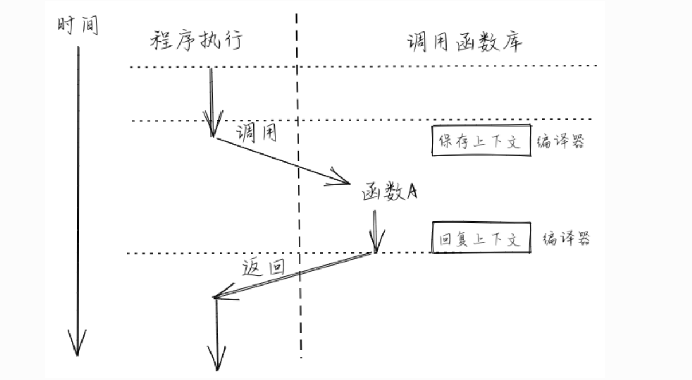
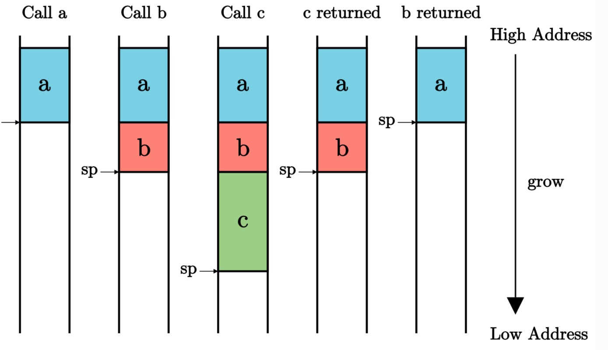
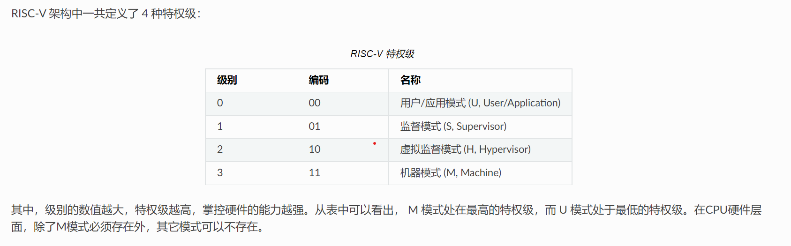

# 清华操作系统课

## Rust语言

rust是静态语言，只不过能自己判断类型

```rust
let a = 123;
a = "abc"; // 错误，不能改变类型
a = 4.56; //错误，不能改变精度
a = 456;//错误，rust设计变量尽量不可变
let mut a = 123//合理
```

### rust函数

```rust
fn main() {
    println!("Hello, world!");
    another_function();
}

fn another_function() {
    println!("Hello, runoob!");
}
```

在上述程序中有条件 if 语句，这个语法在很多其它语言中很常见，但也有一些区别：首先，条件表达式 number < 5 不需要用小括号包括（注意，不需要不是不允许）；但是 Rust 中的 if 不存在单语句不用加 {} 的规则，不允许使用一个语句代替一个块。尽管如此，Rust 还是支持传统 else-if 语法的：

> 必须要写括号

​	while循环和if循环差不多

for循环的三种形式

```rust
fn main() {
    let a = [10, 20, 30, 40, 50];
    for i in a.iter() {
        println!("值为 : {}", i);
    }
}

fn main() {
let a = [10, 20, 30, 40, 50];
    for i in 0..5 {
        println!("a[{}] = {}", i, a[i]);
    }
}

fn main() {
    let s = ['R', 'U', 'N', 'O', 'O', 'B'];
    let mut i = 0;
    loop {
        let ch = s[i];
        if ch == 'O' {
            break;
        }
        println!("\'{}\'", ch);
        i += 1;
    }
}
```

### 变量的所有权

变量的移动,在栈空间的复制

```rust
let x = 5;
let y = x;
```

变量的clone,在堆空间的复制

```rust
let s1 = String::"hello";
let s = s1;
//s和s1指向了同一个资源
```

## QEMU

```
QEMU 本身是一个非常强大的虚拟机，甚至在 Xen、KVM 这些虚拟机产品中都少不了 QEMU 的身影。在 QEMU 的官方文档中也提到，QEMU 可以利用 Xen、KVM 等技术来加速。为什么需要加速呢，那是因为如果单纯使用 QEMU 的时候，它自己模拟出了一个完整的个人电脑，它里面的 CPU 啊什么的都是模拟出来的，它甚至可以模拟不同架构的 CPU，比如说在使用 Intel X86 的 CPU 的电脑中模拟出一个 ARM 的电脑或 MIPS 的电脑，这样模拟出的 CPU 的运行速度肯定赶不上物理 CPU。使用加速以后呢，可以把客户操作系统的 CPU 指令直接转发到物理 CPU，自然运行效率大增。

　　QEMU 同时也是一个非常简单的虚拟机，给它一个硬盘镜像就可以启动一个虚拟机，如果想定制这个虚拟机的配置，比如用什么样的 CPU 啊、什么样的显卡啊、什么样的网络配置啊，指定相应的命令行参数就可以了。它支持许多格式的磁盘镜像，包括 VirtualBox 创建的磁盘镜像文件。它同时也提供一个创建和管理磁盘镜像的工具 qemu-img。QEMU 及其工具所使用的命令行参数，直接查看其文档即可。
```


## Linux多层次环境支持


函数调用，系统调用，指令集，硬件平台

**硬件可以分为**

* 处理器
* 内存
* IO设备

>  Strace是Linux中一个调试和跟踪工具。它可以接管被跟踪进程执行的系统调用和收到的信号。然后把每一个执行的系统调用的名字，参数和返回值打印出来。可以通过strace找到问题出现在user层还是kernel层。strace 显示这些调用的参数并返回符号形式的值。strace 从内核接收信息，而且不需要以任何特殊的方式来构建内核。

代码文件的编译过程可以分为预处理，编译，汇编，链接（.s->.o）

```C
#include <stdio.h>
int main()
{
    printf("Hello World");
    return 0;
}
//只执行了两个系统调用
write(1, "Hello World", 11Hello World)             = 11
exit_group(0)                           = ?
```

只执行了两个系统调用

## make工具

  make工具是一个简化编译工作程序，有了它我们可以进行所谓的“自动化编译”，极大地提高了软件开发的效率。make工具相当于一个Shell，通过解释Makefile的中的命令进行工作。大多数IDE都有这个工具，比如：Visual C++的nmake，Linux下GNU的make。

​    尤其在Linux和Unix系统开发中，make就带来很多便捷。实际上make工具最主要也是最基本的功能就是通过makefile文件来描述源程序之间的相互关系并自动维护编译工作。而makefile 文件需要按照某种语法进行编写，文件中需要说明如何编译各个源文件并连接生成可执行文件，并要求定义源文件之间的依赖关系。

​    在Linux和 UNIX 系统中，我们习惯使用 Makefile 作为 makfile 文件。如果要使用其他文件作为 makefile，可以使用make命令的-f选项来指定要使用makefile文件。

$: make -f mymakefile

Makefie一般需要包含以下内容：

1）宏定义

2）源文件之间的依赖关系

3）可执行的命令

**先要把源文件编译成目标文件.o,然后再通过链接变成可执行文件**

> 如果我们工程有8个C文件和3个头文件，我们定义了如下规则来进行编译
>
> * 如果这个工程没有被编译过，所有文件都要被编译
> * 如果这个工程几个c被修改，我们只编译修改过的文件
> * 如果这个工程的头文件改变了，我们只需要编译头文件，并链接程序

make所看到的第一项规则会被当做默认规则使用。

一个规则可分成三个部分：

目标：依赖1 依赖2。。。

### “?=”

- “？=”表示如果该变量没有被赋值，则赋予等号后的值。举例：

```make
VIR ?= new_value
```

### “:=”

- 相比于前面“最普通”的”=”，”:=”就容易理解多了。”:=”就表示直接赋值，赋予当前位置的值。同样举个例子说明

```make
VIR_A := A
VIR_B := $(VIR_A) B
VIR_A := AA
```

## 启动qemu

```bash
qemu-system-riscv64 \
2    -machine virt \
3    -nographic \
4    -bios ../bootloader/rustsbi-qemu.bin \
5    -device loader,file=target/riscv64gc-unknown-none-elf/release/os.bin,addr=0x80200000
```

- `-machine virt` 表示将模拟的 64 位 RISC-V 计算机设置为名为 `virt` 的虚拟计算机。我们知道，即使同属同一种指令集架构，也会有很多种不同的计算机配置，比如 CPU 的生产厂商和型号不同，支持的 I/O 外设种类也不同。关于 `virt` 平台的更多信息可以参考 [1](https://rcore-os.github.io/rCore-Tutorial-Book-v3/chapter1/3first-instruction-in-kernel1.html#virt-platform) 。Qemu 还支持模拟其他 RISC-V 计算机，其中包括由 SiFive 公司生产的著名的 HiFive Unleashed 开发板。
- `-nographic` 表示模拟器不需要提供图形界面，而只需要对外输出字符流。
- 通过 `-bios` 可以设置 Qemu 模拟器开机时用来初始化的引导加载程序（bootloader），这里我们使用预编译好的 `rustsbi-qemu.bin` ，它需要被放在与 `os` 同级的 `bootloader` 目录下，该目录可以从每一章的代码分支中获得。
- 通过虚拟设备 `-device` 中的 `loader` 属性可以在 Qemu 模拟器开机之前将一个宿主机上的文件载入到 Qemu 的物理内存的指定位置中， `file` 和 `addr` 属性分别可以设置待载入文件的路径以及将文件载入到的 Qemu 物理内存上的物理地址。注意这里我们载入的文件带有 `.bin` 后缀，它并不是上一节中我们移除标准库依赖后构建得到的内核可执行文件，而是还要进行加工处理得到内核镜像。我们后面再进行深入讨论。

> 真实计算机加电启动流程：
>
> 1. 加电后的CPU的PC寄存器被设置为计算机内部只读存储器的物理地址，CPU开始运行ROM的软件，将后续阶段的bootloader的代码载入内存，最后将计算机控制权移交给BootLoader
> 2. bootloader完成一些CPU初始化工作，然后交给操作系统
> 3. 控制权移交给操作系统

## 代码段，数据段

计算机内核分为代码段和数据段

在冯诺依曼的[体系结构](https://so.csdn.net/so/search?q=体系结构&spm=1001.2101.3001.7020)中，一个进程必须有：代码段，堆栈段，数据段。


堆栈段：

　　1. 为函数内部的局部变量提供存储空间。

　　2. 进行函数调用时，存储“过程活动记录”。

　　3. 用作暂时存储区。如计算一个很长的算术表达式时，可以将部分计算结果压入堆栈。

数据段（静态存储区）：

　　包括BSS段（Block Started by Symbol）的数据段。BSS段存储未初始化或初始化为0的全局变量、静态变量，具体体现为一个占位符，并不给该段的数据分配空间，只是记录数据所需空间的大小。数据段存储经过初始化的全局和静态变量。

***\*代码段：\****

　　又称为文本段。存储可执行文件的指令；也有可能包含一些只读的常数变量，例如字符串常量等。

## 编写内核指令

```assembly
 # os/src/entry.asm
     .section .text.entry
     .globl _start
 _start:
    li x1, 100
```

静态链接是指程序在编译时就将所有用到的函数库的目标文件链接到可执行文件中，这样会导致可执行文件容量较大，占用硬盘空间；而动态链接是指程序在编译时仅在可执行文件中记录用到哪些函数库和在这些函数库中用到了哪些符号，在操作系统执行该程序准备将可执行文件加载到内存时，操作系统会检查这些被记录的信息，将用到的函数库的代码和数据和程序一并加载到内存，并进行一些重定位工作。使用动态链接可以显著缩减可执行文件的容量，并使得程序不必在函数库更新后重新链接依然可用。

Qemu 显然不支持在加载时动态链接，因此我们的内核采用静态链接进行编译。

生成可执行文件符合内存预期

## Linux链接脚本

每一个[链接](https://so.csdn.net/so/search?q=链接&spm=1001.2101.3001.7020)过程都由链接脚本(linker script, 一般以lds作为文件的后缀名)控制. 链接脚本主要用于规定如何把输入文件内的section放入输出文件内, 并控制输出文件内各部分在程序地址空间内的布局. 但你也可以用连接命令做一些其他事情.

连接器有个默认的内置连接脚本, 可用ld –verbose查看. 连接选项-r和-N可以影响默认的连接脚本(如何影响?).

-T选项用以指定自己的链接脚本, 它将代替默认的连接脚本。你也可以使用以增加自定义的链接命令.

以下没有特殊说明，连接器指的是静态连接器.

## 函数调用与栈

其中最简单的无疑就是 CPU 一条条连续向下执行指令，也即满足递推公式 an+1=an+L，这里我们假设该平台的指令是定长的且均为 L 字节（常见情况为 2/4 字节）。但是执行序列并不总是符合这种模式，当位于物理地址 an 的指令是一条跳转指令的时候，该模式就有可能被破坏。跳转指令对应于我们在程序中构造的 **控制流** (Control Flow) 的多种不同结构，比如分支结构（如 if/switch 语句）和循环结构（如 for/while 语句）。用来实现上述两种结构的跳转指令，只需实现跳转功能，也就是将 pc 寄存器设置到一个指定的地址即可。

另一种控制流结构则显得更为复杂： **函数调用** (Function Call)。我们大概清楚调用函数整个过程中代码执行的顺序，如果是从源代码级的视角来看，我们会去执行被调用函数的代码，等到它返回之后，我们会回到调用函数对应语句的下一行继续执行。那么我们如何用汇编指令来实现这一过程？首先在调用的时候，需要有一条指令跳转到被调用函数的位置，这个看起来和其他控制结构没什么不同；但是在被调用函数返回的时候，我们却需要返回那条跳转过来的指令的下一条继续执行。这次用来返回的跳转究竟跳转到何处，在对应的函数调用发生之前是不知道的。比如，我们在两个不同的地方调用同一个函数，显然函数返回之后会回到不同的地址。这是一个很大的不同：其他控制流都只需要跳转到一个 *编译期固定下来* 的地址，而函数调用的返回跳转是跳转到一个 *运行时确定* （确切地说是在函数调用发生的时候）的地址。



```
```

## 高地址，低地址




栈是由高地址到低地址

## 在操作系统中预留一个栈

```assembly
 # os/src/entry.asm
     .section .text.entry
     .globl _start
 _start:
     la sp, boot_stack_top
     call rust_main
 
     .section .bss.stack
     .globl boot_stack
boot_stack:
    .space 4096 * 16
    .globl boot_stack_top
13boot_stack_top:
```

## 特权级指令

实现特权级机制的根本原因是应用程序运行的安全性不可充分信任。在上一章里，操作系统以库的形式和应用紧密连接在一起，构成一个整体来执行。随着应用需求的增加，操作系统的体积也越来越大；同时应用自身也会越来越复杂。由于操作系统会被频繁访问，来给多个应用提供服务，所以它可能的错误会比较快地被发现。但应用自身的错误可能就不会很快发现。由于二者通过编译器形成一个单一执行程序来执行，导致即使是应用程序本身的问题，也会让操作系统受到连累，从而可能导致整个计算机系统都不可用了。

**让相对可靠的操作系统运行在一个硬件保护的安全环境中**

* 应用程序不能访问任意的地址空间
* 应用程序不能执行某些破坏计算机的指令

> - `ecall` ：具有用户态到内核态的执行环境切换能力的函数调用指令
> - `eret` ：具有内核态到用户态的执行环境切换能力的函数返回指令



## 实现操作系统执行应用程序

实现陷入指令

```assembly
 1// user/src/syscall.rs
 2use core::arch::asm;
 3fn syscall(id: usize, args: [usize; 3]) -> isize {
 4    let mut ret: isize;
 5    unsafe {
 6        asm!(
 7            "ecall",
 8            inlateout("x10") args[0] => ret,
 9            in("x11") args[1],
10            in("x12") args[2],
11            in("x17") id
12        );
13    }
14    ret
15}
```

从 RISC-V 调用规范来看，就像函数有着输入参数和返回值一样， `ecall` 指令同样有着输入和输出寄存器： `a0``~``a2` 和 `a7` 作为输入寄存器分别表示系统调用参数和系统调用 ID ，而当系统调用返回后， `a0` 作为输出寄存器保存系统调用的返回值。在函数上下文中，输入参数数组 `args` 和变量 `id` 保存系统调用参数和系统调用 ID ，而变量 `ret` 保存系统调用返回值，它也是函数 `syscall` 的输出/返回值。这些输入/输出变量可以和 `ecall` 指令的输入/输出寄存器一一对应。如果完全由我们自己编写汇编代码，那么如何将变量绑定到寄存器则成了一个难题：比如，在 `ecall` 指令被执行之前，我们需要将寄存器 `a7` 的值设置为变量 `id` 的值，那么我们首先需要知道目前变量 `id` 的值保存在哪里，它可能在栈上也有可能在某个寄存器中。

### 特权级切换的应用控制

当 CPU 执行完一条指令（如 `ecall` ）并准备从用户特权级 陷入（ `Trap` ）到 S 特权级的时候，硬件会自动完成如下这些事情：

- `sstatus` 的 `SPP` 字段会被修改为 CPU 当前的特权级（U/S）。
- `sepc` 会被修改为 Trap 处理完成后默认会执行的下一条指令的地址。
- `scause/stval` 分别会被修改成这次 Trap 的原因以及相关的附加信息。
- CPU 会跳转到 `stvec` 所设置的 Trap 处理入口地址，并将当前特权级设置为 S ，然后从Trap 处理入口地址处开始执行。

#### 在 Trap 触发的一瞬间， CPU 就会切换到 S 特权级并跳转到 `stvec` 所指示的位置。但是在正式进入 S 特权级的 Trap 处理之前，上面 提到过我们必须保存原控制流的寄存器状态，这一般通过内核栈来保存。注意，我们需要用专门为操作系统准备的内核栈，而不是应用程序运行时用到的用户栈。

> 每一个进程都有两个栈，一个用户栈一个内核栈

```
// os/src/batch.rs
 2
 3const USER_STACK_SIZE: usize = 4096 * 2;
 4const KERNEL_STACK_SIZE: usize = 4096 * 2;
 5
 6#[repr(align(4096))]
 7struct KernelStack {
 8    data: [u8; KERNEL_STACK_SIZE],
 9}
10
11#[repr(align(4096))]
12struct UserStack {
13    data: [u8; USER_STACK_SIZE],
14}
15
16static KERNEL_STACK: KernelStack = KernelStack { data: [0; KERNEL_STACK_SIZE] };
17static USER_STACK: UserStack = UserStack { data: [0; USER_STACK_SIZE] };
```

栈是向下增长的

用户栈代码

```rust
impl UserStack {
    fn get_sp(&self) -> usize {
        self.data.as_ptr as usize + USER_STACK_SIZE;//换栈是非常简单的，只需要将sp的值修改为get_sp的返回值就行
    }
}
```

### Trap管理

特权级的切换的核心是对trap的管理

在批处理操作系统初始化的时候，我们需要修改 `stvec` 寄存器来指向正确的 Trap 处理入口点。
